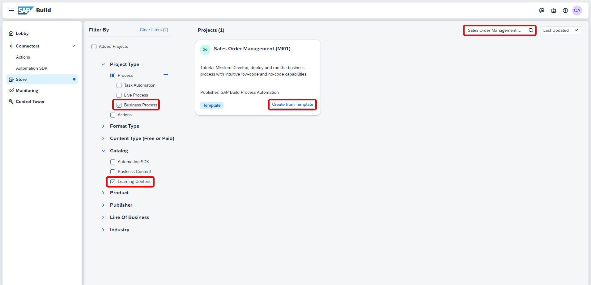
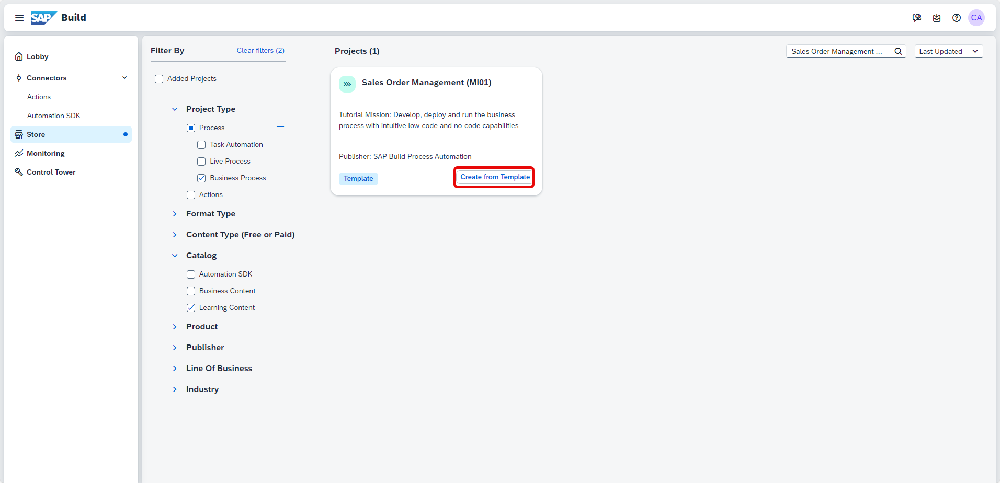
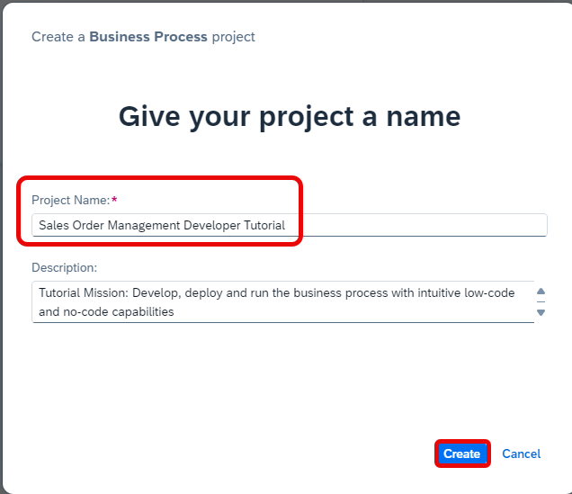

# Acquire a Template Project From the Store
<!-- description --> Import a sample business process from the SAP Build store.

## Prerequisites
- [Subscribe to SAP Build Process Automation](spa-subscribe-booster)

## You will learn
  - How to explore content in the SAP Build Store
  - How to acquire any business process from the SAP Build Store
  - How to reuse a package from the store in SAP Build Process Automation

---

### Explore the store

The store is available for everyone and can be accessed directly from the home page. The store offers pre-built content created and curated by SAP, which can be used free of charge with SAP Build Process Automation.

Packages are categorized by catalog, which let you choose between Automation SDK, Business Content and Learning Content. It also offers a variety of filters, a search feature, and content descriptions to help users find what they are looking for quickly.

1. Navigate to the store in your SAP Build Process Automation tenant.
    
    <!-- border -->

    > **Learning Content** offers learning packages to get started with the Application Development tool. These packages allow you to learn best practices by reusing the most common flows to design your first projects.

    > **Business Content** provides pre-built business processes for concrete business problems.

    > **Automation SDK** provides all the Software Developments Kits that can be acquired from the store.

2. You can select one or more filters on the left to filter the available store projects by Project Type (for example Live Process and Business Process), Format Type (for example, Ready to use and Template), Catalog (for example, Business Content), Product (for example, SAP S/4HANA Cloud), Publisher, Line of Business, and Industry.

    <!-- border -->

### Import sales order management business process

You will import the business process titled **Sales Order Management (MI03)**.

1. Set the following parameters: under **Project Type**, select **Process** > **Business Process** and under **Catalog**, select **Learning Content** and type **Sales Order Management (MI03)**  in the search bar and hit **Enter**.

    > This sample content improves process efficiency by automating repetitive processes, integrating decision logic with business rules and configuring Process Visibility to get insight on the performance of your processes.

    <!-- border -->

1. To add the entire package, select **Create from Template**.

    <!-- border -->
   
2. Name the project **Sales Order Management Developer Tutorial** and choose **Create**.

    <!-- border -->

3. Once the project is imported successfully, to see the newly created project, navigate back to the **Lobby** by clicking on the SAP logo on the top left corner.

    <!-- border -->

    You have now imported a sample process and are ready to test/modify it.

    <!-- border -->

