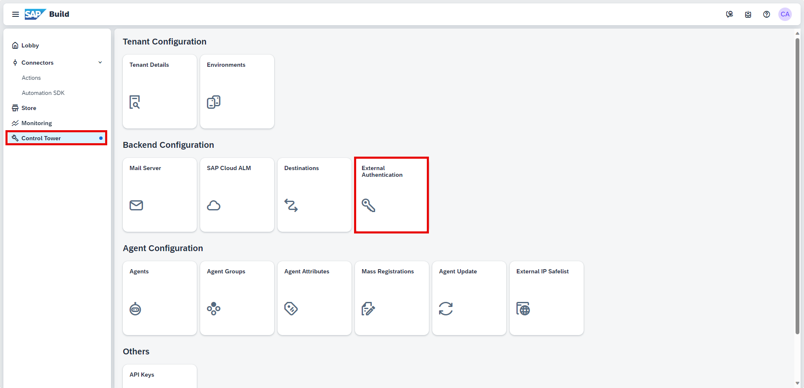
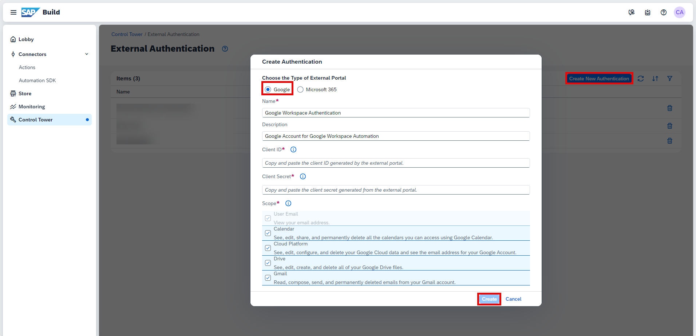
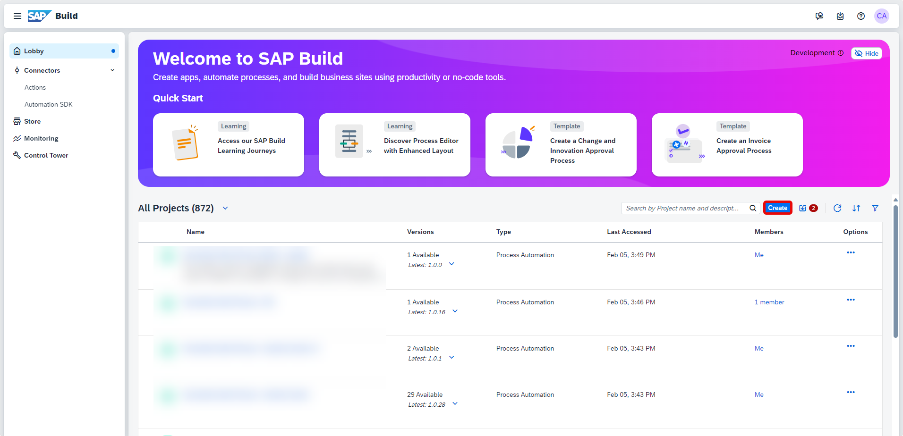
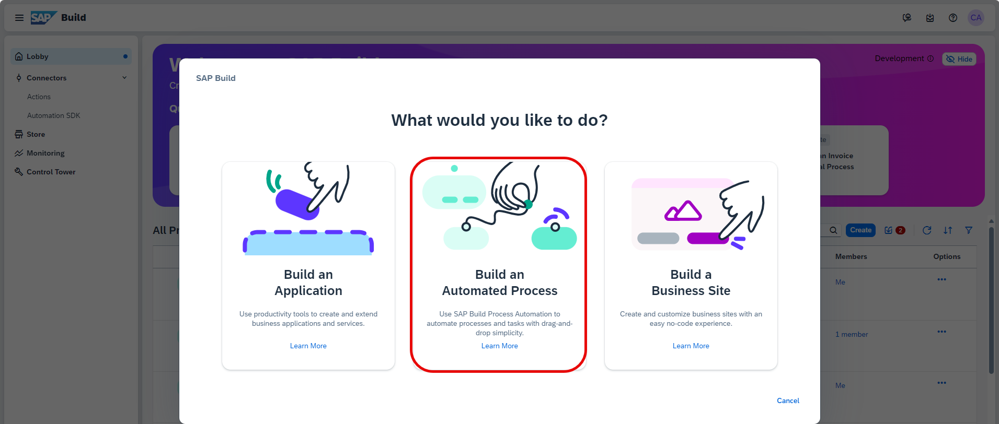
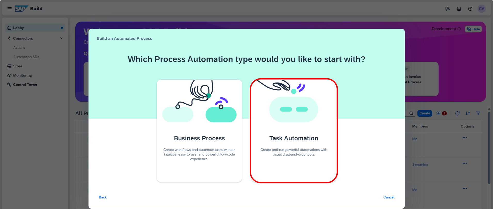
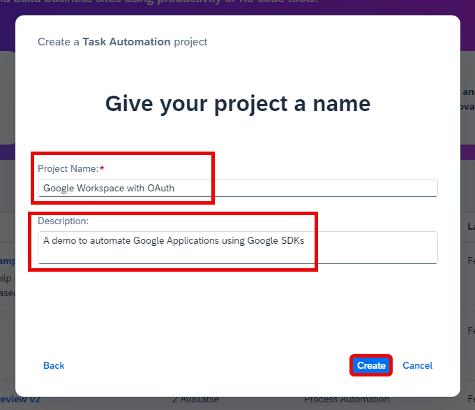

# Authorize SAP Build Process Automation with Google Authorization SDK Using Google Oauth Client ID
<!-- description --> Authorize SAP Build Process Automation to automate Google Applications with Google Authorization SDK using Google Oauth Client ID

## Prerequisites
 - A [SAP BTP Free Tier Account](spa-subscribe-booster) with SAP Build Process Automation booster. If you rather use a SAP BTP Trial account, please follow [Subscribe to SAP Build Process Automation Using SAP BTP Free Trial](spa-subscribe-free-trial)
 - [Configure OAuth in Google Cloud Platform](spa-configure-oauth-google-platform)
 - Install and set up the [Desktop Agent 3](spa-setup-desktop-3-0-agent) to run the automation
 - Desktop Agent v3.16.x or greater and Google Authorization SDK and Google Workspace SDK v1.38.x or greater

## You will learn
 - How to use the authorization mechanisms supported by the Google Authorization SDK
 - How to use Select Google Authentication activity
 - How to use Authorize Google (OAuth Client ID) activity

## Intro
SAP Build Process Automation enables users to automate Google Workspace products such as Gmail, Google Drive, Google Sheets, Google Docs, Google Calendar and other services such as Google Cloud Storage, Document AI and Vision AI. Any company which is using Google Workspace instead of MS Office products, can use the Google Workspace SDK to automate the workspace products. In order to automate Google workspace products, you have to be authorized. There are three authorization mechanisms that Google supports:

- Service Account
- `OAuth`
- Workflow Identity Federation

SAP Build Process Automation supports Service Account and `OAuth`. In this tutorial, you will build an automation to authorize using `OAuth` and send an email using Gmail activities. 

There are two ways to authorize using `OAuth`: either by registering the authentication on the Desktop Agent 3.0 or by getting authorization for a Google account.

> What is OAuth?

> OAuth 2.0 is an industry standard, token-based user authorization mechanism. The client must be registered through Google cloud console and the JSON credential file which contains Client ID and Client secret should be downloaded to a safe location. Refer to pre-requisites to **Setup OAuth Client**.

---

### Authorize Google using OAuth Client ID

After successful completion of setting the `OAuth` client ID as mentioned in the pre-requisites, you would have downloaded the `OAuth` credential file in JSON format and saved it on your local machine.

### First option - Use OAuth Client ID authorization mechanism on Desktop Agent 3.0.

In this first option, you will learn how to use OAuth Client ID authorization mechanism on Desktop Agent 3.0. Desktop Agent 3.0 has an optimized way to use the `OAuth` mechanism as summarized.

- The Authentication details can be configured and operated centrally on SAP Build Process Automation Tenants. Hence the bot developer is less concerned about configuration.
- The Authorization can be done directly through the Desktop Agent, so that the tokens can be fetched before running the bot, which makes the bot unattended after the first run.

To configure External Authentication in SAP Build Process Automation, please follow the below steps:

1. From **SAP Build** Lobby, select **Control Tower > External Authentication**.

    <!-- border -->

2. Choose **Create New Authentication**.

3. In the **Create Authentication** window, provide the following:

    - Name: Google Workspace Authentication,
    - Description: Google Account for Google Workspace Automation,
    - Client Id: *provide the client ID found in the client credential file that you saved in your local machine as mentioned in step 1*,
    - Client Secret: *provide the client secret found in the client credential file that you saved in your local machine as mentioned in step 1*,
    - Scopes: *select the scopes needed for your automation*. For the current scenario, only Gmail needs to be added as a scope.

    > The Scope selection is based on the type of google application being automated. 
    
    If you need to add other scopes, you need to delete the existing scope and create a new one. Hence, let's add all the scopes which can be used to automate any of your Google Applications.

4. Choose **Create**.

    <!-- border -->
    
    This configuration can be identified using the name. As shown in the above diagram, the configuration is stored on the cloud and identified as Google Workspace Authentication.

    Once you have configured the Tenant-Specific configuration, it will be shared to all the connected agent machines. These details will be available on External Authentication section of Desktop Agent 3.0 settings. Here you will have to register by providing the email id and can mark it as default Authentication. You can also undo the registered authentication.

4. To register your External Authentication to the Desktop Agent 3.0. follow these steps:

    - On your Desktop Agent, select **Settings > External Authentication**,
    - Choose your Google Workspace Authentication,
    - Enter the email address with which you want to connect and click on the save icon,
    - Choose **Register**.

    <!-- border -->

    While registering, the consent screen will be launched on the browser window automatically, where you will be prompted to enter your password and provide consent for the scopes configured on the SAP Build Process Automation Tenant.
 
    <!-- border -->

    > **CAUTION:** If you are a free trial user, you will receive the following messages from Google:

    <!-- border -->

    The registration was successful.

    <!-- border -->

### Create an automation to authorize Google applications with Desktop Agent 3.0.

Before you can authorize Google applications, you will need to create an automation.

1. From the **Lobby**, choose **Create**.

    <!-- border -->

2. In the pop-up, select **Build an Automated Process**.

    <!-- border -->

3. Select **Task Automation**.

    <!-- border -->

4. In the **Create Task Automation** window, enter the name: **Google Workspace with OAuth**  and as a description: **A demo to automate Google Applications using Google SDK**.

5. Choose **Create**.

    <!-- border -->

    You will be asked to configure your Desktop Agent version.

6. Select the Desktop Agent version that is registered on your system.

    > Please note that Agent version 3.16 or more is required for Google External Authorization.

    <!-- border -->

    A pop-up window will prompt you to create an automation.

7. In the name field enter **Select Google Authentication**.

8. In the description field enter **An automation to authorize Google OAuth Client ID with Desktop Agent 3.0.**

9. Choose **Create**.

    <!-- border -->

    A new automation named **Select Google Authentication** will be successfully created. You will be navigated to the automation editor where you can start building your automation.

    <!-- border -->

### Add the Google authorization SDK

The Google Authorization SDK is a collection of activities allowing you to acquire authorization with Google to perform activities in the Google Workspace and the Google Document AI SDK. It is mandatory for authorizing SAP Build Process Automation to Google Applications. It contains activities to support authorization mechanisms such as Service Account and `OAuth`.

1. Select **Settings**.

2. In the **Project Properties** window, select **Dependencies**.

    > In the **Manage Dependencies** section, you can see that the Core and Excel SDK were added automatically when the automation was created.

3. Choose **Add Dependency** and select **Add a Business Process project dependency**.

    <!-- border -->

4. Under **Package**, select **Google Authorization SDK** and choose version 1.38 or higher.

5. Choose **Add**.

    <!-- border -->

    The Google Authorization SDK has been added successfully.

6. You may close the **Project Properties** window.

    <!-- border -->

7. In the **Automation Details** side panel, under **Tools**, search for Google.

    The Google Authorization activities will be displayed.

    <!-- border -->

    Now you may use the **Select Google Authentication** activity for authorization.

### Use Select Google Authentication activity 

1. Search for the **Select Google Authentication** activity and drag and drop it into the workflow.

    <!-- border -->

    Here the only parameter required is name, in our case it is **Google Workspace Authentication** as configured on the SAP Build Process Automation Tenant.
    
    <!-- border -->

    > If the parameter is not provided, the default authentication will be used. Once the execution of the activity is successful, the bot is authorized to execute any subsequent google activities.

2. Save your work.

    > **CAUTION:** This activity works only for users who have installed Desktop Agent 3.

3. You may test if the Google Authentication has been set up correctly.
    
    <!-- border -->

### Add Google Workspace SDK

You have added the Google Authorization SDK to authorize SAP Build Process Automation to automate Google Applications, now you will need to add Google Workspace SDK to use and automate Google services.

1. From the automation editor, navigate to **Settings**.

2. Select **Dependencies** and choose **Add Dependency** and **Add a Business Process project dependency**.

3. From the **Package** drop down, select Google Workspace SDK, choose a version of 1.38 and higher and **Add**.

4. The dependency is successfully added. You may close the **Project Properties** window.

    <!-- border -->

5. You may search for google in the search bar and notice all activities available for Gmail, Google Docs, Google Sheets, Google Slides, Google Drive, Google Calendar.

    <!-- border -->

### Create an environment variable

Environment Variables allow you to reuse certain information for a given environment. You use environment variables to pass parameters to automations. In this case, you will need to maintain an environment variable that will contain the email address of the recipient of the email.

1. Select **Settings**.

2. In the Project Properties window, select **Environment Variables**, then **+ Create**.

    <!-- border -->

3. In the create an environment variable screen:

    - Under Identifier enter: `toEmail`,
    - Under description: List of direct recipients of email,
    - Under Type select **String**,
    - Choose the **Create** button.

    <!-- border -->

4. After the Environment Variable is created successfully, close the project properties window.

    <!-- border -->

### Build an automation

1. Search for the **Send Email (Gmail)** activity and drag and drop it into the workflow.

    <!-- border -->

2. Select the activity and under **Gmail parameters**, select **Create Custom Data**.

3. For the Gmail input parameter **to**, select the environment variable created above:`toEmail`.

4. Fill in the input parameters **subject** and **body**.

    <!-- border -->

5. Search for the **Disconnect (Google)** activity and drag and drop it into the workflow.

6. Choose **Save**.

    > This activity is mandatory at the end of the automation.

    <!-- border -->

### Test the automation

1. Choose **Test**.

2. Fill in the **Environment Variable** `toEmail`: the email of the recipient receiving the email.

3. Choose **Test**.

    <!-- border -->

    The testing was successful.

    <!-- border -->

4. Go to the inbox where the email was sent. You should have received the email from Gmail that you configured previously. 

    <!-- border -->

    You successfully configured your external authentication through the Desktop Agent 3.0. and authorized SBPA to automatically send an email from your Gmail account.

### Second option - Create an automation to authorize Google applications

In this section, you will learn how to get authorization for a Google account using OAuth.

OAuth approach is preferred over service account, when accessing user resources and retrieving user data is the use case.

**Example:** Accessing the Drive files of the user, Scheduling a Calendar Event, Replying to an Email etc.

The Authorize Google (OAuth Client ID) activity is used to authorize using OAuth Client and the same activity can be used for both Desktop Agent 2.0 and Desktop Agent 3.0. Once the activity executes successfully, the bot is authorized to execute any subsequent google activities.

1. Navigate back to the **Lobby**.

2. Click on **Create>Build an Automated Process>Task Automation**.

3. In the **Create Task Automation** pop-up, enter a project name: **Google Authorization with OAuth** and a description: **A demo to get authorization for a Google account using OAuth Client ID**.

4. Choose **Create**.

    <!-- border -->

    You will be asked to configure your Desktop Agent version.

5. Select the Desktop Agent version that is registered on your system.

    <!-- border -->

    A pop-up window will prompt you to create an automation.

7. In the name field enter **Google Authorization - OAuth Client ID**.

8. In the description field enter **An automation to authorize Google OAuth Client ID**.

9. Choose **Create**.

    <!-- border -->

    A new automation named **Google Authorization - OAuth Client ID** will be successfully created. You will be navigated to the automation editor where you can start building your automation.

    <!-- border -->

### Create environment variables

You will need to maintain two environment variables that will contain the fully qualified path of the OAuth credential file as well as the user email used in the automation.

1. Select **Settings**.

2. In the Project Properties window, select **Environment Variables**, then **+ Create**.

    <!-- border -->

3. In the create an environment variable screen:

    - Under Identifier enter: `clientCredentialFilePath`,
    - Under description: Fully-qualified path of the OAuth credential file,
    - Under Type select **String**,
    - Choose the **Create** button.

    <!-- border -->

4. In the same way, you will create a second variable named `userEmail`, also of type **String**. Choose **+ Create**.

    > The user's email address is mandatory because the OAuth Approach is used to perform actions on their resources.

    <!-- border -->

### Add the Google dependencies

1. In the **Project Properties** window, select **Dependencies>Add Dependency>Add a Business Process project dependency**.

2. From the **Package** drop down, choose **Google Authorization SDK**.

3. Choose **Add**.

    <!-- border -->

4. Repeat the same steps to add the **Google Workspace SDK**.

    The dependencies are successfully added. You may close the **Project Properties** window.

    <!-- border -->

### Use the Authorize Google (OAuth Client ID) activity

1. In the **Automation Details** panel, under **Tools**, search for **Authorize Google (OAuth Client ID)**.

2. Drag and drop the activity into the workflow.

    <!-- border -->

3. Choose the activity.

4. Under **Input Parameters**, for `clientCredentialFilePath` field enter the environment variable `E clientCredentialFilePath` previously created.

    <!-- border -->

5. Choose the field of the input parameter **Scopes** and select **Create Custom Data**.

    <!-- border -->

    Scopes provide a way to limit the amount of access that is granted while authorizing, the corresponding scopes required for the subsequent activities should be selected. The subsequent google activities will fail, if the scopes were not appropriate.

6. Under **Scopes List** input parameter, choose the **+** next to **List of Google Scopes..Scopes List** and select **Create Custom Data**.

    <!-- border -->

    Select `GmailScope` as you would be building an automation to send an email.

    <!-- border -->

7.  For `userEmail` field enter the environment variable `userEmail` previously created.

    `userEmail` is the user's email address and it is mandatory because the OAuth Approach is used to perform actions on their resources.

    <!-- border -->

8. For the input parameter `storeRefreshToken`: the refresh tokens can be configured to be stored, in order to build unattended bots. However, the first bot run will be attended, since the user consent screen will be launched and user has to provide their consent.

9. For the input parameter `webBrowser`: select the web browser to be launched for completing Google Authorization.

10. Choose **Save**.

    <!-- border -->

### Test Google authorization

You can test if the Google Authorization has been set up correctly.

1. Choose **Test**.

2. Fill in the **Environment Variables**:
    - For `userEmail`: your user email,
    - For `clientCredentialFilePath`: the full path to the json file.

3. Choose **Test**.

    <!-- border -->
    
    When you run the bot for the first time, the user consent screen with the scopes will be launched on the browser window. Once the user consent is given, the access token and refresh token will be generated. You can configure the activity to store these tokens and use it for subsequent bot runs without user intervention. When the refresh token expires or the scopes change, re-authentication and re-authorization are necessary. Every unique combination of client Id, email ID and scopes requires the user's consent on each system running the bot for the first time.

4. While running the bot, the browser will be launched for user Authentication. After successful authentication, the consent screen will be prompted with the selected scopes, where you have to verify the scopes and provide consent:

    <!-- border -->

    > **CAUTION:** If you are a free trial user, you will receive the following messages from Google:

    <!-- border -->

    The testing was successful.

    <!-- border -->

    You have set the Authorize (OAuth Client ID) activity and added the Google Workspace SDK to automate Google applications such as Google Drive, Gmail, Google Docs, Google Sheets and Google Slides. 

    > **CAUTION:** The Authorize Google (OAuth Client ID) activity must be used before any Google SDK activity. Once you are done building your automation, you must use the Disconnect activity at the end of the automation.

    > Please note that all the Google Workspace activities also work with Desktop Agent 2.0.

### Create an environment variable

You will create an environment variable for the list of direct recipients of the email you will send. Please follow step 7 to create a `toEmail` environment variable.

<!-- border -->

### Build and test the automation

You will build an automation that will send an email from your gmail account to another recipient. Please follow step 8 to do so.

Your automation will look like this:

<!-- border -->

You may test your automation. The testing was successful.

<!-- border -->

In the inbox where the email was sent, you will receive the email from Gmail that you configured previously. 

<!-- border -->

You successfully authorized SBPA to automatically send an email from your Gmail account.

