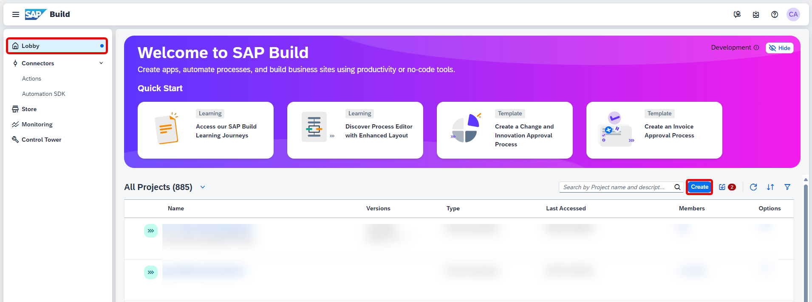
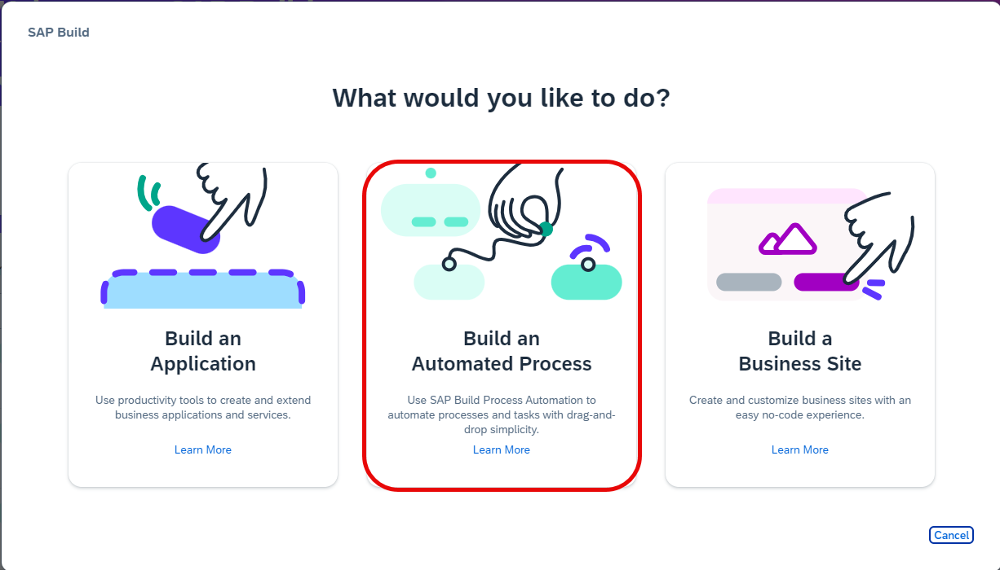
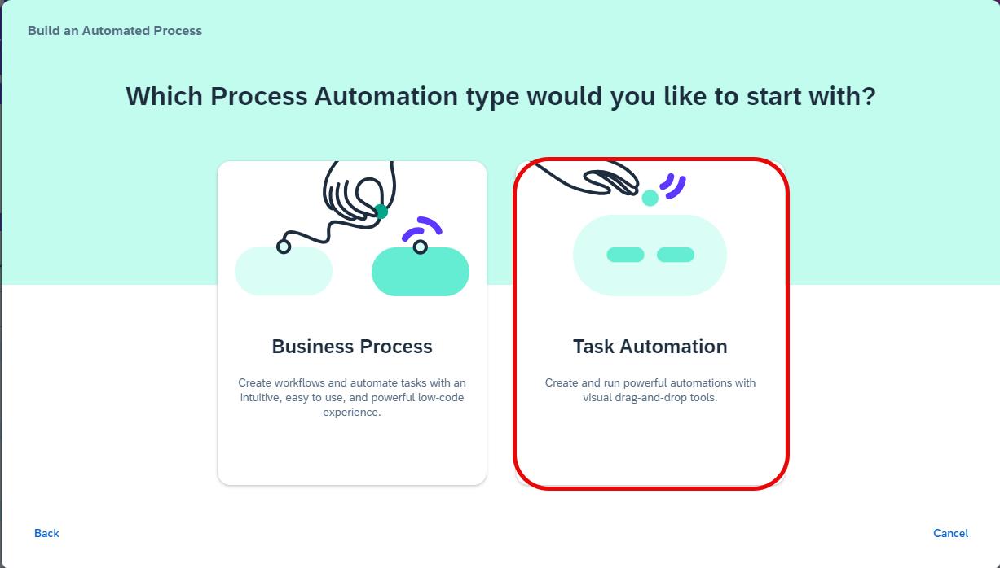
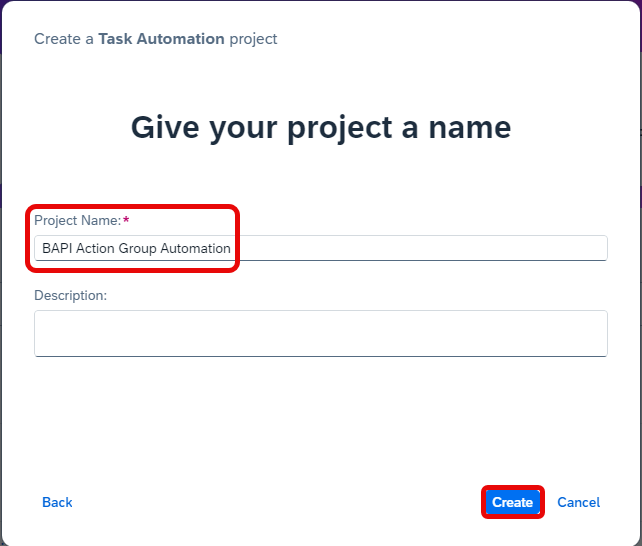
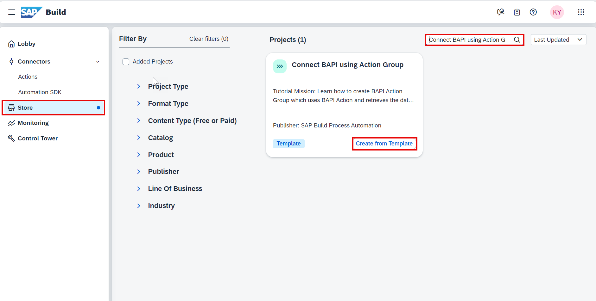
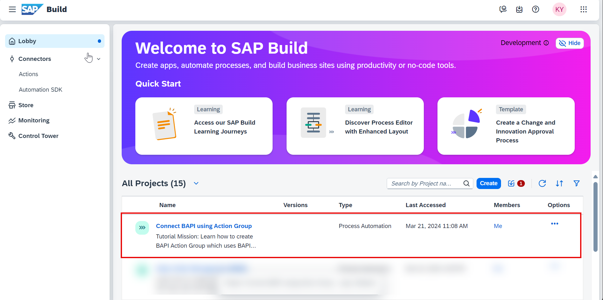

# Connect BAPI using Action Group with SAP Build Process Automation
<!-- description -->Learn how to create BAPI Action Group which uses BAPI  Action and retrieves the data from the backend.

## Prerequisites
- [Desktop agent](https://developers.sap.com/tutorials/spa-setup-desktop-3-0-agent.html) version must be equal to or greater than 2.0.30.
- Install Microsoft Visual C++ 2010 Redistributable Package x86, available on the Microsoft website.
- For using SSO connection system, SSO (SAP Single Sign-On) must be configured on your system.
- BAPI with Remote-enabled Module.

## You will learn
- How to create an Action Group
- How to add BAPI Action in Action Group
- How to configure the Action Group

## Intro

> **IMPORTANT:** Please refer to sample **Connect BAPI using Action Group** in the SAP Build Store if you face any issues while following the tutorial. To retrieve the sample, refer to **step 7** of this tutorial.

BAPI is a standard interface to the business object model in SAP products. BAPIs are the primary methods through which customer code and third-party applications interact with SAP products. An Action Group is collection of actions that once executed, return some response. BAPI is part of an Action Group whose actions help you to construct the parameters to execute the BAPI module and return the BAPI response.

In this tutorial, you will create an Action Group Artifact and connect to `BAPI RFC_GET_TABLE` and query the **MAKT-Material Master** related table.

---

### Execute BAPI module in SAP GUI system

1. Login to SAP GUI application. Run the se37 transaction.

    <!-- border -->

2. Select the `RFC_READ_TABLE` module as the Function Module.

    <!-- border -->

3. Review the Import options for this module.

    <!-- border -->

4. When you execute the module, you get the following output.

    <!-- border -->

    This is the output we expect at the end of our automation. In the next steps you will be building an automation for the same.

### Create a project

1.  In the **SAP Build** Lobby, select the **Create** button.

    <!-- border -->

2. In the popup, select **Build an Automated Process**.

    <!-- border -->

3. Select **Task Automation** option.

    <!-- border -->

4. Enter your project name and select Create.

    <!-- border -->

5. In the **Configure Agent Version** popup that appears, select your desktop agent version. Select **Confirm**.

    <!-- border -->

6. In the **Create Automation** popup, enter the name of the automation and select **Create**.

    <!-- border -->

### Create BAPI Action Group Artifact

1.	Select the **+** icon in top-left corner. Select **Create** option and choose **Action Group**.

    <!-- border -->

2. In the **Create Action Group** popup, enter the name of your Action Group and set the Connection type to **Basic**.

    <!-- border -->

    > There are three types of connections in BAPI Connection System.
    SSO: This connection type allows you to set SSO connection. `SNCName`, `MessageServer`, `InstanceNumber` and Client are commonly used for this connection type. By default, `SNCMode` is set to true for this connection type.
    Basic: This connection type allows you to set Basic connection. User, Password, `MessageServer`, `InstanceNumber` and Client are commonly used for this connection type. By default, `SNCMode` is set to false for this connection type.
    Custom: This connection type allows you to set any other advance connection. You can add connection parameters as per your requirement. By default, `SNCMode` is set to false for this connection type. However, you can change the `SNCMode` value by adding the parameter.
    In the tutorial, you will use **Basic** Connection Type .

3. Open SAP Logon Pad. Select the system, right-click the connection and select **Properties**.

    <!-- border -->

4. Copy the details for your connection from the **System Entry Properties** to **Create Action Group** popup to let the Action Group connect with your system.

    <!-- border -->

5. In the **Connection Parameter** popup, enter your Username and Password and select **Create Connection**.

    <!-- border -->

### Add BAPI Action to the Action Group

Each Action Group artifact can have multiple actions. Each Action corresponds to a single BAPI selection.

1. In the BAPI  Editor, select **Create an action** option.

    <!-- border -->

2. In the **Create BAPI Action** popup, enter the Action name and select **Create**.

    <!-- border -->

3. In the next popup,
    - Enter the BAPI module name as `RFC_READ_TABLE`.
    - Select the search icon.
    - Select the BAPI module from the search results.
    - Select **Create**.

    <!-- border -->

4. In the Input tab, select the `QUERY_TABLE` and **ROWCOUNT** fields.

    <!-- border -->

5.  Select the **OUTPUT** tab. Select the **Data** field and choose **Save**.

    <!-- border -->

6. To test your BAPI module select the **Test** tab.
    - Enter the `QUERY_TABLE` as **MAKT**.
    - Enter the **ROWCOUNT** as 10.
    - Select the **Test** option.

    <!-- border -->

7. You can see the data fetched from the given table is shown in Response Preview.

    <!-- border -->

8. Select **Release**.

    <!-- border -->

9. In the Release popup, select **Release**.

    <!-- border -->

10. After releasing the Action Group you are redirected to the **Overview** page. Here you can see the input and output data types are automatically created according to the fields we selected in previous steps.

    <!-- border -->

### Edit the Automation

1. Select the **Execute BAPI module** automation.

    <!-- border -->

2. In the Automation Editor, search for **Try** control. Drag the control to the canvas.

    <!-- border -->

3. Select the **Try** control and set the **Error to catch** parameter to **Error**.

    <!-- border -->

4. Now search for your Action Group **BAPI Action Group** and drag and drop the **RFC Read Table Action** in the Try block.

    <!-- border -->

5. Once you add the **RFC Read Table Action**, the BAPI SDK will be automatically added which can be seen in project dependencies.

    <!-- border -->

5. Select the Action Group and enter your SAP Logon connection **Username** and **Password**.

    <!-- border -->

6. For the **BAPI Input**, select **Create Custom Data**.

    <!-- border -->

7.  For the **Imports** option, select **Create Custom Data**.

    <!-- border -->

8. Under the `QUERY_TABLE` input, enter the name of the table you want to read. In this use case, we are reading **MAKT** table. Enter the number of rows you want to query in **ROWCOUNT** input parameter.

    <!-- border -->

9. The parameter **Close Connection** closes the connection to your external system automatically. Hence you don't need to close the connection explicitly.

    <!-- border -->

10. Search for the **Log Message** process and drag it below step 2 - RFC Read Table Action.

    <!-- border -->

11. Select the **Log Message** step and in the **message** field, select **BAPI Response**.

    <!-- border -->

### Test your automation

1. Select the **Test** button in top-left corner.

    <!-- border -->

2. In the **Test Automation** popup, select **Test**.

    <!-- border -->

3. In the **Test Console** you can see the number of rows mentioned in row count have been fetched and displayed.

    <!-- border -->

With this, you have successfully created a BAPI Action Group that uses BAPI Action and retrieves the data from the backend in your automation.

### Retrieve sample project from the store (Optional)

   > The entire project is available in the SAP Build Store as a sample and you can follow the below steps to retrieve the project and use it for reference.
    
1. From the SAP Build Lobby, navigate to Store.
   
2. Search for the sample project: **Connect BAPI using Action Group**.
   
3. Choose **Create from Template** to retrieve the sample and save it as a new project in your lobby.

    <!-- border -->

4. Choose **Create**.

    <!-- border -->

    Your project gets created in editable version. You may release and deploy it and run the project.
    
5. Navigate back to the lobby by clicking on the SAP logo.
  
    <!-- border -->

    You can see your project is available in the lobby.
  
    <!-- border -->