# Create and Configure Forms
<!-- description --> Add forms to start the business process, send tasks for approvals and notify business users

## Prerequisites
  - Complete [Create a Business Process](spa-create-process) tutorial

## You will learn
  - How to add interactive forms to the process
  - How to design the form with layout and input fields using drag-and-drop approach
  - How to configure the forms as the process steps

---

## Intro
Tasks are a part of any business process. **SAP Build Process Automation** helps you to create forms that are made available to the business users in their inboxes to take relevant action.

These interactive forms can be created by dragging and dropping the text elements and input fields into the canvas. Once a form has been created, it can then be used as a process trigger to start the process or added as an approval step in the business process.

Let us now explore how these different forms are created. In the steps below, you will create three forms that will be used to:

- Start the approval process.
- Send a task to the inbox of the business user for approval.
- Notify the requester for approval or rejection.

---

### Create a form to trigger a business process

First, you will create a trigger form that will start the business process. For that, you have to open your process in the process builder and add a new form.

1. Choose **+** in the Trigger settings, then **Forms** and **New Form**.

    <!-- border -->

2. In the pop-up window for new form:
    - Enter the Name: **Order Processing Form**
    - Enter a Description: **Form to collect order details**
    - Choose **Create**.

    <!-- border -->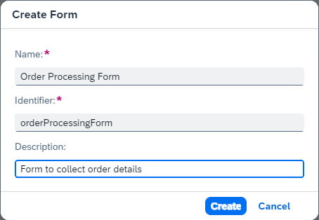

    The form will be added as the **Start Trigger**.

3. To design the form, choose the three dots and select **Open Editor**.

    <!-- border -->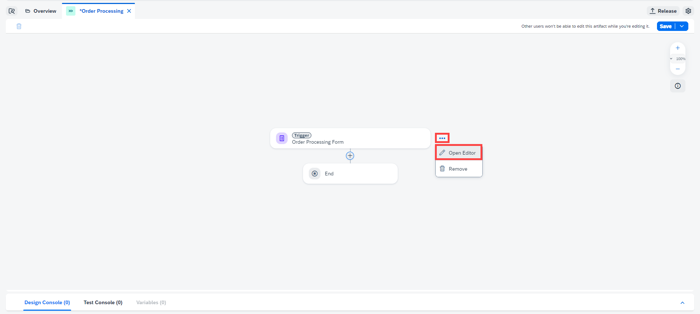

4. You will now design the **Form** with available layout and input fields options. First, drag-and-drop the form layout fields and enter the given names and field settings as below:

    |  **Form Fields**    | **Field Settings with Label**
    |  :------------- | :-------------
    |  Headline 1         | Order Approval Request Form
    |  Paragraph          |Please provide the necessary information of your order and submit for approvals.

    <!-- border -->

5. Now, add **Input Fields**, enter the labels and select the **Required** checkbox.

    |  **Form Fields**   |  **Field Settings with Label**
    |  :------------- | :-------------
    | Text | Customer Name
    | Text | Order Number
    | Number | Order Amount
    | Date | Order Date
    | Text | Shipping Country
    | Date | Expected Delivery Date

    <!-- border -->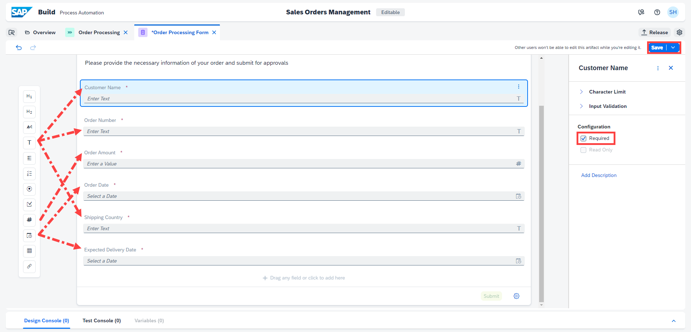

5. The trigger form is ready. Save the form using the **Save** button on the top-right corner of the screen.

    <!-- border -->

    Now, you will design the process with more activities related to approval of the sales order.

### Create an approval form

The approval form will be used to get faster and easier approvals from the business users, to take informed decisions, and get rid of sending emails. These approval forms could be about approving or rejecting sales orders, invoices, onboarding, IT requests, etc. The forms are then converted into tasks in an automated workflow which will appear in the **My Inbox** of the user.

You can create these different forms using the **Form Builder** embedded in the process builder using different form field options. You can design and modify them without any coding.   

1. Go to the **Order Processing** Project.

    <!-- border -->

2. Select **+** next to the Trigger and add a **New Approval Form** to the process.

    <!-- border -->

3. In the **Create Approval** dialog box, do the following:
    - In the Name field enter: **Approval Form**
    - In the Description field enter: **Form to approve or reject the sales order**
    - Choose **Create**.

    <!-- border -->

4. Choose **Open Editor** of the Approval Form.

    <!-- border -->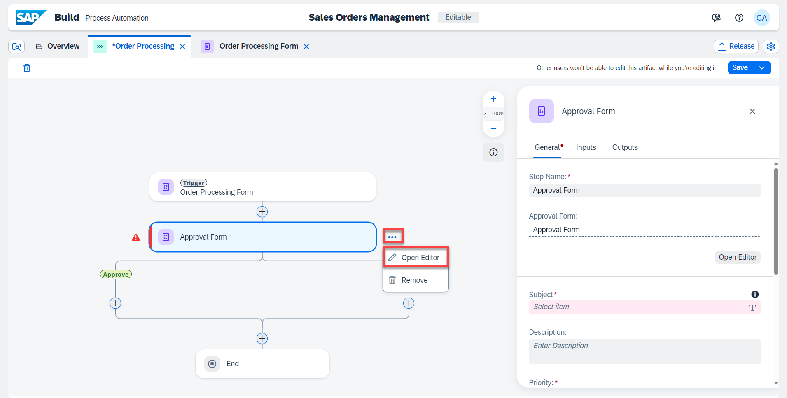

5. Design the **Approval Form** in the form builder by dragging-and-dropping fields into the form editor and configuring respective field settings.

    |  **Form Fields**    | **Field Settings with Label**
    |  :------------- | :-------------
    | Headline 1 | Approve Sales Order
    | Paragraph  | A new order has been received. Please review and confirm whether the requirements can be met or not.
    | Paragraph  | Sales Order Details:

    <!-- border -->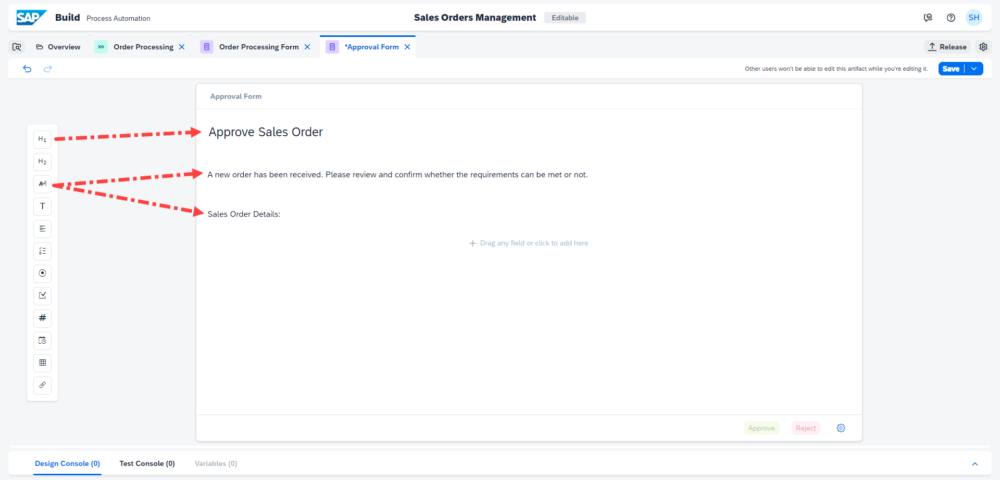

6. Add **Input Fields**, enter the labels and select the **Read Only** checkbox.

    |  **Form Fields**   | **Field Settings with Label**
    |  :------------- | :-------------
    | Text | Customer Name
    | Text | Order Number
    | Number | Order Amount
    | Date | Order Delivery Date

    <!-- border -->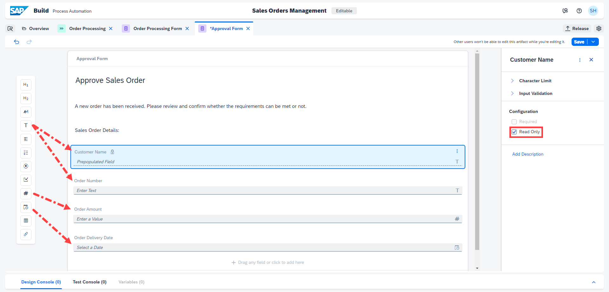

7. Add **Input Fields** and enter **only** the labels.

    |  **Form Fields** | **Field Settings with Label**
    |  :------------- | :-------------
    | Paragraph | Supplier Acknowledgment
    | Checkbox | I acknowledge that we have received your order and will process it based on the availability
    | Text Area | Message to buyer:

    <!-- border -->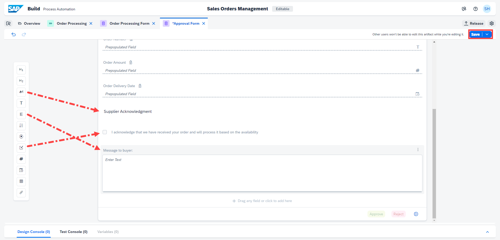

8.	**Save** the form.

### Configure an approval form

1.	Go back to the process builder to map the process content with the form input fields. Select the **Approval Form**.

    <!-- border -->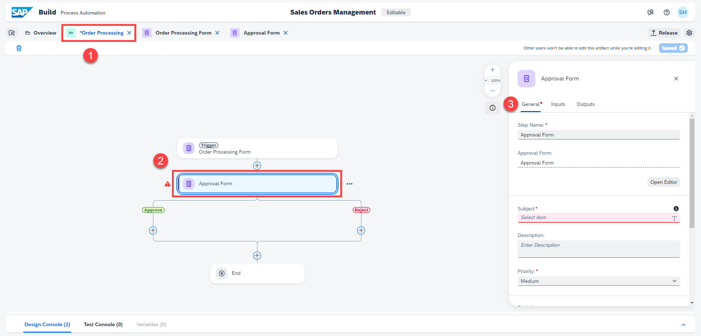

2. Configure the **General** information section.  

3. In the **Subject** section:
    - Enter **Review and approve order**
    - Select **Order Number** from Order Processing Form (Trigger)
    - Enter **from**
    - Select **Customer Name** from Order Processing Form (Trigger)
    - Enter **company**.

    <!-- border -->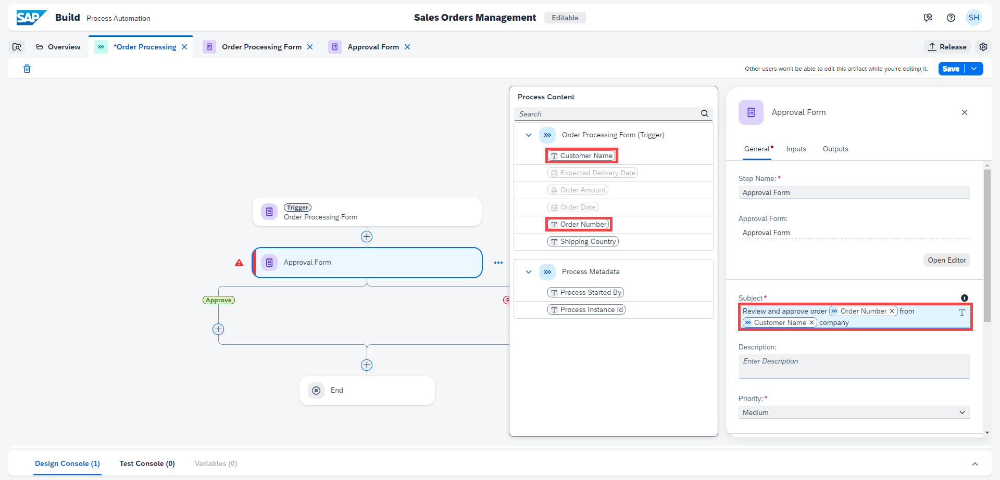

    > The Subject configuration of the form will be shown when this task appears in the `MyInbox`.

4. In the **Recipients** section, under **Users** select **Process Started By** from Process Metadata.

    <!-- border -->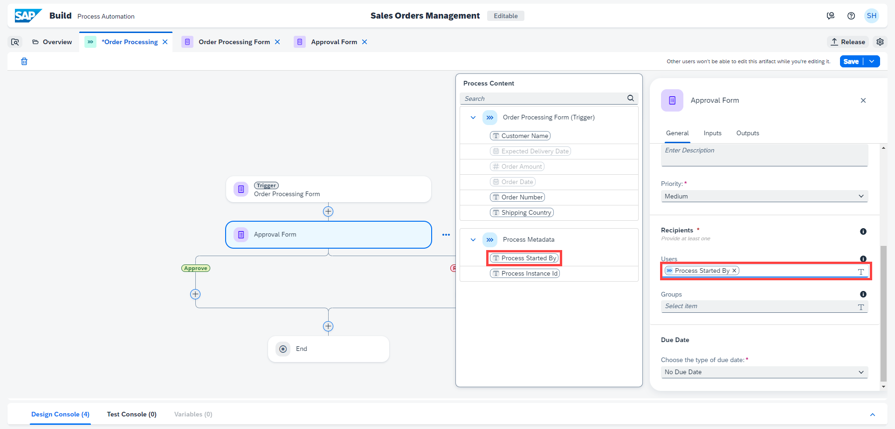

    > This form will appear as the task in the `MyInbox` of the given Recipients to take action.

5. In the **Due Date** section:
    - Select **Static Duration** as **type of due date**
    - Enter **2 Days** as the duration.

    > ### What is going on?
    > This means that the due date to approve or reject the form will be set to 2 days.

    <!-- border -->

    As the task appears in the `MyInbox`, there will be duration information shown to the recipients like Overdue if the task was not completed in 2 days, or within 1 day if the task is supposed to be completed in 1 day etc.

6.	Similarly, go to the **Inputs** tab and map the different input fields, which were marked as read-only in the approval form, by selecting the respective **Process Content** entry.

    | **Form Input Fields**| **Process Content Entry**
    |  :------------- | :-------------
    | Customer Name | Customer Name
    | Order Delivery Date |  Expected Delivery Date
    | Order Amount | Order Amount
    | Order Number | Order Number

    <!-- border -->

    > The process content will highlight the entries with the same data type of the input field. For example: if the input field is of Number type then Process Content will show only number-type entries.

7. **Save** the process. The process should look like the following.

    <!-- border -->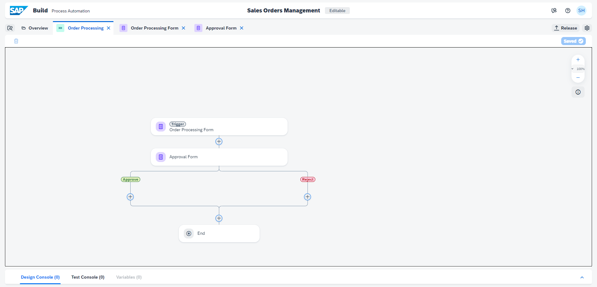

    Note that there is an error in the Approval Form, which will be addressed in the subsequent steps.

### Create and configure form for notifications

After the user approves or rejects the request, the next step is to create notifications. These notifications will inform the requester whether their sales order is approved or rejected, and will be sent either via an email or through the form. They will appear in the inbox of the requester as a task.

1. To add a confirmation to the process, select **+** next to the Approve action. Choose Forms and **New Form**.

    <!-- border -->

2. In the **Create Form** dialog box, do the following:
    - In the Name field, enter **Order Confirmation Form**
    - In the Description field, enter **Notification form to inform whether the sales order is approved by the supplier**
    - Choose **Create**.

    <!-- border -->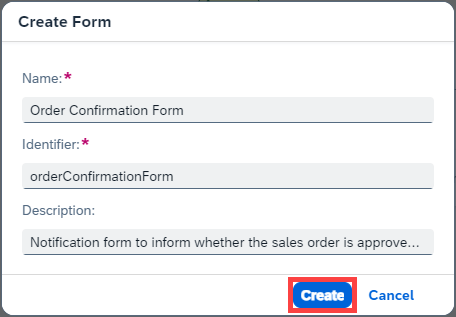

3. Choose **Open Editor** of the form.

    <!-- border -->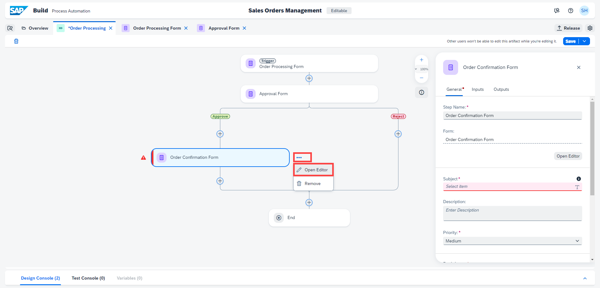

4. In the form builder, design the form to notify the requester of the order confirmation. Add the following **Layout Fields**:

    | **Form Fields** | **Field Settings with Label**
    |  :------------- | :-------------
    | Headline 1 | Order Confirmation
    | Paragraph  |Your order has been received and accepted for delivery. We will send you the details as soon as the order is shipped. You can find the details of your order below, please review and verify your request:
    | Text Area  | Message from the supplier:
    | Paragraph  | Your Sale's Order Details:

    <!-- border -->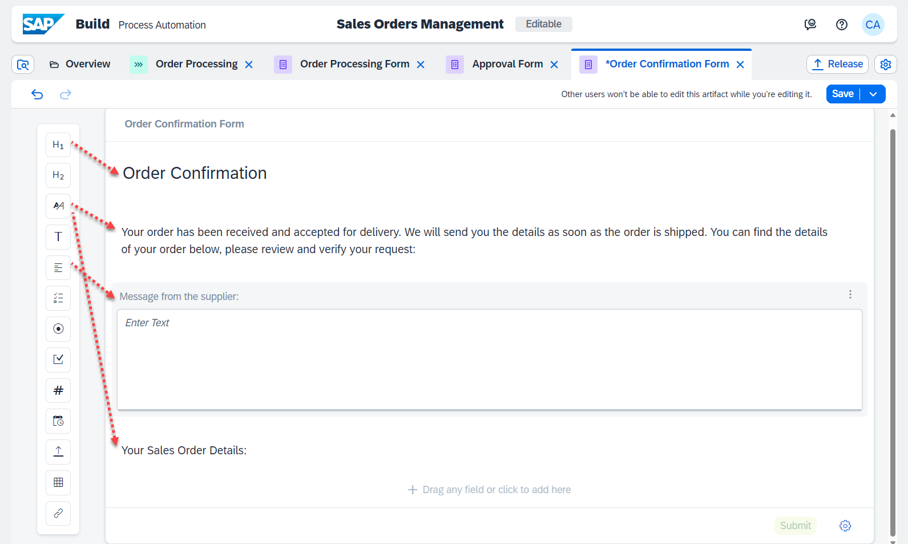

5. Add below **Input Fields**, enter the labels and select the **Read Only** checkbox.

    | Form Fields| Field Settings with Label
    |  :------------- | :-------------
    | Text | Order Number
    | Number | Order Amount
    | Date | Expected Delivery Date

    <!-- border -->

6.	**Save** the form.

7.	Go back to the process builder to map the process content with the form input fields.

8. Select the **Order Confirmation** form to configure the **General** information section.

9. In the **Subject** box:
    - Enter **Your order**
    - Select **Order Number** from Order Processing Form
    - Enter **has been successfully received**

10. In the **Users** section, under **Recipients**, select **Process Started By** from Process Metadata.

    <!-- border -->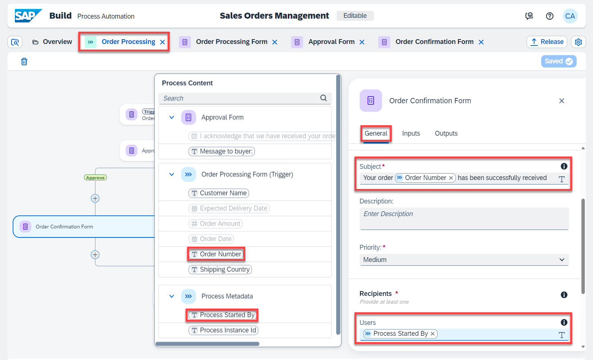

11. Go to the **Inputs** section and map the different input fields, which were marked as read-only, with the respective process content entries.

    | **Form Input Fields**| **Process Content Entry**
    |  :------------- | :-------------
    | Order Number | Order Number
    | Message from the supplier | Message to buyer
    | Expected Delivery Date | Expected Delivery Date
    | Order Amount | Order Amount

    <!-- border -->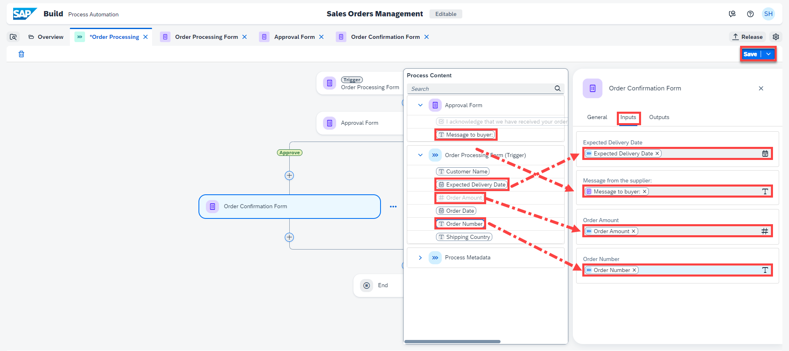

    > The process content will highlight the entries with same data type of the input field. For example: if the input field is of Number type then Process Content will show only number-type entries.

12. **Save** the process. With this you completed designing and configuring the notification form.

    > You can copy the same form to create another form to send a rejection notification to the requester. If copy is not available then create the form in the same way and modify the texts wherever relevant as shown below. 

13. To add the new rejection form, you will use the **Duplicate** feature. Select the **Overview**.

    > **Duplicate** feature is used to copy artifacts within the Business Process whereas **Copy** feature is used to copy artifacts across the business processes.

    <!-- border -->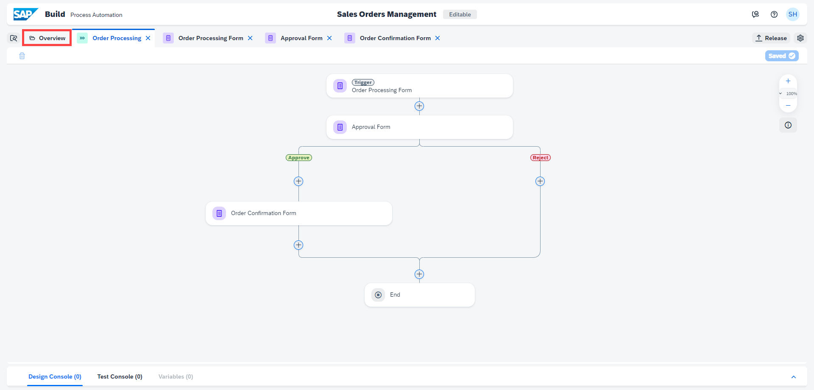

14. In the **Overview** screen:
    - Find **Order Confirmation Form** under the Artifacts section and select **...**
    - Choose **Duplicate**

    <!-- border -->

15. In the duplicate artifact pop-up window change the name to **Order Rejection Form** and select **Duplicate**.

    <!-- border -->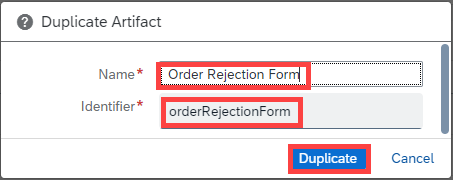

16. The form is automatically opened in the form builder. Change the order rejection form in the form builder to reflect the data for rejection case.

    | **Form Fields** | **Field Settings with Label**
    |  :------------- | :-------------
    | Headline 1 | Order Rejection
    | Paragraph  | We are sorry to inform you that your order cannot be accepted. Any inconvenience caused due to the refusal of the order is regretted. You can find the reason of the rejection and the details of your order below, please confirm the request:

17. For the below **Input Field** enter the label:

    | **Form Fields** | **Field Settings with Label**
    |  :------------- | :-------------
    | Paragraph | Please press the SUBMIT button to acknowledge the order status.

    <!-- border -->

18. **Save** the form.

19. Go back to the process builder and add the order rejection notification form to the process. Select **Approval Form** and choose **+** option for the **Reject**. Choose **Forms** and select **Order Rejection Form**.

    <!-- border -->

20.	Configure the order rejection form. In the General section configure in the **Subject** box:
    - Enter **Your order**
    - Select **Order Number** from the Order Processing Form
    - Enter **is rejected by the supplier**

21. Under Priority select **High**.

22. Under Recipients select **Process Started By**.

    <!-- border -->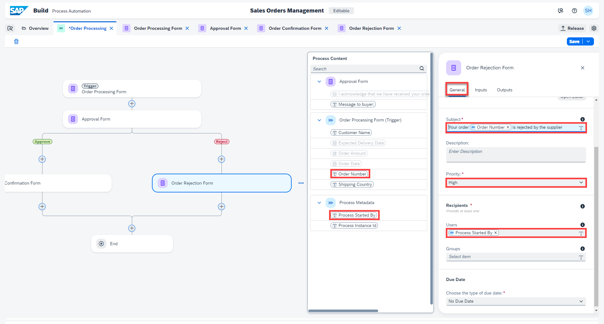

21. Configure the **Inputs** section.

    |  **Form Input Fields**  | **Process Content Entry**
    |  :------------- | :-------------
    | Expected Delivery Date | Expected Delivery Date
    | Message from the supplier | Message to buyer
    | Order Amount | Order Amount
    | Order Number | Order Number

    <!-- border -->

22.	Finally, connect the outgoing flow of the order rejection form to the **End** activity.

    <!-- border -->

23. **Save** your work.

    With this you have completed the process design of your business process. You have experienced building a process in a completely no-code environment and with no technical know-how. You used the process builder to create a one-step approval process with trigger form, approval form and notification forms.

---
