# Create an API Trigger for the Process
<!-- description --> Create an API trigger for the business process.

## Prerequisites
 - Acquire the template - Sales Order Management(MI01) by referring to tutorial [Acquire a Template Project From the Store](spa-acquire-businessprocess-store) **OR**
 - Complete the mission [Build Your First Business Process with SAP Build Process Automation](mission.sap-process-automation)

## You will learn
  - How to create an API trigger to start an instance of a business process from any service, like SAP Build Apps

## Intro
A business process is started by defining a trigger, an event that indicates to your SAP Build Process Automation tenant to start a process instance.

Process triggers can be a form, such as a request form, an API call, where an external system starts the process or an Event.

You can start an instance of your process using an API call, with the inputs for the call configured from the process builder. These inputs can then be used as input fields in your process.

You may also start the instance with an event trigger which on-boards and listens to back-end events emitted from an external source system and reacts to such events by triggering artifacts such as processes and automations.

### Create a data type

A data type is an artifact describing a data structure that can be used as an input and/or an output parameter in automations or processes.
You have two options to create the fields in data type. You can either import an excel file or define the fields manually.

Once you have acquired the Template Project from the Store, your process looks as below.
    <!-- border -->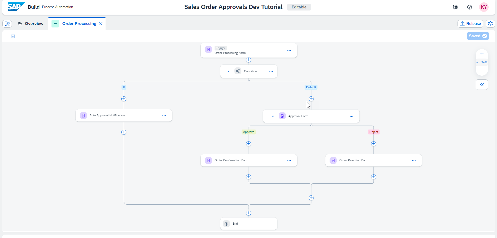

[OPTION BEGIN [Import Excel File]]

In this option, you will be importing an excel file to create the data type. Based on the values present in the excel, the type of field is determined automatically and the fields are created accordingly. For example `orderAmount` is maintained as 19000, hence the type of the field `orderAmount` is determined as Number.

1.  Download [add link](add link) excel file for Sales Order datatype.

    <!-- border -->

2.  Navigate to your project. Click on the **Project Content** icon on the top left corner > **+** > **Create** > **Data Type** .

    <!-- border -->

3.  Name the data type **Sales Order**.

    <!-- border -->

4. Click on **Import Excel File**.

    <!-- border -->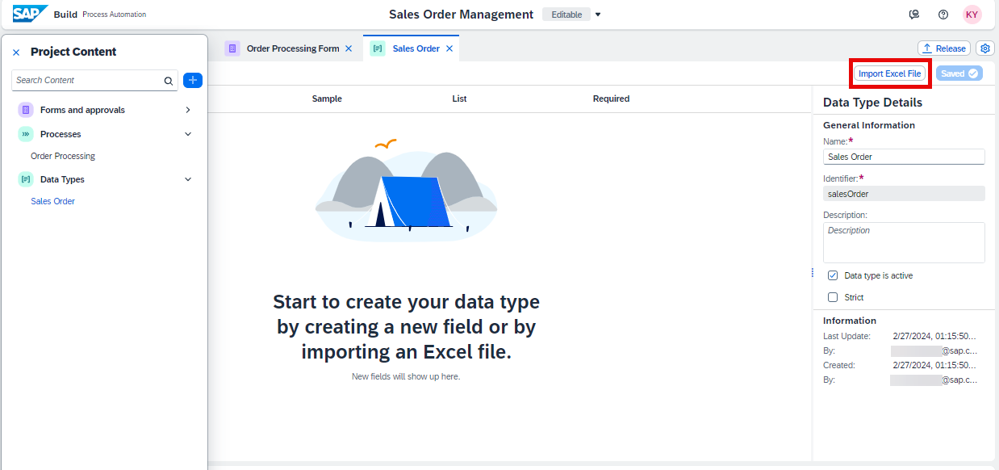

5. Click on **Browse** to select the excel file.

    <!-- border -->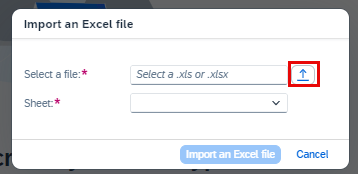

6. Select **Import an Excel File**.

    <!-- border -->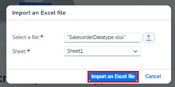

    Your final data type looks as below.

    <!-- border -->

[OPTION END]

[OPTION BEGIN [Define Fields Manually]]

In this option you will be defining each field with field name and type of field manually.

1.  Click on the **Project Content** icon on the top left corner > **+** > **Create** > **Data Type**.

    <!-- border -->

2.  Name the data type **Sales Order**.

    <!-- border -->

3. Click on **New Field** to add new fields to the data type **Sales Order**.

    <!-- border -->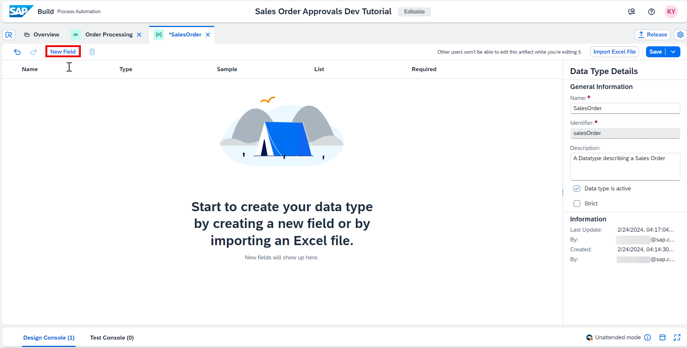

4.  Repeat the process to add all the fields of the type as shown below.

    |  Field Name   | Type
    |  :------------- | :-------------
    |  `customerName`     | String |
    |  `orderNumber`     | String |
    |  `orderAmount`     | Number |
    |  `orderDate`    | Date|
    |  `shippingCountry`    | String|
    |  `expectedDeliveryDate`  | Date|

    >**IMPORTANT:** The spelling and casing of the fields, as well as any extra spaces, is crucial because the API to trigger the process will require the fields exactly as written.

    Your final data type looks as below. Click **Save** to save the data type.

    <!-- border -->

[OPTION END] 

### Create an API trigger for the process

1. Open the process **Order Processing**.

    <!-- border -->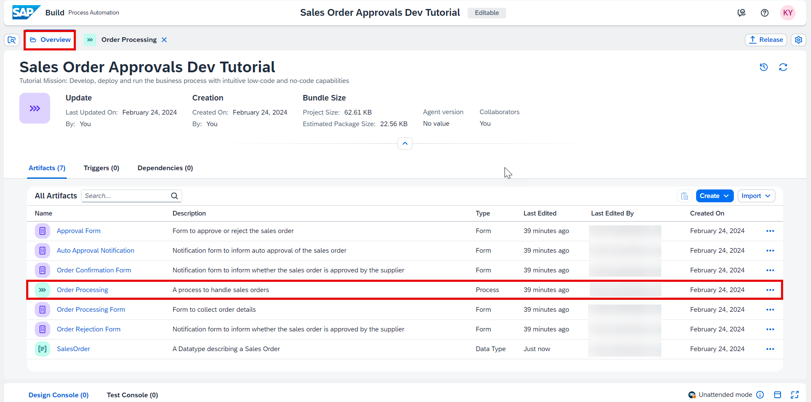

2. From the **Editable** version of the project, choose the three dots of the **Order Processing Form** and select **Remove** to delete the form.

    <!-- border -->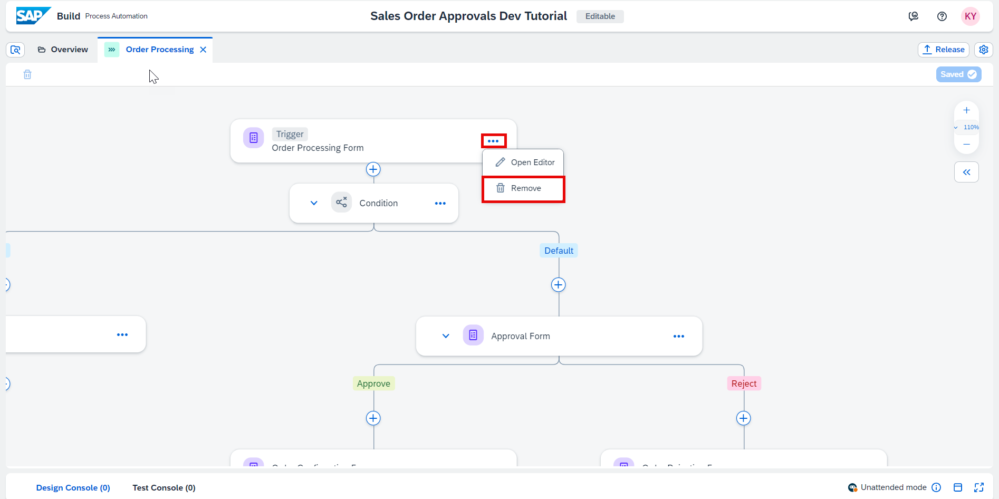

    A warning message will inform you that the related bindings will be removed. Choose **OK**.

    <!-- border -->

3. **Save** the project.

4.  To add an API trigger for the process, click on the **Add a Trigger** > **Call an API**

    >Since the bindings are lost, all the artifacts are in error state. Once the API trigger is created, the bindings will be updated.  

    <!-- border -->
    <!-- border -->

5.  Enter the name of the trigger as **Sales Order Trigger**. Choose **Create**.

    <!-- border -->

### Create inputs for the process

1. Open the **Process Details** by clicking on the Canvas.
    <!-- border -->

2. Choose **Variables**. Then choose **Configure** to configure process inputs.
    <!-- border -->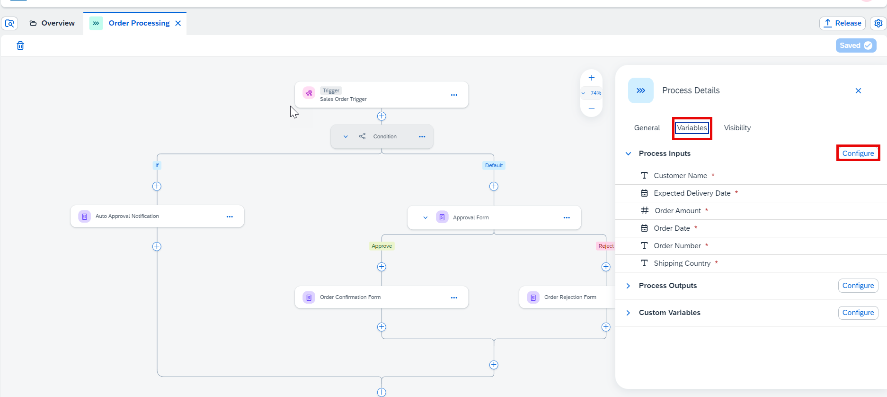

3. Delete the existing inputs by clicking on the delete button. 
    >The existing inputs were configured from the **Order Processing Form**. Since we have removed it, we will need to configure new input parameters for the **Sales Order Trigger**.

    <!-- border -->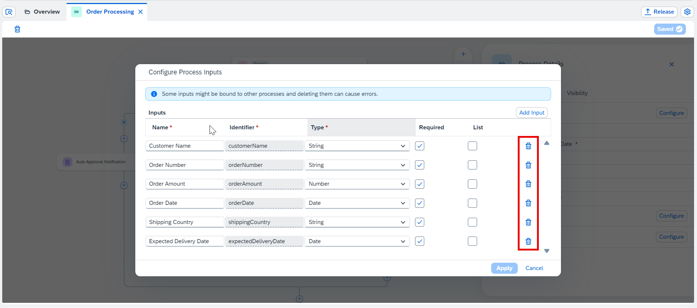

4. Choose **Add Input** to add parameters.
    Add the following parameter:

    |  **Name**    | **Type**
    |  :------------- | :-------------
    |  `salesOrderDetails`       | `SalesOrder`

   <!-- border -->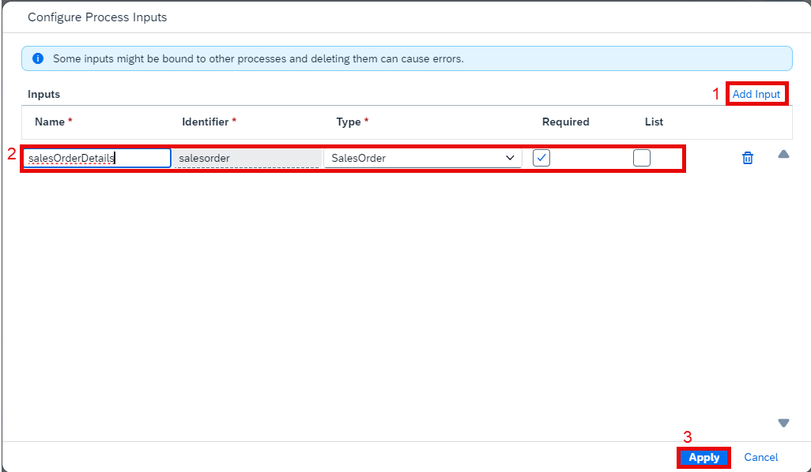

5. Once the trigger is created successfully, you can view the trigger under the **Triggers**  section in the **Overview** page.

    <!-- border -->  

    >You can edit, deactivate, or delete the API trigger properties from Triggers tab in the respective process builder overview.
    >
    >- Deactivate means that while the trigger exists in design-time, you cannot consume it in runtime.
    >
    >- Delete will permanently delete the trigger from design-time, but for already deployed processes the trigger will still exist at runtime.
    >
    >In general, any changes in the trigger will be effective only when the process is released and deployed.
    >
    >**Note:** All the API triggers that are created in that project will be shown.

### Modify the process

Since you have created an API trigger, the bindings were lost as mentioned in **Step 1**. Let's adjust the process with the new inputs configured for the API trigger.

1. Choose the condition artifact and click on **Open Condition Editor**.

    <!-- border -->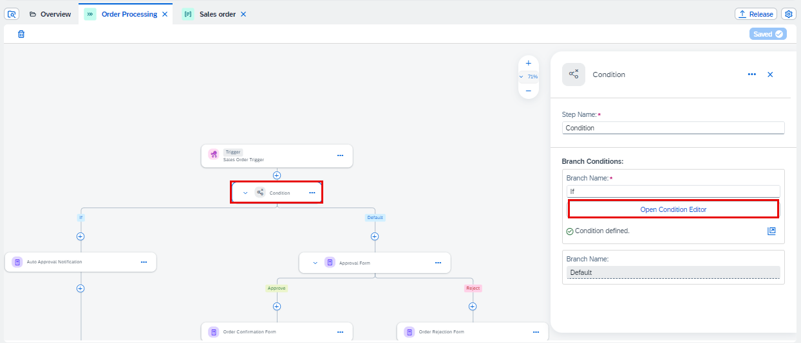

2. Choose **Approval Form** to adjust the bindings.

    Modify the **General** section. Since the process would be started through an API, remove the Users **Process Started by** and enter your `EmailID` that was configured for the tenant.

    <!-- border -->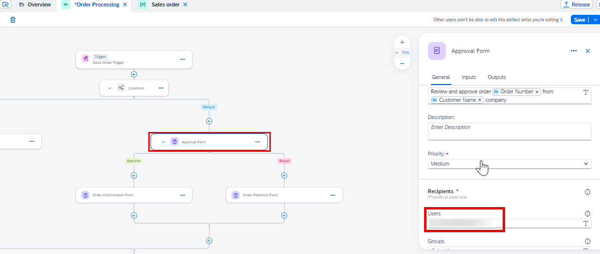

3. Modify the **Inputs** section.

    <!-- border -->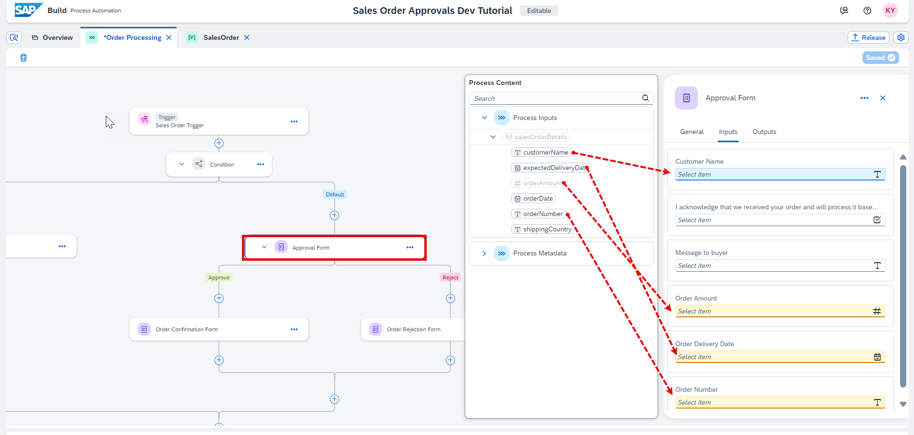

4. Choose **Order Confirmation Form** to adjust the bindings.

    Modify the **General** section. Since the process would be started through an API, remove the Users **Process Started by** and enter your `EmailID` that was configured for the tenant.

    <!-- border -->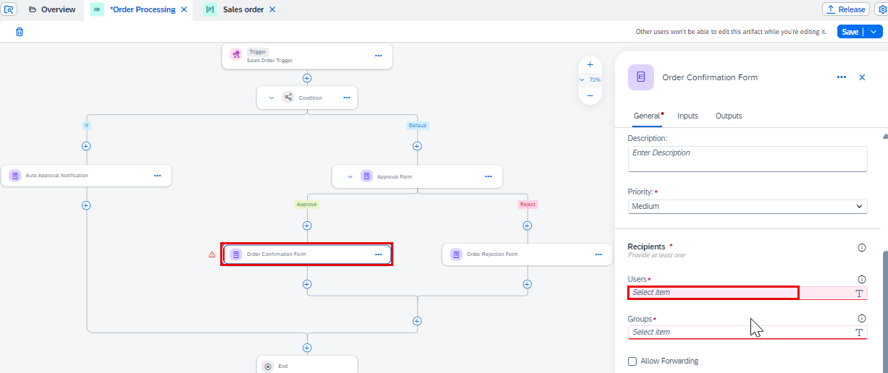

5. Modify the **Inputs** section.

    <!-- border -->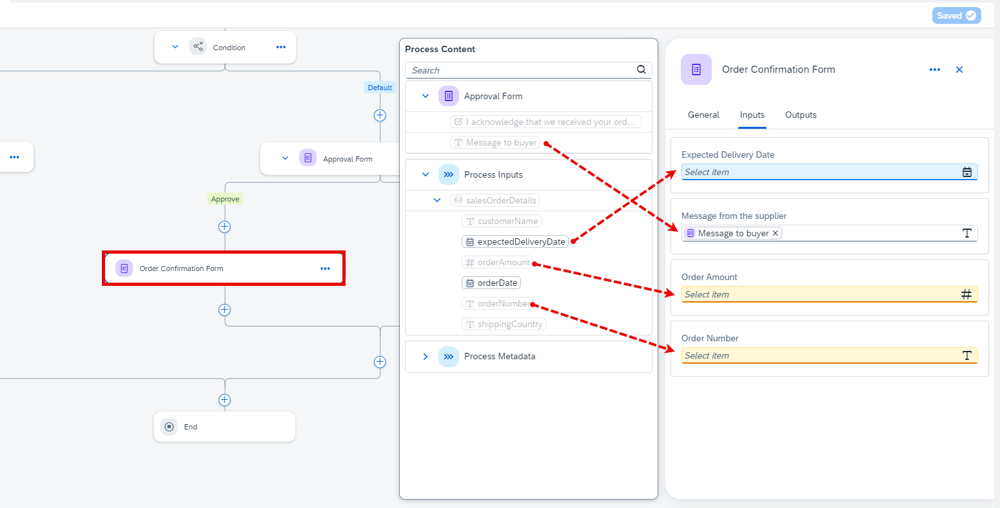

6. Choose **Order Rejection Notification Form** to adjust the bindings.

    Modify the **General** Section. Since the process would be started through an API, remove the Users **Process Stared by** and enter your `EmailID` that was configured for the tenant.

    <!-- border -->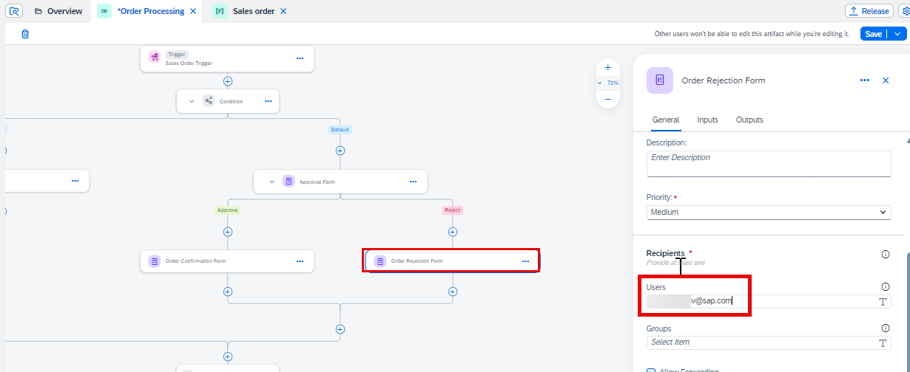

7. Modify **Inputs** section.

    <!-- border -->

8. Choose **Auto Approval Notification Form** to adjust the bindings.

    Modify the **General** section. Since the process would be started through an API, remove the Users **Process Started by** and enter your `EmailID` that was configured for the tenant.
    <!-- border -->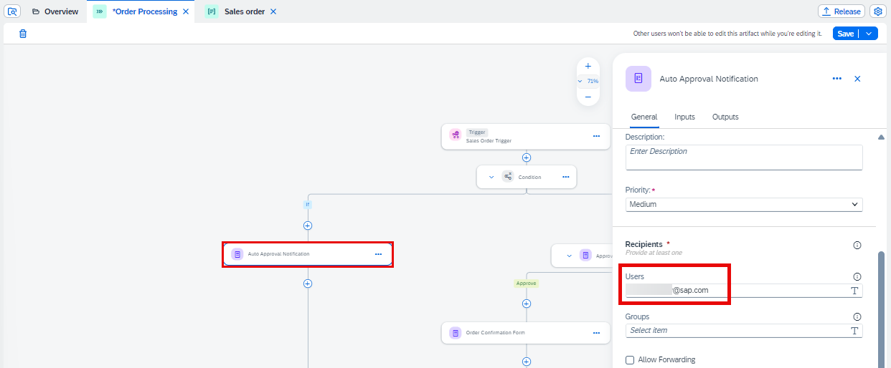

9. Modify the **Inputs** section.

    <!-- border -->

10. **Save** your project.

### Release and deploy the process with an API trigger

1. **Release** the project.

    <!-- border -->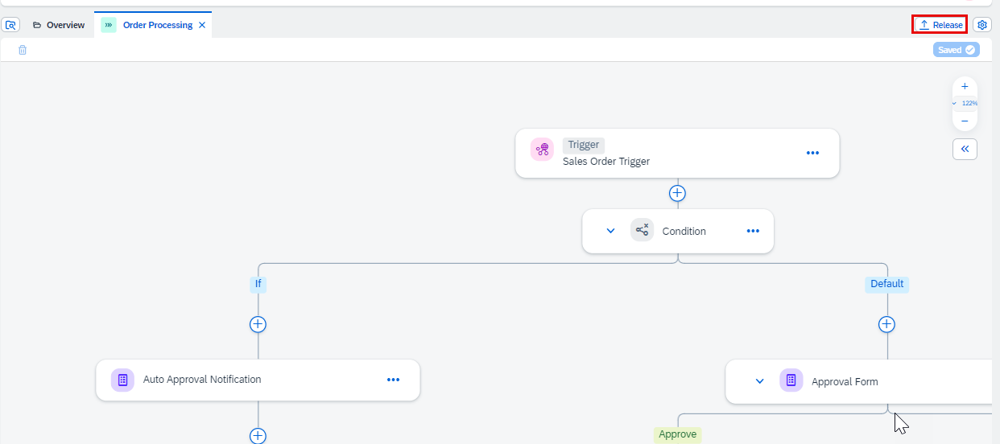

    > **CAUTION:** If you have acquired the Sales Order Approvals template from the Store, you will need to delete the forms and processes that are above the quota limit and not being actively used in the tutorial to successfully release the Process with an API trigger.

2. After successful release of the project, **deploy** the project.

    <!-- border -->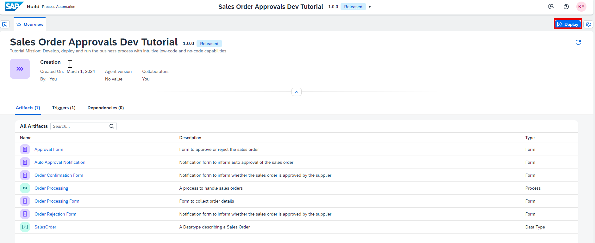

    You have successfully released and deployed the process and it is ready to consume via APIs.

---
