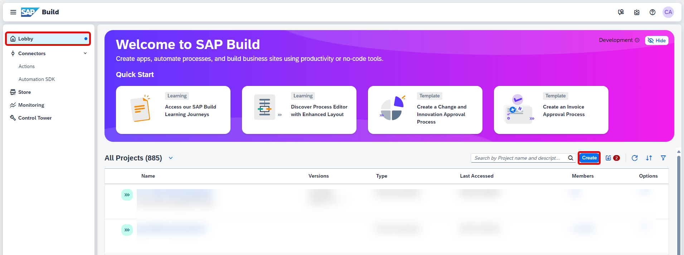
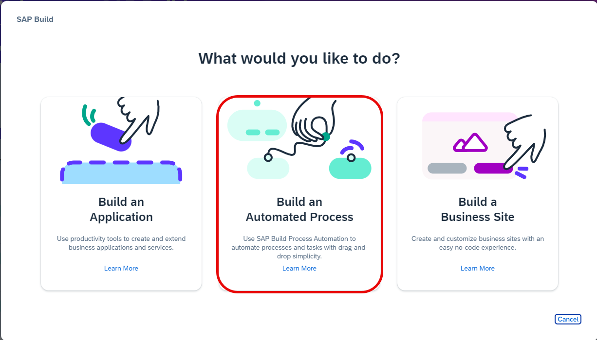
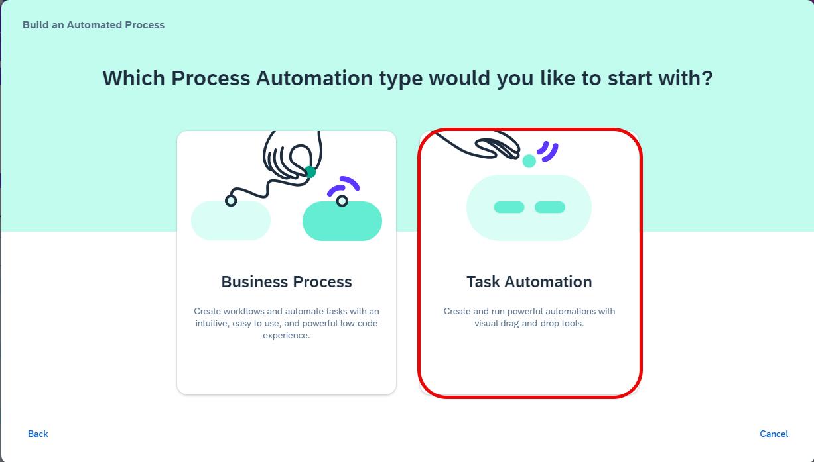

# Automate Windows Calculator Application Using the Recorder
<!-- description --> Automate computations in the windows calculator application with manual capture mode and capture on hover mode

## Prerequisites
 - A [SAP BTP Free Tier Account](spa-subscribe-booster) with SAP Build Process Automation booster
 - Install and set up the [Desktop Agent 3](spa-setup-desktop-3-0-agent) to run the automation
 - Basic understanding of how to record applications in SAP Build Process Automation

## You will learn
  - How to use the Recorder with the desktop calculator application
  - How to use Manual Capture mode
  - How to use Capture on Hover mode
  - How to automate the application
  

## Intro
The Recorder allows you to record desktop applications. It enables users to speed up the bot design process. Using the Recorder, actions on the provider application can be recorded, metadata of the screen can be captured and the artifacts can be exported to SAP Build Process Automation. In this tutorial, you will learn the difference between Manual Capture and Capture on Hover mode.

---

### Open the application

Open the calculator application on your desktop.

<!-- border -->

### Create your project

You will create a new project in **SAP Build Process Automation** application.

1. Navigate to **SAP Build** application and create a project by choosing **Create**.

    <!-- border -->

2. Select **Build an Automated Process**.

    <!-- border -->

3. Select **Task Automation**.

    <!-- border -->

4. In the **Create a Task Automation project** window, please give the project the name: **Create Computations** and the description: **Automate computation creation in the desktop calculator** and choose **Create**.

    <!-- border -->

5. Once the project is created, a new tab will open. You will need to configure your agent version. Select the version of the agent installed on your machine and choose **Confirm**.

    <!-- border -->

6. A pop-up window asking you to create an automation will appear, please choose **Cancel**.

    <!-- border -->

    > ### What is going on?
    > As you will be using the recorder feature, you do not need to create an automation but an application.

    The next step would be to create your application within your project.

### Create and capture your application

1. In the **Overview** tab of your **Create Computations** project, choose **Create**, then choose **Application**.

    <!-- border -->

2. In the **Create Application** window, name your application: **Create Computations** and choose **Create**.

    <!-- border -->

3. From the list of open applications, select **Calculator** application and choose **Next**.

    > ### What is going on?
    > **SAP Build Process Automation** starts detecting the applications and their screens currently running on your local machine. When it's done, you'll see a list of screens in the picker panel on the left.
 
    <!-- border -->

    > You have the option to select either **Recorder** type or **Manual Capture** type. This tutorial will show you how to use the **Recorder**.

4. Select **Recorder** as type and choose **Record**.

    <!-- border -->

    > Please note that the technology that you will be recording is **UI Automation**.

5. You will notice 2 pop-ups for recording in progress and SAP Intelligent RPA Recorder.

    <!-- border -->  

### Record your application - Part 1

> The Recorder records the steps you perform across the screens of an application.

1. Click the **Record** <!-- border --> button to start recording in the recorder widget.

2. Perform a simple calculation by adding `10` and `5` to get result `15`. Click `10`, `+`, `5` and `=`. You will notice that the steps are getting recorded in the recorder.

3. Click the result `15` in the Calculator so that it gets recorded too. You will later use this result in the automation.

    <!-- border -->

### Record your application - Part 2

You will now convert the time and record the results. To do so you need to select the panel toggle menu on the left. You need to change the capture mode from automatic to Capture on Hover.

> ### What is going on? 
> The Manual Capture mode takes a screenshot and captures meta-data of the application being recorded. However, this is not possible for some UI components such as sub-menus in a windows application or web-applications, which become visible only when they are clicked because these UI elements will be hidden when user clicks on manual capture button. In such cases, you can still capture the items such as menu, submenu or any hover control using the Capture on Hover mode. This mode enables the capture on hover + `Ctrl` key press.

1. Select **Capture on Hover** mode.

    <!-- border -->

2. In the Calculator application, select the **Open Navigation** icon <!-- border -->

3. To capture on hover, you need to hover the mouse over the screen which needs to be captured and then hold the `Ctrl` key till the capture begins. 

    The application screen being captured will be highlighted when the capture begins, then you may release the `Ctrl` key to avoid duplicate captures.

    > The recorder will record the change in DOM and a new screen appears in the recorder widget.

4. Select **Time**.

    <!-- border -->

    You need to capture the new screen. To do so you will need to switch to manual capture mode.

5. Select **Manual Capture Mode**.

    <!-- border -->

6. To record the new screen, click the **New Capture** button <!-- border -->

7. Wait until the recorder has recorded all the elements of the screen.

    <!-- border -->

    You need to convert **Hours** to **Seconds**. To do so you will have to select the **Hours** dropdown and select **Seconds**. Since you will be capturing a dropdown you need to change the capture mode to Capture on Hover.

8. Select **Capture on Hover** mode.

    <!-- border -->

9. Click the **Hours** dropdown.

10. Hover the mouse over the screen and hold `Ctrl` key till the capture begins.

    The hovered area is highlighted with a red border and then starts capturing the highlighted area.

    > The recorder will record the new screen with the dropdown elements and a new screen appears in the recorder widget.

11. Select **Seconds**.

    <!-- border -->

    The Calculator shows **Seconds** and **Minutes**. You need to capture the new screen. To do so you will need to switch to Manual Capture mode.

12. Select **Manual Capture Mode**.

    <!-- border -->

13. Now click the **New Capture** <!-- border --> button to record the new screen.

14. Wait until the recorder has recorded all the elements of the screen.

    <!-- border -->

15. Select `0` value for **Minutes** and then, type `10`.

16. Select the resultant value `600` in **Seconds**. You will use this value later in automation. You will see the following steps added to the recorder widget.

    <!-- border -->

### Export your recording

1. Choose <!-- border --> button to stop the recording.

2. Click **Export** to move the recording to **SAP Build Process Automation**.

    <!-- border -->

3. Reset and close the Calculator application.

### Review your automation

> Once all the artifacts are moved to **SAP Build Process Automation**, the automation can be executed to replay the recorded steps. It can also be modified and then executed.

You can see that a **Create Computations Automation** was created.

<!-- border -->

As well as a **Create Computations** application.

<!-- border -->

1. Open the **Create Computations Automation**. 

2. **Get Calculator Results**

    - Double click on the **Calculator** screen.

    - On Capture 1, click on the **Calculator Results** element.

    - Search for a **Get Element** activity and drag and drop the activity on the element. 

    - Close the **Calculator** screen.

    - Choose **Save**.

    <!-- border -->

    > The activity will be added at the bottom of the automation and you will need to position it accordingly.

    - Now drag the **Get Element Calculator Results** activity and drop it below step 9 in the automation.

    - Select the activity and make the following change to the activity properties:

        - Output Parameters : **addition**

    <!-- border -->

    - Search for a **Log Message** activity and drag and drop it below the **Get Element Calculator Results** activity to display the result. 

    - Set the Input Parameter **message** as **addition**.

    - Choose **Save**.

    <!-- border -->

3. **Get Conversion Result**

    - Double click on the **Calculator** screen.

    - On Capture 5, click on the **Value 1** element.

    - Search for a **Get Element** activity and drag and drop the activity on the element to fetch the converted hours to seconds.

    - Close the **Calculator** screen.

    - Choose **Save**.

    <!-- border -->

    > The activity will be added at the bottom of the automation and you will need to position it accordingly.

    - Now drag the **Get Element Value 1** activity and drop it below step 27 in the automation.

    - Select the activity and make the following changes to the activity properties:

        - Step Name : **Get Element Conversion Results**
        - Output Parameters : **seconds**

    <!-- border -->

    - Search for a **Log Message** activity and drag and drop it below the **Get Element Conversion Results** activity to display the result. 

    - Set the Input Parameter **message** as **seconds**.

    - Choose **Save**.

    <!-- border -->

    Your automation looks like the following one:

    <!-- border -->

### Test your automation

Before testing the automation, please make sure you reset the Time screen from 0 Hours to 0 Minutes as well as the the Standard screen. Set your Calculator to the Standard screen before closing it.

<!-- border --> 

1. Click **Test** to test the automation.

2. Results will be displayed in the log area.

<!-- border -->

---
