# Create an SAP UI5 Task for a Business Process
<!-- description --> Create an SAP UI5 Task for a sales order business process in SAP Business Application Studio.

## Prerequisites
 - Set up [SAP Business Application Studio for Development](https://developers.sap.com/tutorials/appstudio-onboarding.html)


## You will learn
  - How to create and deploy an order approval SAP UI5 Task with SAP Business Application Studio.

## Intro

An SAP UI5 Task is a user task that could be integrated in a workflow or in a business process in SAP Build Process Automation. It's developed with SAP UI5 framework, thus it allows a big flexibility to use custom code.

---

### Create a Dev Space in SAP Business Application Studio

Let's start our journey by creating a dedicated Dev Space for our project.

1. Open your SAP Business Application Studio

    - choose the **Create Dev Space** button

    <!-- border -->

2. Customize your Dev Space

    - enter a name for the **Dev Space**
    - select **SAP Fiori** application type and **Workflow Module** as additional SAP Extension
    - choose the **Create Dev Space** button

    <!-- border -->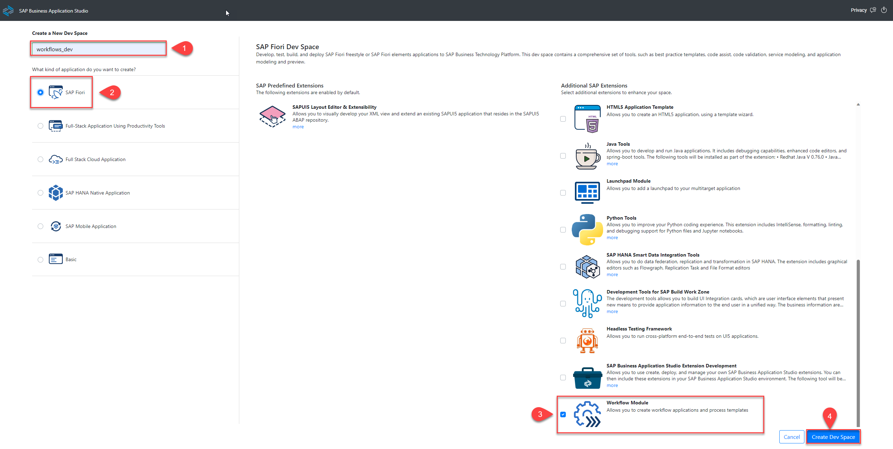

3. Start the Dev Space and wait for it to be on **RUNNING** status

    <!-- border -->

4. Once the link of the Dev Space is available, click on it to open the SAP Business Application Studio

    <!-- border -->

### Create a project

[OPTION BEGIN[New Project]]
1. Choose the project template

    - open the **File Explorer**
    - choose the **Create Project** button
    - select **Basic Multitarget Application** tile
    - choose the **Start** button

    <!-- border -->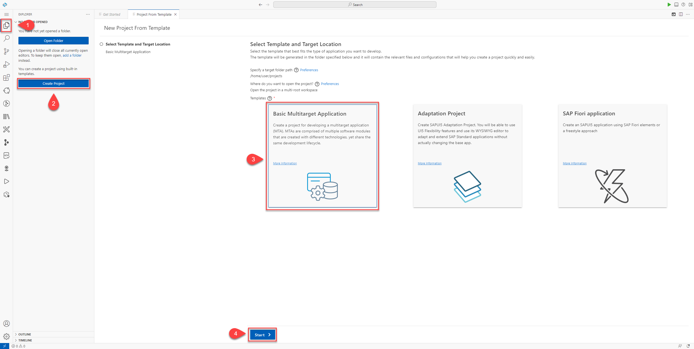

2. Choose the project template

    - provide a **Name**
    - choose the **Finish** button

    <!-- border -->

3. Create an MTA Module: Approuter Configuration

    - in the File Explorer, locate the **mta.yaml** file and right-click on it
    - select **Create MTA Module from Template**

    <!-- border -->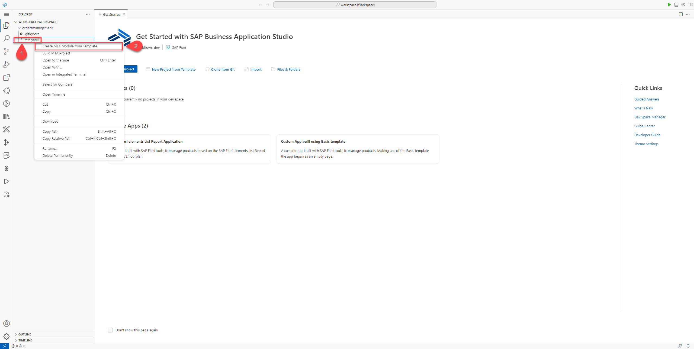

4. Choose the Module template

    - select the **Approuter Configuration** tile
    - choose the **Start** button

    <!-- border -->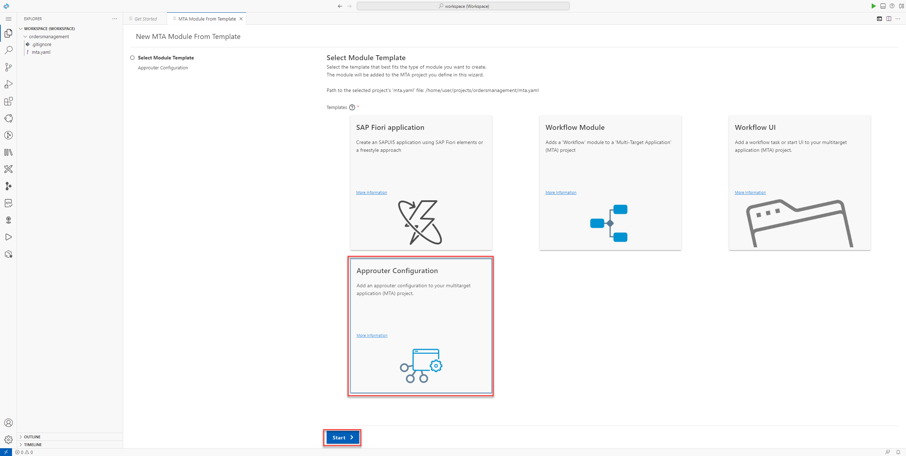

    - provide a **Name** for the business solution of the project
    - choose the **Next** button

    <!-- border -->

5. Create a second MTA Module: Workflow UI

    - in the File Explorer, locate the **mta.yaml** file and right-click on it
    - select **Create MTA Module from Template**

    <!-- border -->

6. Select the Module Template

    - select the **Workflow UI** tile
    - choose the **Start** button

    <!-- border -->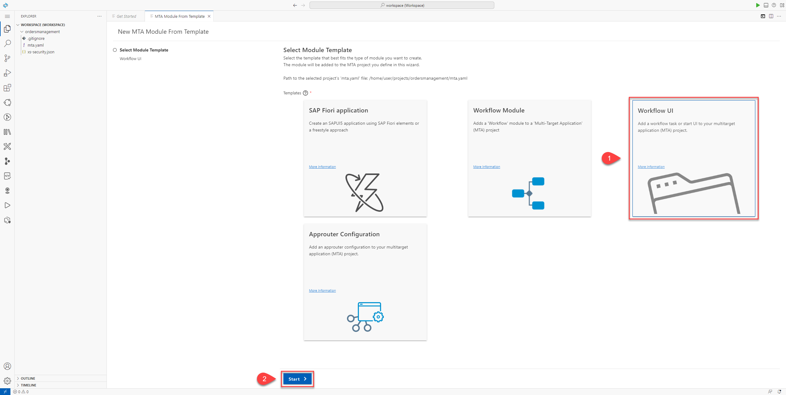

7. Choose the **Next** button to set the default basic properties

    <!-- border -->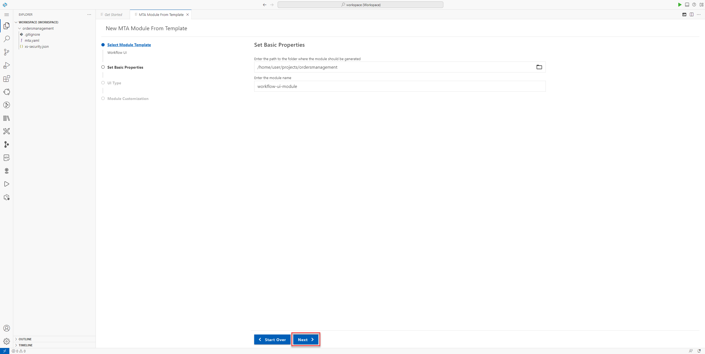

8. Select the UI Type

    - select the **Task UI** tile
    - choose the **Next** button

    <!-- border -->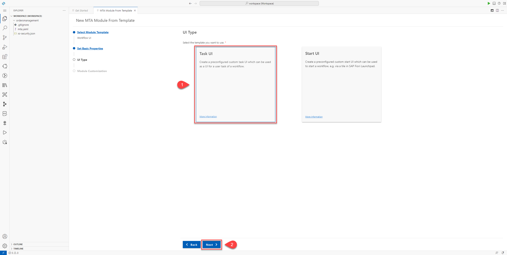

9.  Module Customization

    - provide the required module information
    - choose the **Finish** button

    > The **application namespace** is needed to customize the code.

    <!-- border -->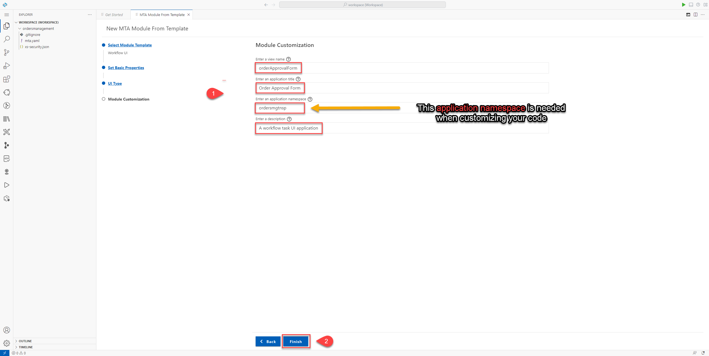

[OPTION END]

[OPTION BEGIN[Import Project]]

1. Download project here (attach link)

2. Click on the Menu button and navigate to **File** > **Import Project**.

    <!-- border -->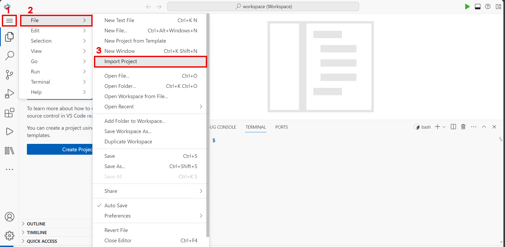

3. Choose the downloaded project **ordersmanagement.tar**.
   After importing successfully, it can be viewed in the file explorer in the workspace.

    <!-- border -->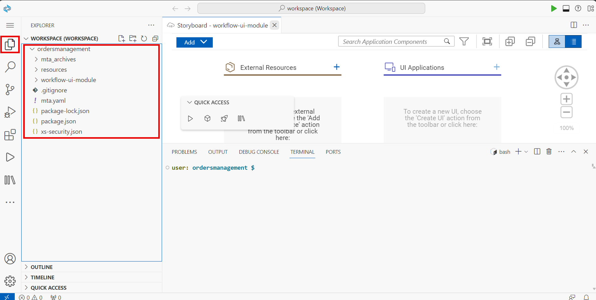

4. Please navigate to **Step 4: Build and deploy your application**.
   
[OPTION END]

### Code customization


1.  Upgrade the package.json version

    - in the File Explorer, locate and open the *package.json* file under  `../workflow-ui-module/`
    - change the version of the `"@ui5/cli"` value under `devDependencies` to **^3.0.0**

    <!-- border -->

2.  Customize your *manifest.json* file

    - in the File Explorer, locate and open the *manifest.json*
    - customize it by adding the code bellow (including the comma in the beginning) after the **sap.cloud** node in the json file. (line 125 to 198)

    <!-- border -->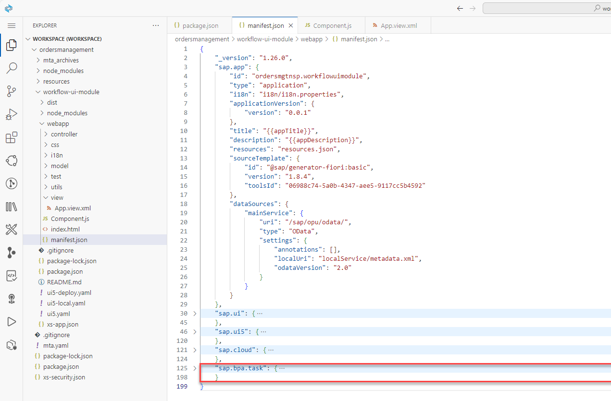


    ```JSON
        ,
        "sap.bpa.task": {
            "_version": "1.0.0",
            "outcomes": [
                {
                    "id": "approve",
                    "label": "Approve"
                },
                {
                    "id": "reject",
                    "label": "Reject"
                }
            ],
            "inputs": {
                "$schema": "http://json-schema.org/draft-07/schema",
                "title": "input",
                "type": "object",
                "required": [
                    "customerName",
                    "orderNumber",
                    "orderAmount",
                    "orderDate",
                    "expectedDeliveryDate",
                    "shippingCountry"
                ],
                "properties": {
                    "customerName": {
                        "type": "string",
                        "title": "Customer Name",
                        "description": "Customer Name"
                    },
                    "orderNumber": {
                        "type": "string",
                        "title": "Order Number",
                        "description": "Order Number"
                    },
                    "orderAmount": {
                        "type": "number",
                        "title": "Order Amount",
                        "description": "Order Amount"
                    },
                    "orderDate": {
                        "type": "string",
                        "title": "Order Date",
                        "description": "Order Date"
                    },
                    "expectedDeliveryDate": {
                        "type": "string",
                        "title": "Expected Delivery Date",
                        "description": "End Date of the Vacation"
                    },
                    "shippingCountry": {
                        "type": "string",
                        "title": "Shipping Country",
                        "description": "Shipping Country"
                    }
                }
            },
            "outputs": {
                "$schema": "http://json-schema.org/draft-07/schema",
                "title": "output",
                "type": "object",
                "required": [
                    "comment"
                ],
                "properties": {
                    "comment": {
                        "type": "string",
                        "title": "Comment",
                        "description": "Comment to buyer"
                    }
                }
            },
            "category": "approval"
        }
    ```

    > For the sales order approval use case, you need the following sales order details as **inputs** and a comment from the approver as **output** of the task.

3.  Customize your *xs-app.json* file

        - in the File Explorer, locate and open the *xs-app.json* in your workflow-ui-module folder
        - it must be the *first entry of routes entry*

    ```JSON

      {
      "source": "^/api/(.*)$",
      "target": "$1",
      "service": "com.sap.spa.processautomation",
      "endpoint": "api",
      "csrfProtection": true,
      "authenticationType": "xsuaa"
     },

    ```
    <!-- border -->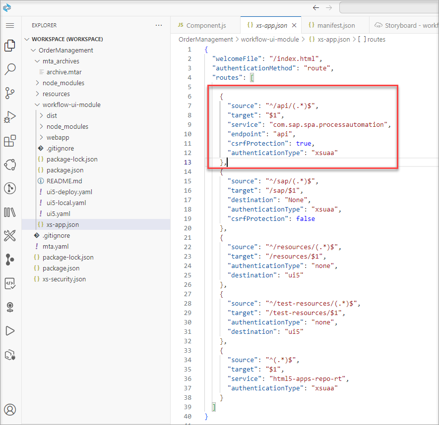

4.  Customize your **App.view.xml** file

    - in the File Explorer, under `../webapp/view/` folder, locate and open the `App.view.xml` file
    - customize it with your needed page layout

    <!-- border -->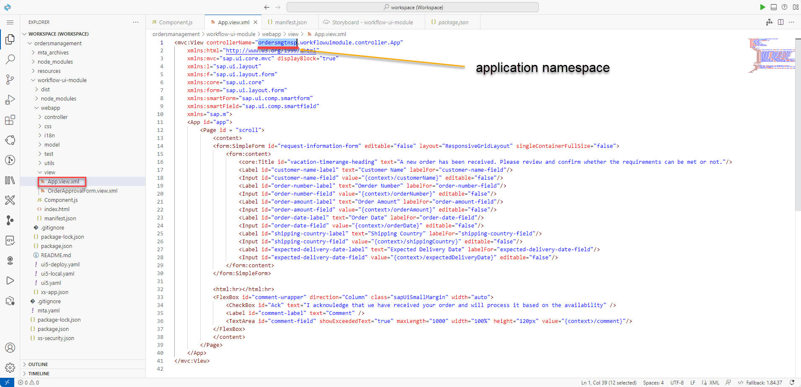

    > In the sales order approval use case, you need the following sales order details in the `App.view.xml`. Please, replace the occurrences of `<APPLICATION NAMESPACE>` with your application namespace.


    ```XML
    <mvc:View controllerName="<APPLICATION NAMESPACE>.workflowuimodule.controller.App"
    xmlns:html="http://www.w3.org/1999/xhtml"
    xmlns:mvc="sap.ui.core.mvc" displayBlock="true"
    xmlns:l="sap.ui.layout"
	xmlns:f="sap.ui.layout.form"
    xmlns:core="sap.ui.core"
    xmlns:form="sap.ui.layout.form"
    xmlns:smartForm="sap.ui.comp.smartform"
	xmlns:smartField="sap.ui.comp.smartfield"
    xmlns="sap.m">
    <App id="app">
        <Page id = "scroll">
            <content>
            <form:SimpleForm id="request-information-form" editable="false" layout="ResponsiveGridLayout" singleContainerFullSize="false">
                <form:content>
                    <core:Title id="vacation-timerange-heading" text="A new order has been received. Please review and confirm whether the requirements can be met or not."/>
                    <Label id="customer-name-label" text="Customer Name" labelFor="customer-name-field"/>
                    <Input id="customer-name-field" value="{context>/customerName}" editable="false"/>
                    <Label id="order-number-label" text="Order Number" labelFor="order-number-field"/>
                    <Input id="order-number-field" value="{context>/orderNumber}" editable="false"/>
                    <Label id="order-amount-label" text="Order Amount" labelFor="order-amount-field"/>
                    <Input id="order-amount-field" value="{context>/orderAmount}" editable="false"/>
                    <Label id="order-date-label" text="Order Date" labelFor="order-date-field"/>
                    <Input id="order-date-field" value="{context>/orderDate}" editable="false"/>
                    <Label id="shipping-country-label" text="Shipping Country" labelFor="shipping-country-field"/>
                    <Input id="shipping-country-field" value="{context>/shippingCountry}" editable="false"/>
                    <Label id="expected-delivery-date-label" text="Expected Delivery Date" labelFor="expected-delivery-date-field"/>
                    <Input id="expected-delivery-date-field" value="{context>/expectedDeliveryDate}" editable="false"/>
                </form:content>
            </form:SimpleForm>

            <html:hr></html:hr>
            <FlexBox id="comment-wrapper" direction="Column" class="sapUiSmallMargin" width="auto">
                <CheckBox id="Ack" text="I acknowledge that we have received your order and will process it based on the availability" />
                <Label id="comment-label" text="Comment" />
                <TextArea id="comment-field" showExceededText="true" maxLength="1000" width="100%" height="120px" value="{context>/comment}"/>
            </FlexBox>
            </content>
        </Page>
    </App>
</mvc:View>
    ```

5.  Customize your *Component.js* file

    - in the File Explorer, under `../webapp/` folder, create or modify the *Component.js* file with the following code

    <!-- border -->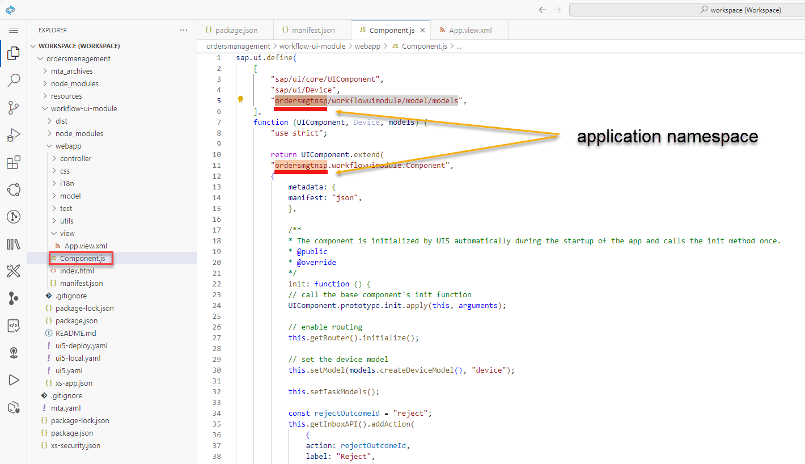

    > Please, replace the occurrences of `<APPLICATION NAMESPACE>` with your application namespace.

    ```JavaScript
    sap.ui.define(
        [
            "sap/ui/core/UIComponent",
            "sap/ui/Device",
            "<APPLICATION NAMESPACE>/workflowuimodule/model/models",
        ],
        function (UIComponent, Device, models) {
            "use strict";

            return UIComponent.extend(
            "<APPLICATION NAMESPACE>.workflowuimodule.Component",
            {
                metadata: {
                manifest: "json",
                },

                /**
                * The component is initialized by UI5 automatically during the startup of the app and calls the init method once.
                * @public
                * @override
                */
                init: function () {
                // call the base component's init function
                UIComponent.prototype.init.apply(this, arguments);

                // enable routing
                this.getRouter().initialize();

                // set the device model
                this.setModel(models.createDeviceModel(), "device");

                this.setTaskModels();

                const rejectOutcomeId = "reject";
                this.getInboxAPI().addAction(
                    {
                    action: rejectOutcomeId,
                    label: "Reject",
                    type: "reject",
                    },
                    function () {
                    this.completeTask(false, rejectOutcomeId);
                    },
                    this
                );
                const approveOutcomeId = "approve";
                this.getInboxAPI().addAction(
                    {
                    action: approveOutcomeId,
                    label: "Approve",
                    type: "accept",
                    },
                    function () {
                    this.completeTask(true, approveOutcomeId);
                    },
                    this
                );
                },

                setTaskModels: function () {
                // set the task model
                var startupParameters = this.getComponentData().startupParameters;
                this.setModel(startupParameters.taskModel, "task");

                // set the task context model
                var taskContextModel = new sap.ui.model.json.JSONModel(
                    this._getTaskInstancesBaseURL() + "/context"
                );
                this.setModel(taskContextModel, "context");
                },

                _getTaskInstancesBaseURL: function () {
                return (
                    this._getWorkflowRuntimeBaseURL() +
                    "/task-instances/" +
                    this.getTaskInstanceID()
                );
                },

                _getWorkflowRuntimeBaseURL: function () {  
                  var ui5CloudService = this.getManifestEntry("/sap.cloud/service").replaceAll(".", "");  
                  var ui5ApplicationName = this.getManifestEntry("/sap.app/id").replaceAll(".", "");  
                  var appPath = `${ui5CloudService}.${ui5ApplicationName}`;
                  return `/${appPath}/api/public/workflow/rest/v1`

                },

                getTaskInstanceID: function () {
                return this.getModel("task").getData().InstanceID;
                },

                getInboxAPI: function () {
                var startupParameters = this.getComponentData().startupParameters;
                return startupParameters.inboxAPI;
                },

                completeTask: function (approvalStatus, outcomeId) {
                this.getModel("context").setProperty("/approved", approvalStatus);
                this._patchTaskInstance(outcomeId);
                },

                _patchTaskInstance: function (outcomeId) {
                const context = this.getModel("context").getData();
                var data = {
                    status: "COMPLETED",
                    context: {...context, comment: context.comment || ''},
                    decision: outcomeId
                };

                jQuery.ajax({
                    url: `${this._getTaskInstancesBaseURL()}`,
                    method: "PATCH",
                    contentType: "application/json",
                    async: true,
                    data: JSON.stringify(data),
                    headers: {
                    "X-CSRF-Token": this._fetchToken(),
                    },
                }).done(() => {
                    this._refreshTaskList();
                })
                },

                _fetchToken: function () {
                var fetchedToken;

                jQuery.ajax({
                    url: this._getWorkflowRuntimeBaseURL() + "/xsrf-token",
                    method: "GET",
                    async: false,
                    headers: {
                    "X-CSRF-Token": "Fetch",
                    },
                    success(result, xhr, data) {
                    fetchedToken = data.getResponseHeader("X-CSRF-Token");
                    },
                });
                return fetchedToken;
                },

                _refreshTaskList: function () {
                this.getInboxAPI().updateTask("NA", this.getTaskInstanceID());
                },
            }
            );
        }
    );
    ```

6.  Last check in the *mta.yaml* file

    In the **File Explorer**, under your project main folder, check *mta.yaml* file with the following code and make sure that the node under `modules:parameters:content` is named `subaccount` instead of `instance`

    <!-- border -->


    The node under `resources:parameters:config:init_data` is named `subaccount` instead of `instance`


    <!-- border -->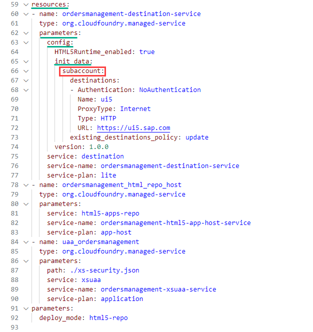


### Build and deploy your application

1.   Open your Subaccount Overview in SAP BTP Cockpit

    > You will need some information about **API Endpoint**, **Org** and **Space** that are visible in the **BTP Cockpit**, under **Subaccount overview**.

    <!-- border -->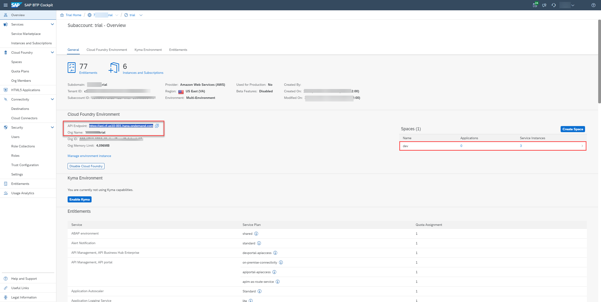

2.   Start a new Terminal and login to cloud foundry    

    - from the menu, select **Terminal --> New Terminal**
    - connect to your account using **cf login** command. (In case of 2FA, you may need to append the One-time password code to your password)
    - select the **Org** if asked
    - select the **Space** if asked

    <!-- border -->


3. Build MTA Project

    - in the File Explorer, locate the **mta.yaml** file and right-click on it
    - select **Build MTA Project**

    <!-- border -->

4. Build the application

    > **IMPORTANT: Skip this step if you have imported the project. Your project will run into an error as the application is already included in the `mtar` file.**

    Use the `npm run build` command to build your application.

    <!-- border -->

5. Deploy the application

    Use the `npm run deploy` command to deploy your application.

    > You may use the command `cf deploy mta_archives/ordersmanagement_0.0.1.mtar` replacing the `mtar` file name with your generated one.

    <!-- border -->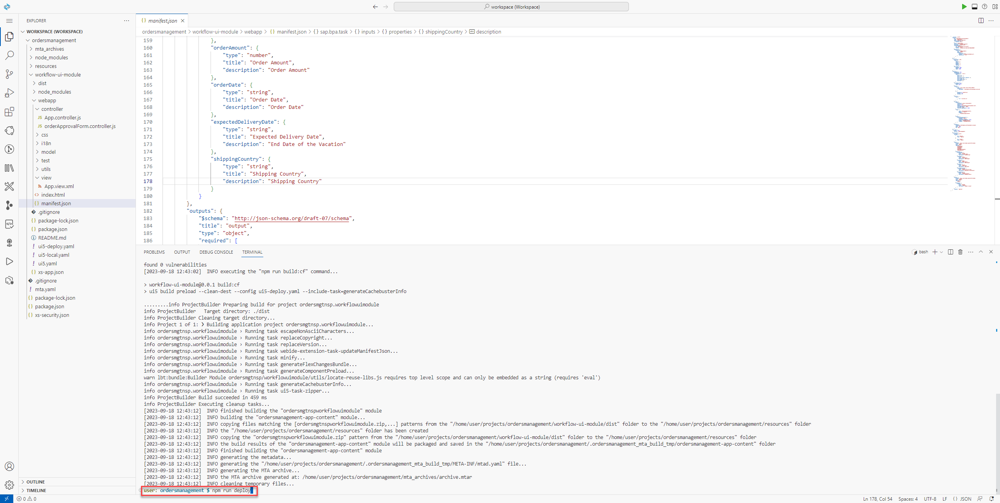


6. Once deployed, your application should be visible in the **BTP Cockpit** under **HTML5 Applications** if you're subscribed to SAP Build Work Zone.

    <!-- border -->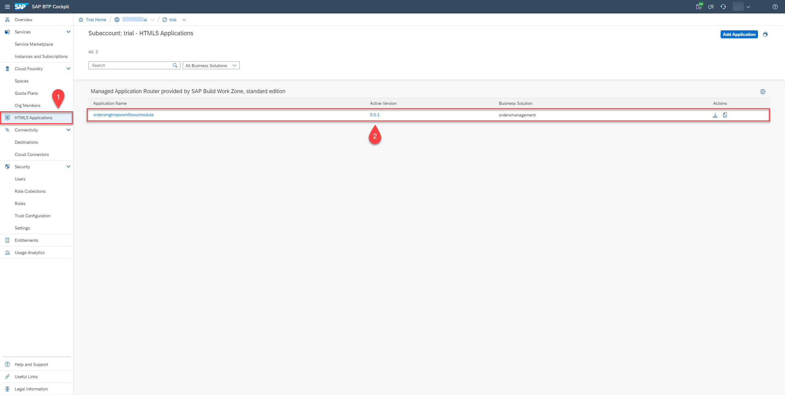

    You have successfully completed the tutorial, creating and deploying an SAP UI5 application for order approval business processes.
