# Use Custom Variables for the global process
<!-- description --> Add, modify and use custom variables in the process.

## Prerequisites
  - A [SAP BTP Free Tier Account](spa-subscribe-booster) with SAP Build Process Automation booster **OR**
  - A [SAP BTP Trial account](spa-subscribe-free-trial) 
 

## You will learn
  - How to create and use Custom Variables 

## Intro

**What is Live Process Content?**

Custom Variables allow you to store information, that are accessible anywhere in the process. They can be used in the process irrespective of the conditional flow.

---

### Process description 

For your company, you need to design the process to submit innovation ideas by the employees. The process should by triggered by the employee who fill out the form. Then CFO would like it to be divided to CAPEX and OPEX categories, so two different councils can process the ideas and decide whether to provide an approval. If the innovation idea requires additional information, the council will send it back to the requestor. In case the process will be approved by the council, the CFO will received the case for the final approval. The requestor must receive an email with the council or CFO decision. 

### Create the project

1. In the SAP Build **Lobby** select **Create** button.

    <!-- border -->

2. Select **Build an Automated Process**.

    <!-- border -->

3. Select **Business Process**.

    <!-- border -->

4. Name the Project **Innovation Idea Process**, and confirm with **Create** button.

    <!-- border -->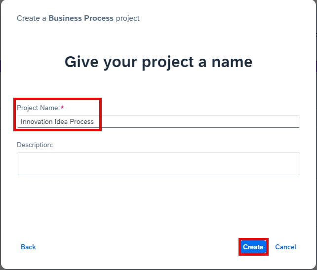

5. Create the process by providing the Name **Innovation Idea Global Process**.

    <!-- border -->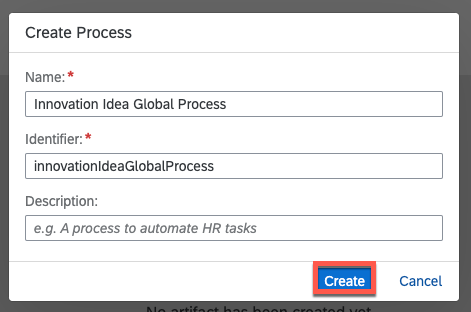

### Configure the custom variables

1. Create global custom variables for the process. Select **Process Details** > **Variables** > **Custom Variables** > **Configure**.

    <!-- border -->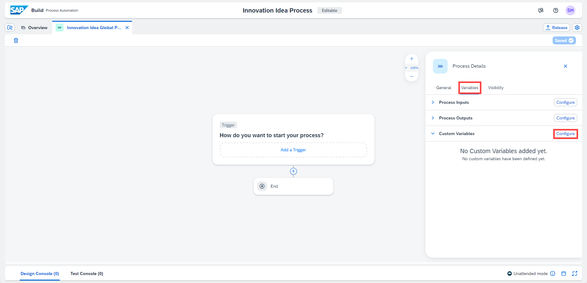

2. Configure the following Variables. To fo that select **Add Variables** button.

    | **Name**    | **Type** | 
    | -------- | ------- |
    | Rework | Boolean |
    | global cost | number |
    | global description | string |
    | global idea name | string |
    | global council comments | string |
    | category opex/capex | string |

    <!-- border -->

3. Select **Apply** and **save** the process.

### Add Subprocess

> Due to product limitations, we need to add a subprocess. Please note that this step will not be necessary, once the custom variables will be available as Output in Trigger form.

1. Select **+** > **Subprocess** > **New Process**. 
   
    <!-- border --> 

2. Name it **Subprocess** and choose **Create**.

    <!-- border -->

3. **Open Editor** of the Subprocess to configure Inputs and Outputs.
   
    <!-- border -->

4. Select **Process Details > Variables > Process Inputs > Configure**.

    <!-- border -->

5. Select **Add Input** and add Inputs below and select **Apply**:

    | **Name**    | **Type** | 
    | -------- | ------- | 
    | Name SP    |  String   | 
    | Description SP | String |
    | Number SP | Number  | 
    | Category SP | String | 

    <!-- border -->

6. Select **Configure** next to Process Outputs.

    <!-- border -->

7. Select **Add Ouput** and add Inputs below and select **Apply**:

    | **Name**    | **Type** | 
    | -------- | ------- | 
    | Name SP    |  String   | 
    | Description SP | String  |
    | Number SP | Number | 
    | Category SP | String | 

    <!-- border -->

8. **Save** changes and close the subprocess tab.

### Create the trigger form

1. Create the trigger form for the requestor. To do that select **+ > Forms > New Form**. 

    <!-- border -->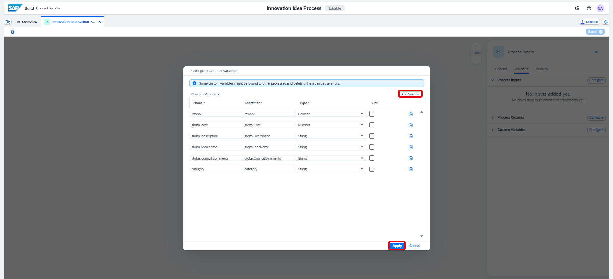

2. Name it **Innovation Idea Form**. Select **Create**.

    <!-- border -->

3. Choose **Open Editor** of the form and add Form Input Fields by clicking on the Fields or using drag and drop option.

    | **Form Field**    | **Value** | **Option** |
    | -------- | ------- | ------- |
    | Headline 2  | Innovation Ideas Form    |  |
    | Paragraph | Please fill out the form with your innovation ideas. Once the form will be processed, you will be informed about the Council or CFO decision via email.     | |
    | Text    | Name of the idea     |Required |
    | Text Area | Idea Description | Required |
    | Number | Estimated Cost of the Innovation | Required |
    | Dropdown  | Select the category | Required |

    <!-- border -->

4. For the Dropwdown Fields provide two Values: OPEX and CAPEX. 
   
    <!-- border -->

    > Note: To add an attachment to the form, please [Configure SMTP Destination](https://help.sap.com/docs/build-process-automation/sap-build-process-automation/configuring-smtp-mail-destination) to send mail notifications. 

5. **Save** the form and close the tab.

### Map  Subprocess Inputs and Outputs

1. In the Process Overview tab select subprocess and go to the Inputs section. Map the following from Trigger Form Outputs:
     - **Category SP** with **Select the category**
     - **Description SP** with **Idea Description**
     - **Name SP** with **Name of the idea**
     - **Number SP** with **Estimated Cost of the Innovation**

    <!-- border -->

2. Select subprocess and go to the Outputs section. Set Custom Variables and map with subprocess Outputs:
     - **Global cost** with **Number SP**
     - **Global description** with **Description SP**
     - **Global idea name** with **Name SP**
     - **Category OPEX/CAPEX** with **Number SP**

    <!-- border -->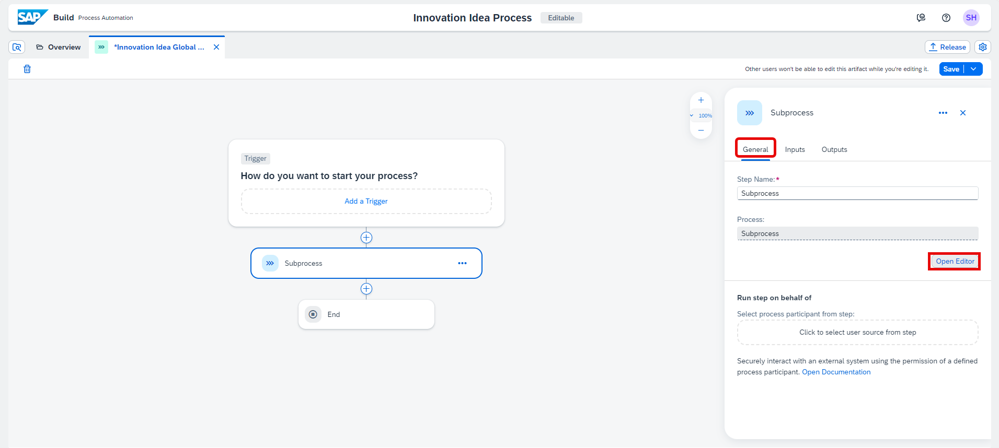

3. **Save** the process.

### Create Approval Forms and Conditions

1. Create an approval form. Select **+ > Approvals > New Approval Form**.

    <!-- border -->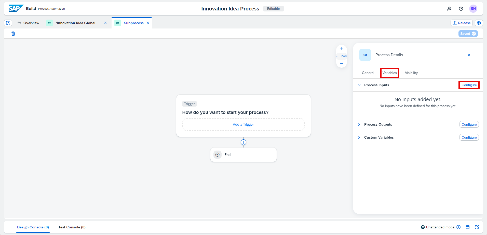

2. Name it **CAPEX Council Approval** and make sure to mark the checkbox **Based on a form** and select the trigger form from the list.
   
    <!-- border -->

3. Select **Open Editor** of the CAPEX form. Make changes in the form:
    - change the Headline to **CAPEX Approval for Innovation Idea**
    - at the end of the form add additional Input fields:

    | **Form Field**    | **Value** | **Option** |
    | -------- | ------- | ------- |
    | Paragraph | In case you need more information from the requestor, please check the inbox below to send the form back to requestor and reject the approval.    | |
    | Checkbox    | Rework needed!     |  |
    | Text Area | Council comment| Required |

    <!-- border -->

4. **Save** the CAPEX approval form, and close the tab.

5. In the Process Tab choose Capex form. In the General Section:
    - Under **Subject** enter: Capex Council Approval
    - Under **Users** enter: email of the Capex Council

    <!-- border -->

6. In the **Inputs** section map the content:
    - **Estimated Cost of the Innovation** with **global cost**
    - **Idea Description** with **global description**
    - **Name of the idea** with **global idea name**
    - **Select the category** with **category opex/capex**
  
    <!-- border -->

7. In the Output section add the variables and map them:
    - **Rework** with the content from Approval form **Rework needed!**
    - **global council comments** with the content from Approval form  **Council Comment**

    <!-- border -->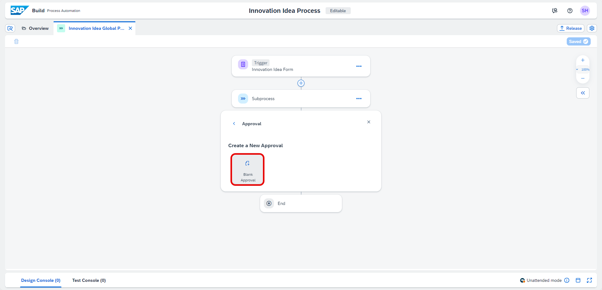

8. Before CAPEX form add a condition which will distribute the form to CAPEX or OPEX council. Select **+** > **Controls** > **Condition**. 

    <!-- border -->

9. Define the condition panel:
    - Provide the step Name: **Condition OPEX/CAPEX** custom variable
    - Name the Branch: **If CAPEX**
  
    <!-- border -->

10. Open Condition Editor and define the condition:
    - For item select **category opex/capex**
    - For Value type **CAPEX**

    <!-- border -->

11. In the **Overview** tab, create a duplicate of CAPEX form.

    <!-- border -->

12. Name it **OPEX Council Approval**.
   
    <!-- border -->

13. Change the Headline to **OPEX Approval for Innovation Idea** and **Save**. Close the tab.

    <!-- border -->

14. In the Process tab, add the OPEX form after **Default Condition Branch**.

    <!-- border -->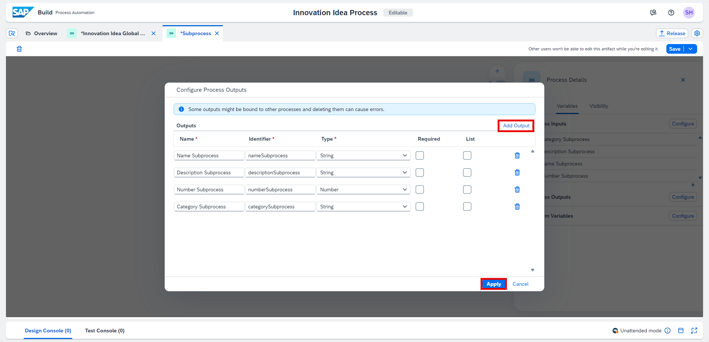

15. In the General Section of the OPEX Council Approval:
    - **Subject** enter: Opex Council Approval
    - **Users** enter: email of the Opex Council

    <!-- border -->

16. In the Input section map the content:
    - **Estimated Cost of the Innovation** with **global cost**
    - **Idea Description** with **global description**
    - **Name of the idea** with **global idea name**
    - **Select the category** with **category opex/capex**

    <!-- border -->

16. In the Outputs add the variables and map them:
    - **Rework** with the content from Approval form **Rework needed!**
    - **global council comments** with the content from Approval form  **Council Comment**

17. Create an **Approval Form** after the process would be Approved by the CAPEX Council. Select **+** > **Approvals** > **New Approval Form**.

    <!-- border -->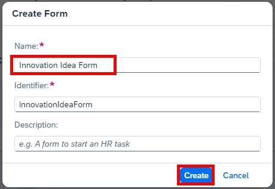

18. Name it as a **CFO Approval**, and make sure to mark the checkbox **Based on a form** and select the **CAPEX Council Approval** form from the list.
   
    <!-- border -->

19. Open the Approval form. Edit it as follows:
    - Rename the Headline to **Final CFO Approval for Innovation Idea**.
    - Remove the checkbox Input ''Rework needed''
    - Add in the end a paragraph: **Please provide your final decision for the Innovation Idea:**
    - Add a Text Area Input named **CFO Decision**, and mark it as required 

    <!-- border -->

20. **Save** the form and close the tab.

21. In the process tab, select CFO Approval Form and in General Section enter:
    - Under Subject: **CFO Approval**
    - Under Recipient: Email of the CFO

    <!-- border -->

22. In the Inputs map the content from custom variables:
    - **Council comment** with **global council comments**
    - **Estimated Cost of the Innovation** with **global cost**
    - **Idea Description** with **global Description**
    - **Name of the idea** with **global idea name**
    - **Select the category** with **category opex/capex**

    <!-- border -->

23. Connect OPEX Council Approval Form with CFO Approval Form.

    <!-- border -->

24. **Save** the process.

### Create the Rework Form and Conditions

1. Now, we will create a form for a requestor, in case the changes will be necessary. In the Overview tab **duplicate** the **Innovation Idea** form.

    <!-- border -->

2. Name it **Innovation Idea Form - Rework**.

    <!-- border -->

3. Provide changes in the form:
    - Change the Headline to: **Innovation Ideas Form: Modify you form**
    - Change the Paragraph to: **Please make changes to the form based on the comments from the Council below:**
    - Add **Text Area** Input, name it **Comments from the Approval Council**, and select Read only
    - Add a **Headline 2** input, named **Data from Your Initial Innovation Form**
    - For the Inputs: Name of the idea, Idea Description, Estimated Cost of the Innovation, Select the category select **Read only** configuration

    <!-- border -->
    
4. Add additional inputs in the end:

    | **Form Field**    | **Value** | **Option** |
    | -------- | ------- | ------- |
    | Paragraph | Please modify your form below, based on the comments from the Council and your initial form. After that submit the form.   | |
    | Text    |  Name of the idea - Edited     | Required |
    | Number | Estimated Cost of the Innovation - Edited | Required |
    | Text Area | Idea description - Edited | Required |
    | Dropdown | Select the category - Edited | Required |

5. In the drop down list add **OPEX** and **CAPEX** as Data to display.

    <!-- border -->

6. **Save** the form. Close the form tab.

10. Add the condition after **CAPEX Reject** and **OPEX Reject**. Name it **Rework**.

11. In the condition editor >  Branch Name write: **Rework required**

    <!-- border -->
   
14. Select **Open Condition Editor** and define the condition:
    - For item select **category opex/capex**
    - For Value type **CAPEX**

8. Add the form **Innovation Idea Form - Rework** after condition branch Rework required.

    <!-- border -->

13. Connect reject of the OPEX Approve Form with the condition.

    <!-- border -->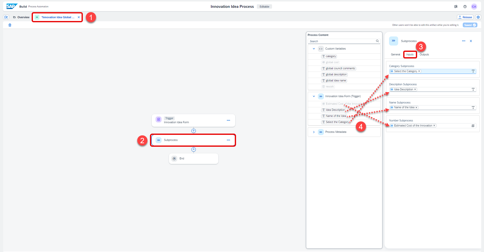

9.  Connect **Rework Form** with the first condition (If CAPEX).

    <!-- border -->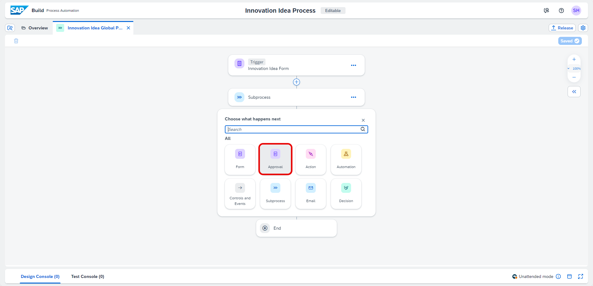

7. In the Process Tag, select **Rework form**. In the General Section:
    - Name the Subject: **Innovation Idea Form - Rework**
    - Select in **Recipients > Users > Process Started by**

    <!-- border -->

8. Map the Inputs:
    - **Comments from the Approval Council** with **global council comments**
    - **Estimated Cost of the Innovation** with **global cost**
    - **Idea Description** with **global description**
    - **Name of the idea** with **global idea name**
    - **Select the category** with **category opex/capex**

    <!-- border -->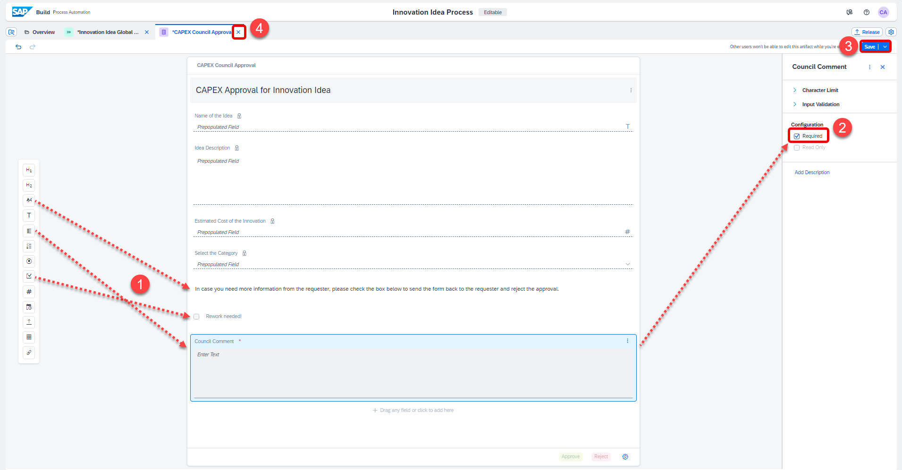

15. **Save** the process.
    
    <!-- border -->

### Add Mail Artifacts

1. After the CFO Approval select **+** and **Mail**.

    <!-- border -->

2. Edit the Artifact details:
    - Change the step name to **Approval Email**.
    - In Email Header **To** enter: **Process Started by**
    - In Email Header **Subject** enter: **Your Innovation Idea was approved**
    - In Additional Options **CC** enter: CFO email address

    <!-- border -->

3. Select **Open Mail Body Editor**. 

    <!-- border -->

4. Provide the body email and select Apply:

    > Dear `Process Started by`,
    >  Thank you for you idea. We have carefully evaluated it.
    >  The CFO decision is to proceed with the idea.
    >  Please find the CFO's comment below:
    >  `CFO Decision`

    <!-- border -->

4. Now, add the same way the rejection email: 
    - Change the step name to **Rejection Email**.
    - In Email Header **Subject** enter: **Your Innovation Idea was rejected**
    - Email Body:
    > Dear `Process Started by`,
    >  Thank you for you idea. We have carefully evaluated it.
    >  The CFO decision is to not proceed with the idea.
    >  Please find the CFO's comment below:
    >  `CFO Decision`

5. Connect the Rejection email with end of the process

    <!-- border -->

6. Add another rejection email after second condition (rework required) default branch.

    <!-- border -->

7. Edit the Email:
    - Change the step name to **Send Rejection Mail from OPEX CAPEX Council**.
    - In Email Header **Subject** enter: **Your Innovation Idea was rejected**
    - Email Body:
    > Dear `Process Started by`,
    >  Thank you for you idea. We have carefully evaluated it.
    >  The Council decision is to not proceed with the idea:
    >  `global council comments`

    <!-- border -->

8. Connect **Send Rejection Mail from OPEX CAPEX Council** with End of the process.

    <!-- border -->

9.  **Save** the process.

### Release and deploy the process

1. Release the process.
   
    <!-- border -->
    <!-- border -->

2. Deploy the process.

    <!-- border -->
    <!-- border -->
    <!-- border -->

### Test the process 

3. Open the main process. 
   
    <!-- border -->

4. Select the trigger Form. Copy the Trigger Form link and open in the new tab.

    <!-- border -->

5. Run the process, by providing the values in the Innovation Form.

    <!-- border -->

6. To approve the form as CAPEX/OPEX Council or CFO open the **Inbox** in the Lobby. 

    <!-- border -->

---
