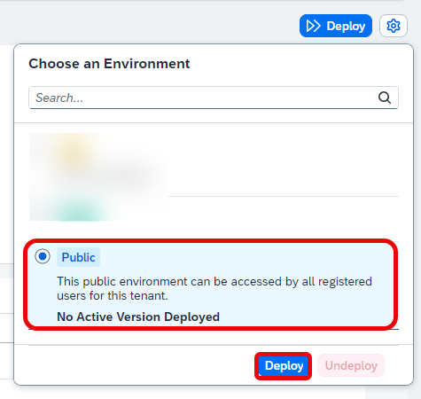
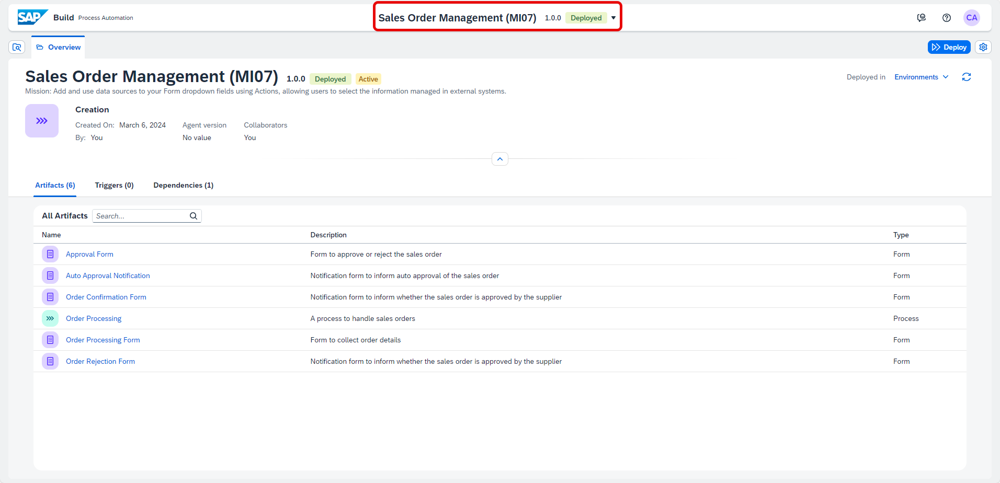
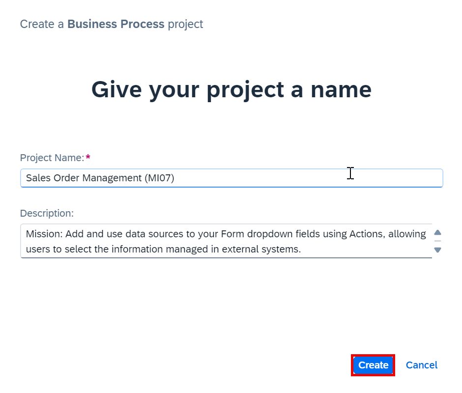
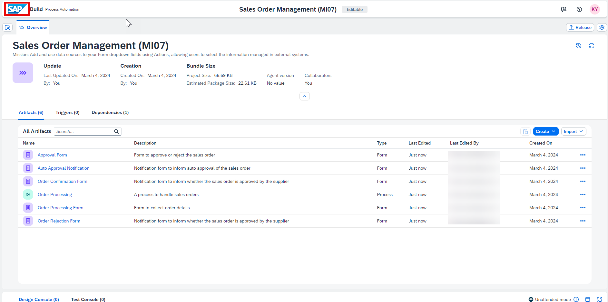
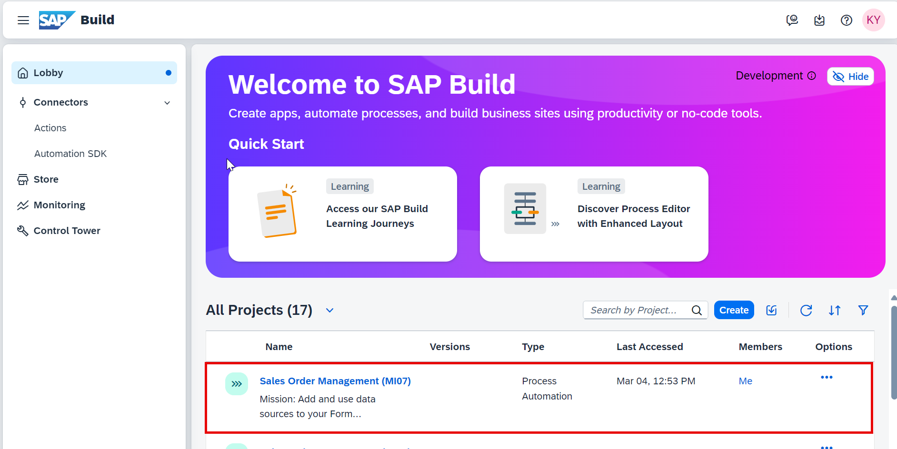

# Deploy and Test the Project
<!-- description --> Deploy the project and test the dropdown filtering

## Prerequisites
- Complete the tutorial [Create a Project and add a Dropdown](spa-dropdown-value-help-filtering)

## You will learn
- to release and deploy the project
- to filter data in a dropdown
- to retrieve sample project from the Store

## Intro
In this tutorial, you will release and deploy the project created in the previous tutorial and test the dropdown filtering in the form.

### Release and deploy the business process project

1. In the project overview tab, select the **Release** option.

    <!-- border -->

2.  In the Release Project popup, select **Release**.

    <!-- border -->

3.  Select the **Deploy** option in the top-right corner.

    <!-- border -->

4. Choose an **Environment** and select **Deploy**.

    <!-- border -->

5.  In the **Define Variables** section, select the destination variable `S4_Business_Partner` and select **Deploy**.

    <!-- border -->

    Your project is deployed.

    <!-- border -->

### Test the dropdown filtering in the form

1. Open the project content on the left menu and select **Order Processing** process.

    <!-- border -->

2. Select the **Order Processing Form** artifact and copy the deployed form link.

    <!-- border -->

3. Paste the link into a new browser tab/window to open it.

4. Select the dropdown button for the **Customer Name** field. You can see all the customer names fetched by the action project from the S4/HANA database.

    <!-- border -->

5. In the **Customer Name** field, if you enter anything, the records will get filtered accordingly.

    <!-- border -->

    > The filtering is implemented only on the number of records mentioned in $top parameter of actions project, since only those records are fetched and shown. 

    You have successfully completed releasing and deploying your project and tested the dropdown filtering in the Order Processing form.

    
### Retrieve sample project from the store (Optional)

   > The entire project is available in the SAP Build Store as a sample and you can follow the below steps to retrieve the project and use it for reference.

This sample project can be downloaded from the SAP Build Store.

To retrieve this sample, please follow these steps:
    
1. From the SAP Build Lobby, navigate to Store.
   
2. Search for the sample project: **Sales Order Management (MI07)**.
   
3. Choose **Create from Template** to retrieve the sample and save it as a new project in your lobby.

    <!-- border -->

4. Choose **Create**.

    <!-- border -->

    Your project gets created in editable version. You may release and deploy it and run the project.
    
5. Navigate back to the lobby by clicking on the SAP logo.
  
    <!-- border -->

    You can see your project is available in the lobby.
  
    <!-- border -->

---
