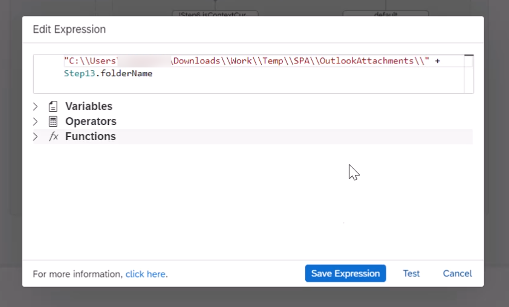
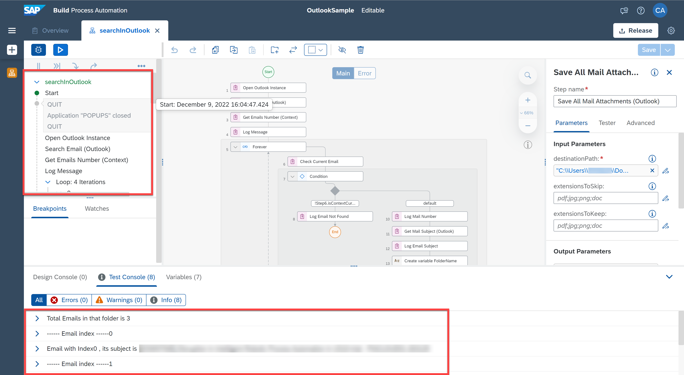

# Extend Outlook SDK Based Automation
<!-- description --> In this tutorial, you will be adding functionalities to your first Outlook SDK based automation project, In the end, you will learn how to search outlook inbox or a specific email folder, retrieve email properties and download any attachments found in a specific local folder.

## Prerequisites
Complete the tutorial: [Build Your First Automation Using Outlook SDK of SAP Build Process Automation](spa-create-outlook-automation)

## You will learn
    - How to use Outlook SDK of SAP Build Process Automation to
    - Download attachments from an email
    - Reply to an email

## Intro
SAP Build Process Automation has native integration to several Microsoft Office products including Outlook, Excel SDK. In this Tutorial, you will extend additional capabilities of Outlook SDK to your automations.

---

### Retrieve search

As a first step, since an email search can result in multiple emails, customize your automation project to handle multiple emails in the search context.

1. SAP Build Process Automaton comes handy with several loop controls. Add a **Forever** loop activity after **Log Message**. You can read more about it from the [documentation](https://help.sap.com/docs/IRPA/8e71b41b9ea043c8bccee01a10d6ba72/75f13165ec274305bfe13f56231f93ehtml).
   
    <!-- border -->

2. **Forever** loop needs to make sure it is executed until there is one email in the search result. In order to know this, use **Check Current Email** activity which will return if there is any pending emails in the search context. Kindly make sure to test an appropriate output parameter for this activity.
   
    <!-- border -->

3. The output of **Check Current Email** activity step is a boolean.
   
    <!-- border -->

4. The result of the previous step will return true if an email exists in the search context, stop the loop when there are no more emails to process.  You use the Condition Expression Editor and include **Is not** or **!** on the boolean output parameter from previous step. Add the given expression through the expression editor and close it.
   
    <!-- border -->

5. Add a Log Message that loop has reached its end. You can provide a custom message if you want.
   
    <!-- border -->

6. Add an appropriate log message to this step.
   
    <!-- border -->

7. If none of the conditions are met, the workflow of the automation will continue through the default branch. Now to the default branch, you can log the loop index first. **Log Message** comes handy during debugging. You may remove it, in case you no longer need them.
   
    <!-- border -->

8. You can optionally include a custom log message.
   
    <!-- border -->

9. For each email in the loop context, let us retrieve its email **Subject** through **Get Mail Subject** activity.
    
    <!-- border -->

10.  Add a log message to print the email subject.
  
    <!-- border -->

11.  To the log message event, add your custom message
    
    <!-- border -->

12.   Add **Get Next Email (Context)** activity to advance the loop variable.
   
    <!-- border -->

13.   Save and Test the automation, you should see appropriate results.
    
    <!-- border -->

14.   You can include additional attributes related to your email in search context result. For example, see the various activities you can use to retrieve additional attributes in your search context.
    
    <!-- border -->

    At this stage, you converted your project to process a series of emails in the search context. An Email may contain one or more file attachments. In the next step, you will download the file attachments.

### Download attachments from an email

In this step, you will create a local folder in your windows file system. Then define a folder name dynamically using current timestamp. Finally, save each email attachment to that local folder.

1.  Create a string variable folder name. For this use **String** datatype and drag and drop into the workflow. You can include it above **Get Next Email (Context)** activity as shown below.
   
    <!-- border -->

2.  To the string variable, assign a timestamp value as its value. This is done by using `Date.now().toString()` via the expression editor.
    > In the real world, you may want to use your business process specific folder Name.

    <!-- border -->

3.  Just make sure, you set the desired variable name as the output parameter.
   
    <!-- border -->

4.  Using the folder name, create a folder in the file system and include relevant **Create Folder** activity from the **File System** collection to the flow.
   
    <!-- border -->

5.  In case you wish the new folder to be created in a specific path, you can append that location to the folder name. Make sure you append **double slash** (\\) to the path.
   
    <!-- border -->

6.  Here you save all the attachments in an email in one go by adding **Save All Mail Attachments** activity to your flow. You can also individually save every attachment using **Save Mail Attachment**. It is a good idea for you to explore the difference between both these options on your own.
   
    <!-- border -->

7.  You will refer the folder path from the previous step as the destination location for saving attachments.
   
    <!-- border -->

8.  Save and test the project.
   
    <!-- border -->

9.  If any email in your search context contains an attachment, it is saved in your local folders. Based on the logic of this automation, you can review it based on recently created folder in your local file system.
    
    <!-- border -->

### Send an email reply

At times, you may want the automation to handle sending an acknowledgement or an email reply to the email received.

1.  Add **Send Reply (Outlook)** activity to the flow after **Save All Attachments** activity.
  
    <!-- border -->

2.  In the activity properties, **Create Custom Data** to the email reply activity.
   
    <!-- border -->

3.  You can optionally include additional attributes like an email ID to be kept in cc, bcc in your reply.
   
    <!-- border -->

4.  You can optionally modify reply email's subject. For example, you can use a custom subject to the email reply as **Email reply**.
   
    <!-- border -->

5.  You can include custom message as email body in your reply.
   
    <!-- border -->

6.  Save and Test the project.
   
    <!-- border -->

7.  You can validate the result by checking your email reply.
   
    <!-- border -->

> If you wish to enhance this use case, after you finish processing an email from your search context, say with the file that was saved, you can move the email from current mail box folder to a "Processed folder". This will be a good enhancement to this tutorial project that you may try.

> - Do review the below resources:
>     - Microsoft Outlook Best Practices from the SAP Build Process Automation [documentation] (https://help.sap.com/docs/IRPA/8e71b41b9ea043c8bccee01a10d6ba72/5a48c81502db40b08e4aac866e04592a.html).
>     - Outlook Email Best Practices Automation from the [SAP Build Process Automation Store](https://irpa.store.sap.com/#/package/a4c61c62-356e-4165-bdcb-bef08e236cf5).
