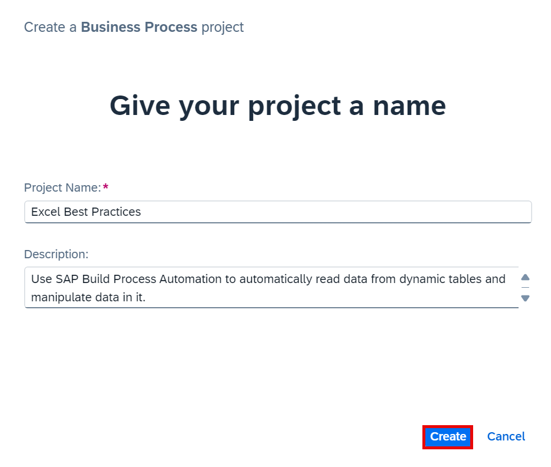
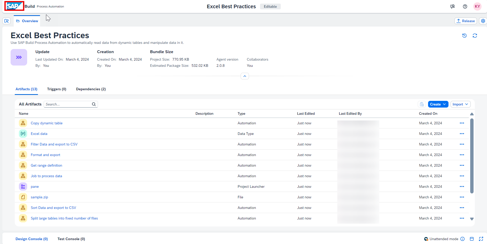
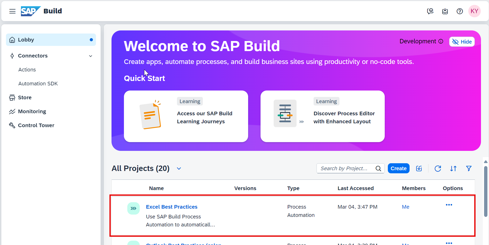
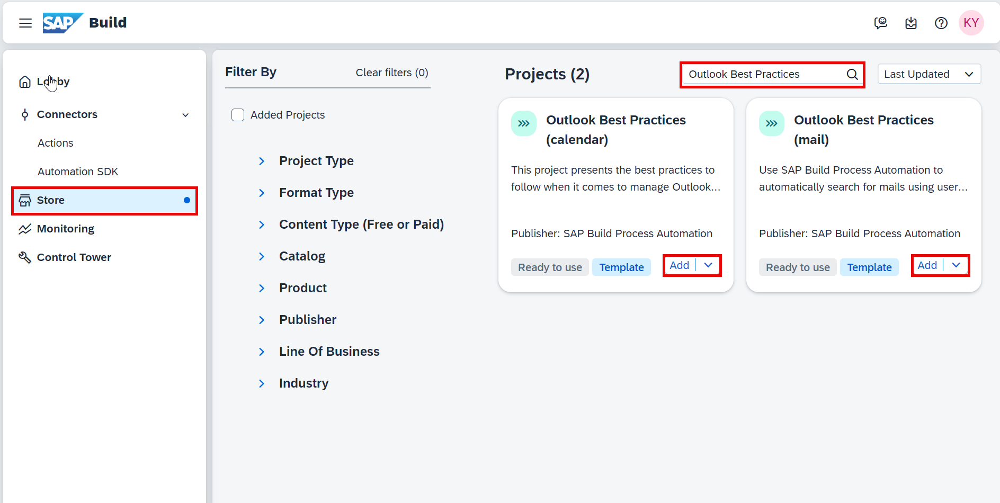

# Integrate Excel and Outlook SDK Based Automations To A Single Project
<!-- description --> In this tutorial, you will customize the Excel and Outlook SDK based projects, so that they can be integrated together as a single business process.

## Prerequisites
- Complete the tutorial: [Extend Outlook SDK based automation](spa-extend-outlook-automation)
- Complete the tutorial: [Build Your First Automation Using Excel SDK of SAP Build Process Automation](spa-create-excel-automation)

## You will learn
  - How one automation in a project can be embedded into another automation project
  - How one automation can call another automation,
  - How to pass values from one automation to another
  - How you can build an integrated business process using SAP Build Process Automation

## Intro
SAP Build Process Automation has native integration to several Microsoft Office products including Outlook, Excel SDK. In this tutorial, you will integrate the automations to a single business process. Create a new automation that includes both the Outlook and Excel automations. Use a combination of environment variables and input/output variables to pass information across the project and in this way, processing will be dynamic and can work for any email or Excel file.

---

### Customize Outlook automation


1. In your **Outlook Sample** project, add `baseFolderPath` as an environment variable.
   <!-- border -->

2. Use this new path in **Save All Mail Attachments**.
   <!-- border -->

3. To reuse this automation, release the **Editable** project. You can do so in two ways.
    - Either you can do so from Lobby by choosing **(...)**
    - From within the project you can do so by clicking the button **Release**

    <!-- border -->

4. Another way to release the project.
   <!-- border -->

5. At release time, it will ask you to specify a version number, you can accept the default suggestion.
   <!-- border -->

6. Notice the name change from Editable to (version number) Released.
   <!-- border -->


### Customize Excel automation


1. In your Excel project, add **Get Folder Collection** to the `baseFolderPath` environment variable. This step will return all the sub folder names within a given folder. In this case, it will give each timestamp based folders fetched from each email from the Outlook. Rename the output parameter to `folderList`.
  <!-- border -->

2. You can see the folder name by using a **Log Message**.
  <!-- border -->

3. Loop through each folder. For this will add **For Each** loop to the flow.
  <!-- border -->

4. Add all the required steps into the folder. The idea is on each file, a certain set of actions needs to be performed.
  <!-- border -->

5. Within each index of **For Each**, fetch list of Excel files in each folder. For this, add **Get File Collection** to the loop.
  <!-- border -->

6. The value for **Get File Collection** is as given in the image.
  <!-- border -->

7. Add one more **For Each** to loop through each Excel file in that sub folder. Here to distinguish both the loop variables, you can rename it appropriately. Also include the required Excel actions within this sub **For Each** loop.
  <!-- border -->

8. First create a string variable and assign the loop variable's full path to the Excel file.
  <!-- border -->

9. Adjust the **Get File Name** to take the output variable.
  <!-- border -->

10. This tutorial uses hard coded ranges in **Filter Range**. When you generalize the logic to your needs, you may want to calculate this at run time. For example, add `Get UsedRange Row` and Get `UsedRange Column` activities to find out the start and end cell values.


11. Now use a **Custom script** activity to calculate complete range.
    <!-- border -->

    ```JavaScript
    var startColumn = 1;
    var startCell = String.fromCharCode(startColumn + 64) + startColumn;
    var endCell = String.fromCharCode(columnRange + 64) + rowRange;
    return startCell + ":" + endCell;
    ```

12. Just for demonstration purpose, filter against the first column and look for cell values containing a.
  <!-- border -->

13. Use similar approach to find out range of values after filtering to be used with **Copy Range**.
  <!-- border -->

14. Append **"\_new"** to the new CSV file name in **Save As Workbook**.
  <!-- border -->

15. Like the Outlook sample, you need to release the package and publish to the library. You can do so either from the SAP Build Lobby or from within the project.


### Create an integrated automation project


1. Create a brand new Automation project **Main Automation**.
  <!-- border -->

2. Include both Excel and Outlook projects as dependency. Here you will add Excel Project. Similarly you have to add Outlook based project.
  <!-- border -->

3. This is the result after adding both project's packages as dependency.
  <!-- border -->

4. Call this new project as **Main Automation** project.
  <!-- border -->

5. Add automations from both Outlook sample and Excel sample projects to the flow.
   <!-- border -->

    > Don't be confused with the name. There are Package/Project Name(s) and Automation name(s). In this step, you will be using automations

6. Save and test the project.

7. At the end, after this tutorial is tested, the below source data was used.
  <!-- border -->

8. After the automaton is executed, it has filtered the data (Town starting with a), hidden a column (Column F with title `storey_range`) and resultant Excel will look like this:
  <!-- border -->

### Learn Microsoft Office Best Practices

> To learn more about Excel and Outlook SDKs of SAP Build Process Automation, refer to the samples available in the store.

To retrieve these samples, please follow these steps:
    
1. From the SAP Build Lobby, navigate to Store.
   
2. Search for the sample project: **Excel Best Practices**.
   
3. Choose **Add** > **Create from Template** to retrieve the sample and save it as a new project in your lobby.

    <!-- border -->

4. Choose **Create**.

    <!-- border -->

    Your project gets created in editable version. You may release and deploy it and run the project.
    
5. Navigate back to the lobby by clicking on the SAP logo.
  
    <!-- border -->

    You can see your project is available in the lobby.
  
    <!-- border -->

6. Similarly, you can add **Outlook Best Practices(calendar)** and **Outlook Best Practices(mail)** from the Store to your lobby.
    <!-- border -->

---
