# Integrate an SAP UI5 Task in a Business Process
<!-- description -->Integrate an Existing Workflow SAP UI Task in a sales order approval business process.

## Prerequisites
 - Complete [Create an SAP UI5 Task in for a Business Process](spa-create-sapui5-task-orderapproval) tutorial
 - Complete [Subscribe to SAP Build Process Automation](spa-subscribe-booster) tutorial
 - Complete [Build Your First Business Process with SAP Build Process Automation](mission.sap-process-automation) mission

## You will learn
  - How to integrate your SAP UI5 Approval Form in an SAP Build Process Automation project.

---

### Import your SAP UI5 form in your SAP Build Process Automation

1. Open your Sales Order Management project you created as a prerequisite.

    > **CAUTION**: If you are using a SAP BTP Free Trial account, you are limited to a quota of 5 forms within your project. Please delete the **Approval Form** before you import your SAP UI5 form.

    <!-- border -->

2. Perform the following steps:

    - under the **Editable** version of your project
    - choose the **Import** button.
    - select **Form** from the contextual menu

    <!-- border -->

3. Fill the Import Form details:

    - set the **Application ID**, the name of your SAP UI5 application you get from the *manifest.json* file
    - set the **Version**, the application version you get from the *manifest.json* file
    - provide a **Name**, an identifier and a description for your approval form
    - choose the **Import** button

    <!-- border -->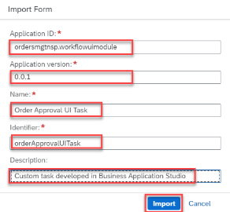

4. The form should open in the **Forms Editor**:

    - if you want to open the *manifest.json*, choose the **hyper link** button
    - close the **Forms Editor**

    <!-- border -->

### Update your Business Process

1. Open your **Order Processing** business process

    <!-- border -->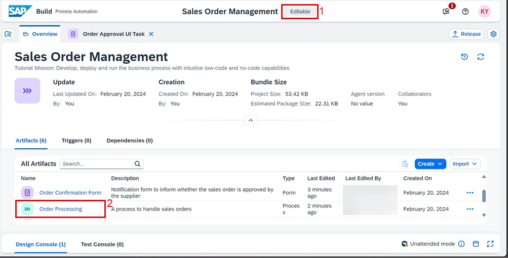

2. Remove the current **Approval Form** designed by with **Forms Builder**

    <!-- border -->

3. Add your imported **Order Approval UI Task** as approval into your business process

    <!-- border -->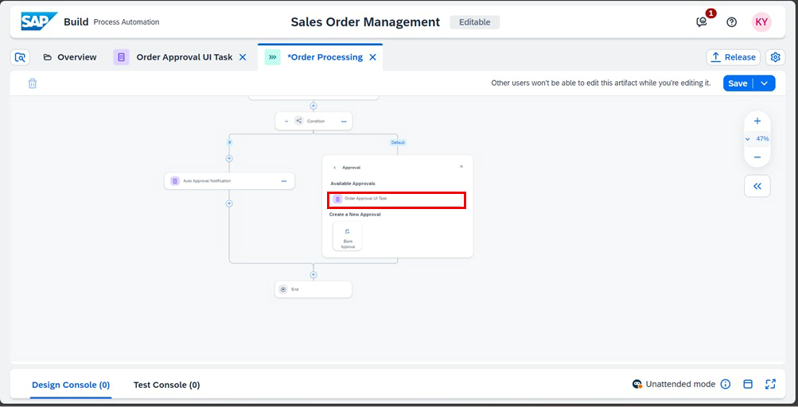

4. Connect the **reject** branch into the **Order Rejection Notification** form

    <!-- border -->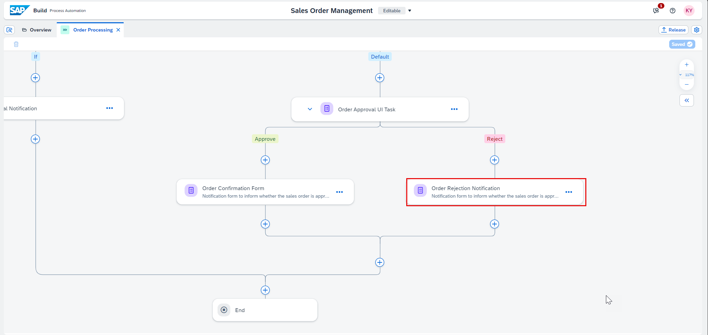

5. Select the Order Approval UI Task, fill and map the required fields:

    - in the **Subject** field, enter **Review and approve order**, select **Order Number** from Order Processing Form, enter **and**, select **Ship To Party** from Order Processing Form
    - set the **Users** under **Recipients** with **Process Started By** from Process Metadata
    - choose the **Inputs** tab

    <!-- border -->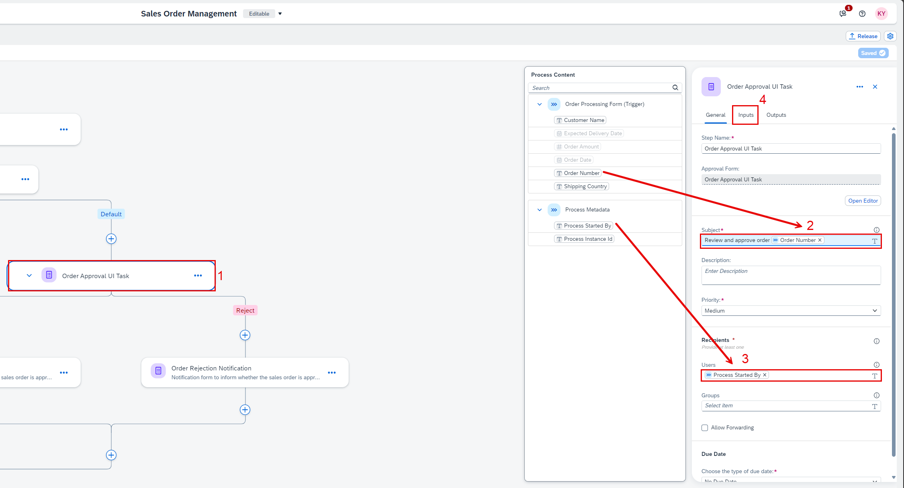

6. Map the required form **Inputs** accordingly

    <!-- border -->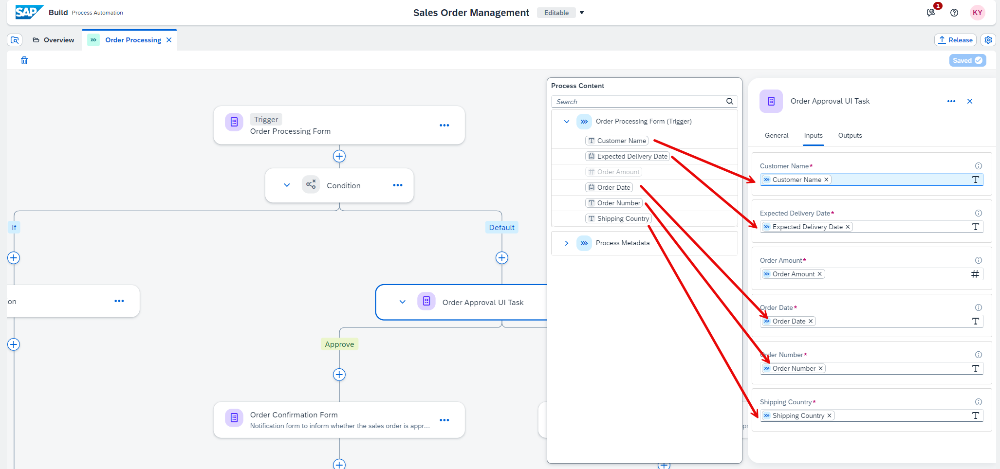

7. Select the **Order Confirmation Form** and map the required missing input accordingly

    <!-- border -->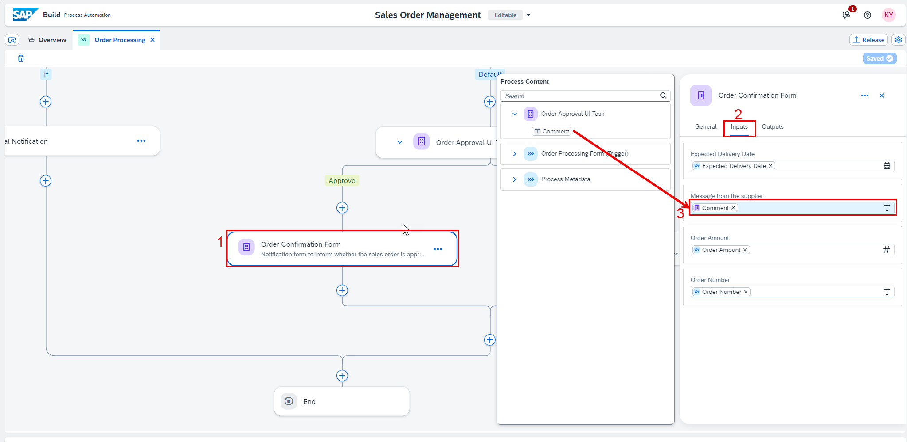

8. Select the **Order Rejection Notification** form

    - map the required missing input accordingly

    <!-- border -->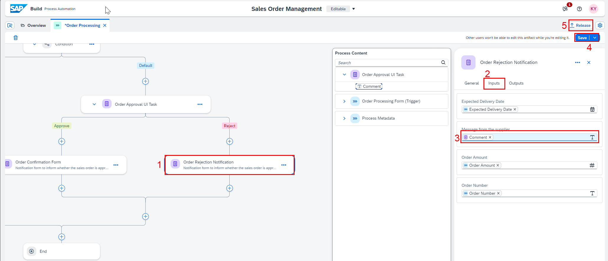

9. Save your project

10. Release your project

### Deploy your project

1. Deploy your **Project** and retrieve the **Form Trigger** link for testing

    <!-- border -->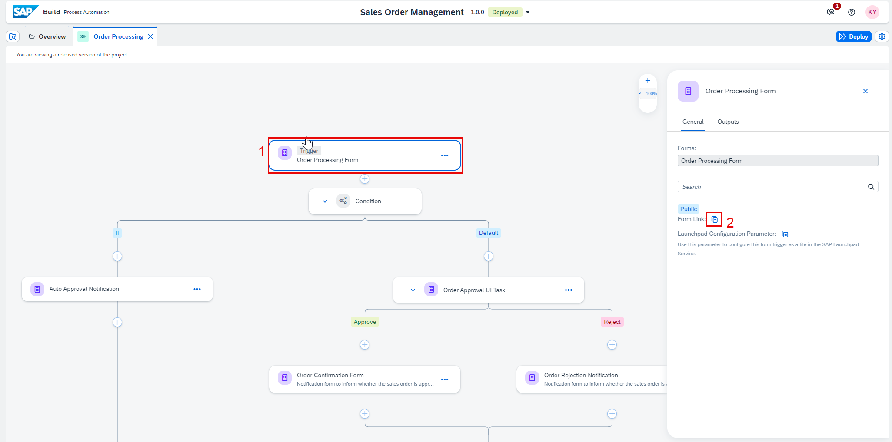

2. Provide **Sales Order** data and test your process going through the approval process branch

    <!-- border -->

### Check task in Inbox

[OPTION BEGIN [SAP Build Process Automation]]       
1. Open your **Inbox**

    <!-- border -->

2. Review your approval task and take a decision.

    <!-- border -->

3. Complete your process:

    - Refresh your tasks
    - Check that the decision is reflected with the right notification task

    <!-- border -->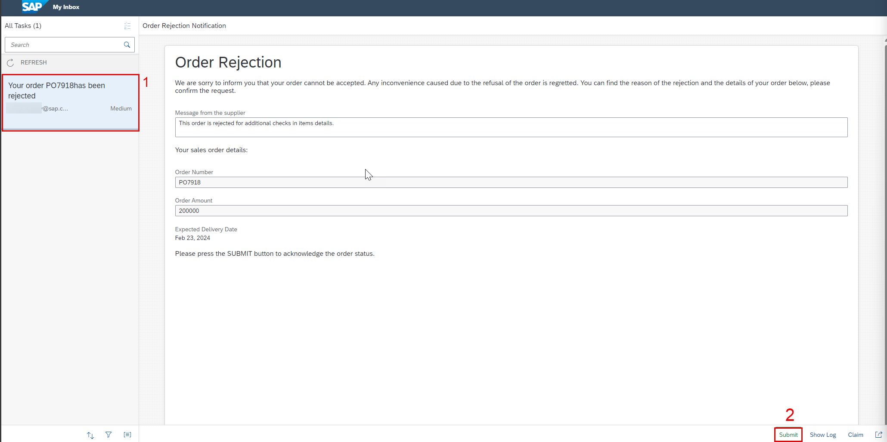
[OPTION END]

[OPTION BEGIN [SAP Build Work Zone(Standard Edition)]]        
>Pre-requisite: Complete [Configure SAP Build Work Zone, Standard Edition ](spa-configure-workzone)tutorial

1. Once you have subscribed to SAP Build Work Zone, Standard Edition navigate to **Site Directory** and go to the site.

    <!-- border -->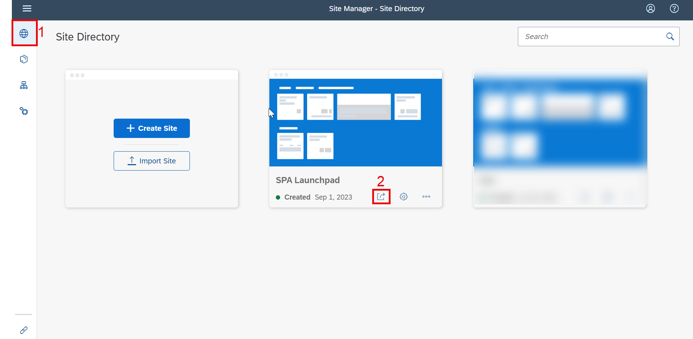

2. Choose the **Inbox** tile.

    <!-- border -->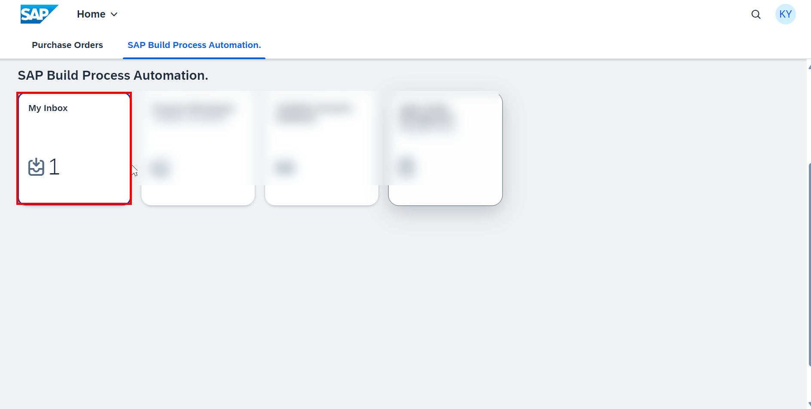 

3. Review your approval task and take a decision.

    <!-- border -->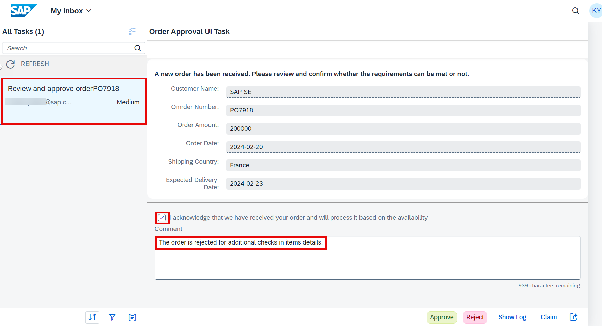

4. Complete your process:
    - Refresh your tasks
    - Check that the decision is reflected with the right notification task
    <!-- border -->

[OPTION END]

### Process monitoring

1. Monitor the business process

<!-- border -->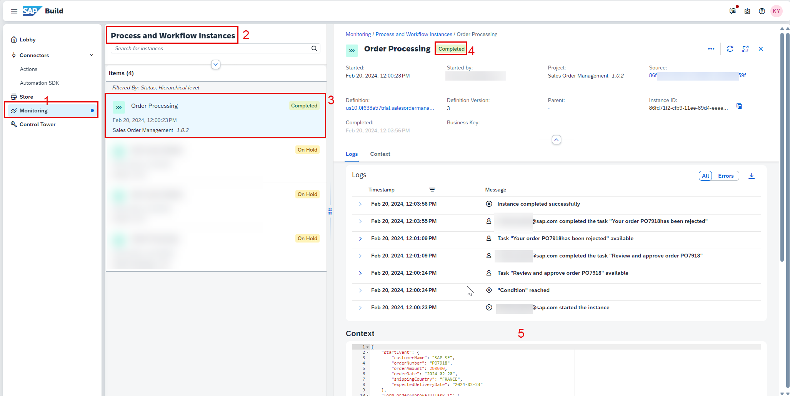

You have successfully completed the tutorial, integrating an SAP UI5 application in the order approval business process.

### Retrieve sample project from the store (Optional)

> The entire project is available in the SAP Build Store as a sample and you can follow the below steps to retrieve the project and use it for reference.

To retrieve this sample, please follow these steps:
    
1. From the SAP Build Lobby, navigate to Store.
   
2. Search for the sample project: **Sales Order Management (MI08)**.
   
3. Choose **Create from Template** to retrieve the sample and save it as a new project in your lobby.

    <!-- border -->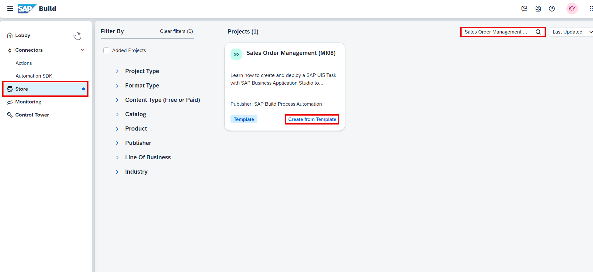

4. Choose **Create**.

    <!-- border -->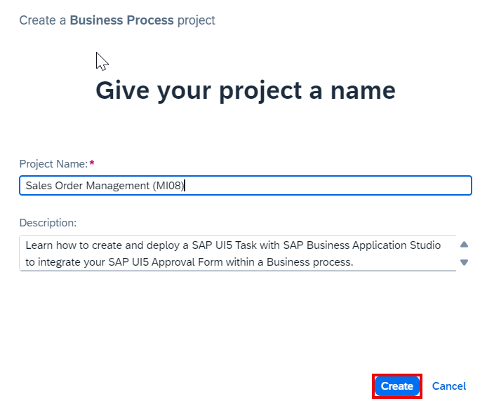

    Your project gets created in editable version. You may release and deploy it and run the project.
    
5. Navigate back to the lobby by clicking on the SAP logo.
  
    <!-- border -->

    You can see your project is available in the lobby.
  
    <!-- border -->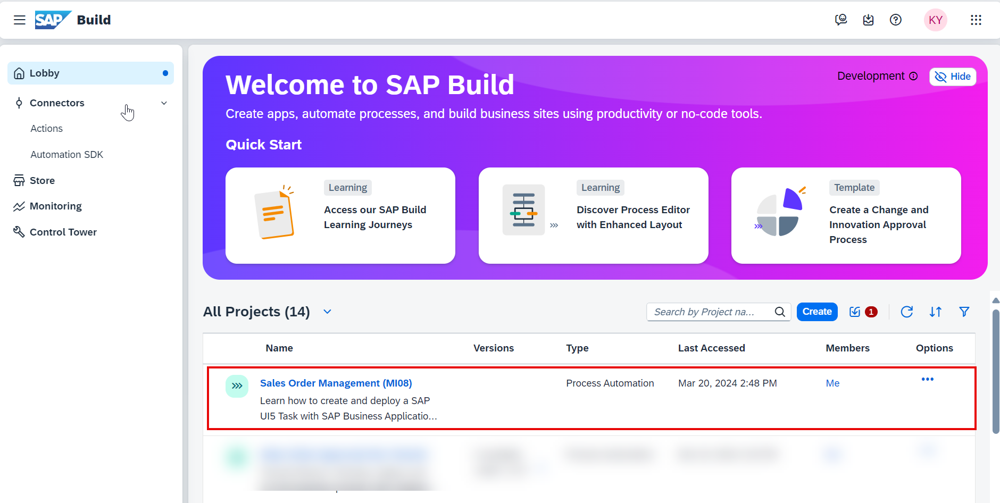
