# Integrate an SAP UI5 Task in a Business Process
<!-- description -->Integrate an Existing Workflow SAP UI Task in a sales order approval business process.

## Prerequisites
 - Complete [Create an SAP UI5 Task in for a Business Process](spa-create-sapui5-task-orderapproval) tutorial
 - Complete [Subscribe to SAP Build Process Automation Using SAP BTP Free Trial](spa-subscribe-free-trial) tutorial
 - Complete [Build Your First Business Process with SAP Build Process Automation](mission.sap-process-automation) mission

## You will learn
  - How to integrate your SAP UI5 Approval Form in an SAP Build Process Automation project. 

---

### Import your SAP UI5 form in your SAP Build Process Automation

1. Open your Sales Order Management project you created as a prerequisite. 
   
    > **CAUTION**: If you are using a SAP BTP Free Trial account, you are limited to a quota of 5 forms within your project. Please delete the **Approval Form** before you import your SAP UI5 form.

    <!-- border -->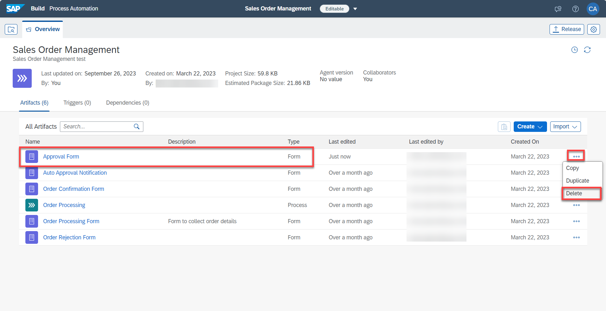 

2. Perform the following steps:
   
    - under the **Editable** version of your project
    - choose the **Import** button.
    - select **Form** from the contextual menu
  
    <!-- border -->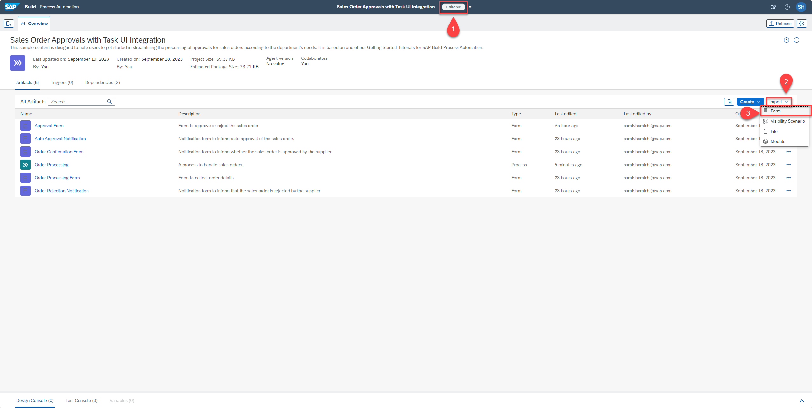

3. Fill the Import Form details:
   
    - set the **Application ID**, the name of your SAP UI5 application you get from the *manifest.json* file 
    - set the **Version**, the application version 
    - provide a **Name**, an identifier and a description for your approval form
    - choose the **Import** button
  
    <!-- border -->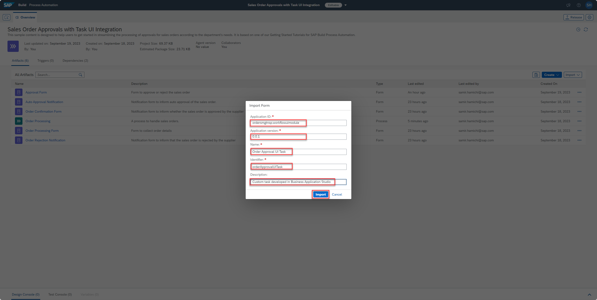

4. The form should open in the **Forms Editor**:
   
    - if you want to open the *manifest.json*, choose the **hyper link** button 
    - close the **Forms Editor**

    <!-- border -->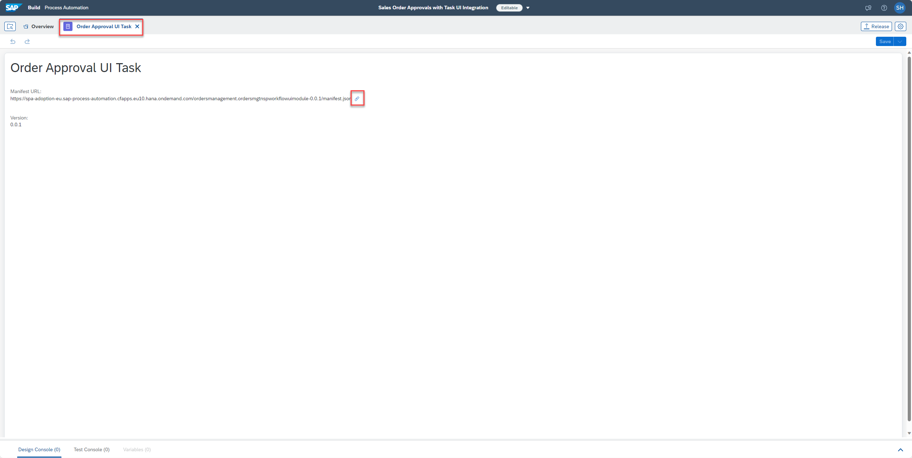

### Update your Business Process

1. Open your **Order Processing** business process 
  
    <!-- border -->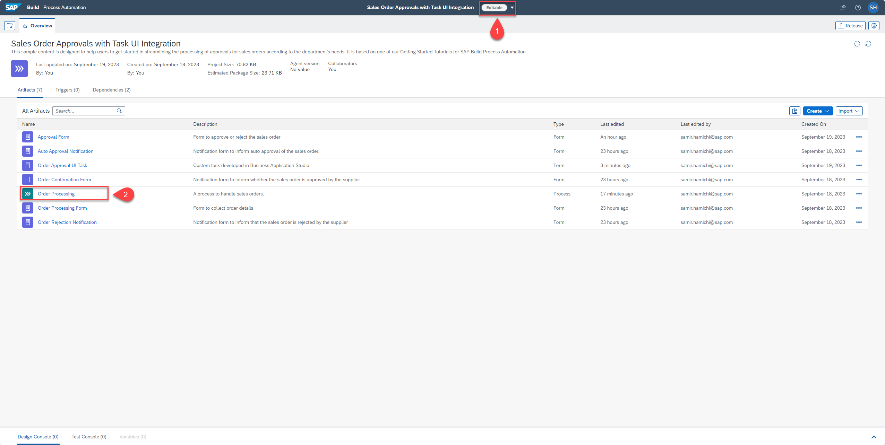

2. Remove the current **Approval Form** designed by with **Forms Builder**
  
    <!-- border -->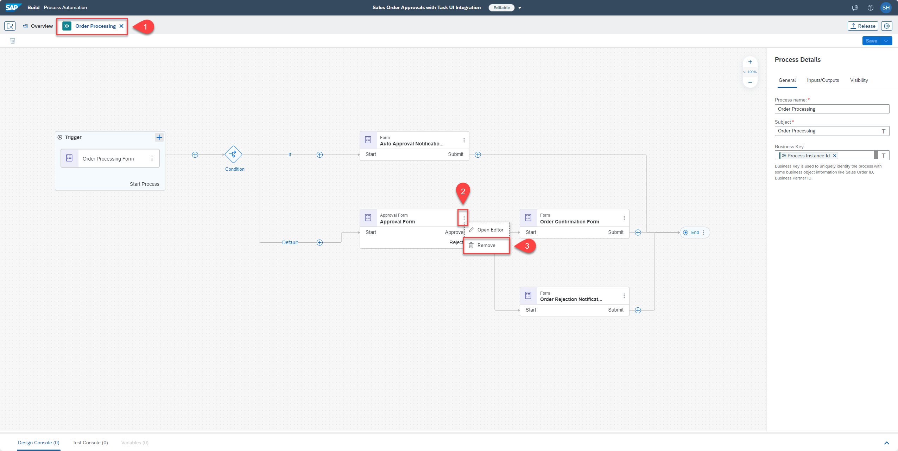

3. Add your imported **Order Approval UI Task** as approval into your business process 
  
    <!-- border -->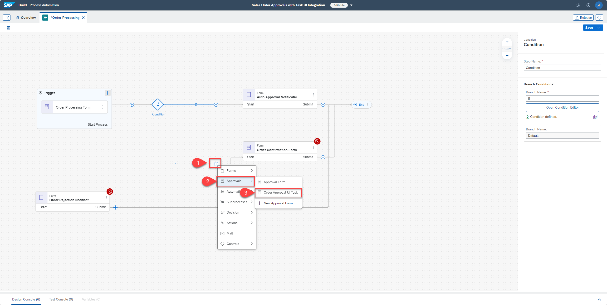

4. Connect the **reject** branch into the **Order Rejection Notification** form
  
    <!-- border -->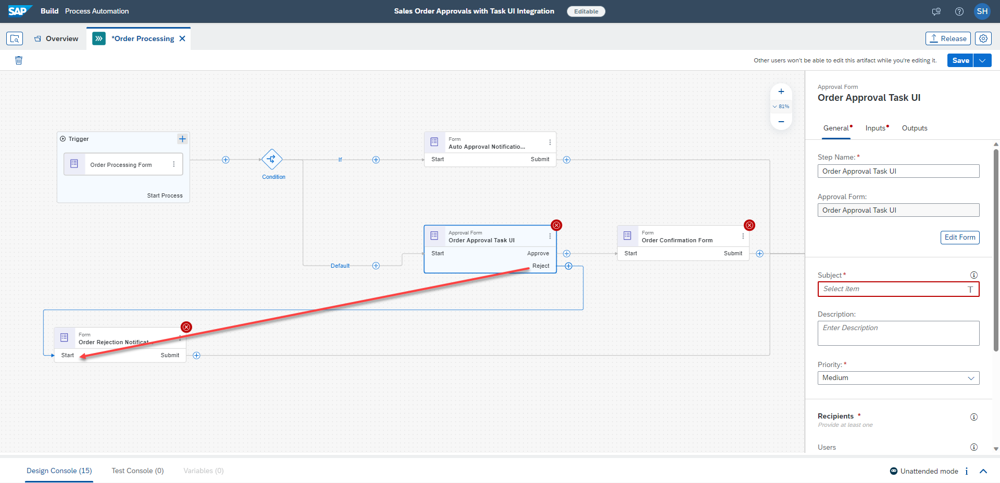

5. Select the Oder Approval UI Task, fill and map the required fields:
   
    - in the **Subject** field, enter **Review and approve order**, select **Order Number** from Order Processing Form, enter **and**, select **Ship To Party** from Order Processing Form
    - set the **Users** under **Recipients** with **Process Started By** from Process Metadata
    - choose the **Inputs** tab 
    
    <!-- border -->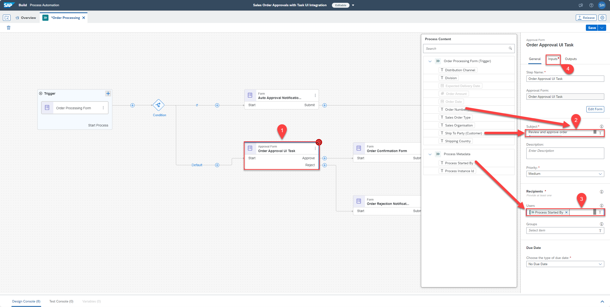

6. Map the required form **Inputs** accordingly
  
    <!-- border -->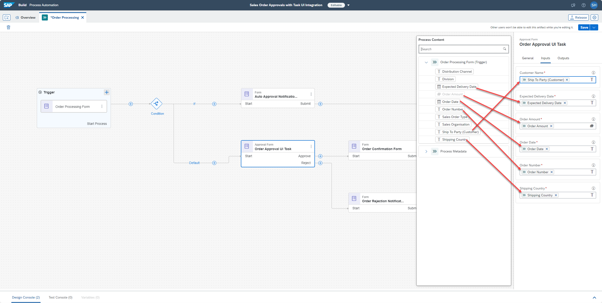

7. Select the **Order Confirmation Form** and map the required missing input accordingly
  
    <!-- border -->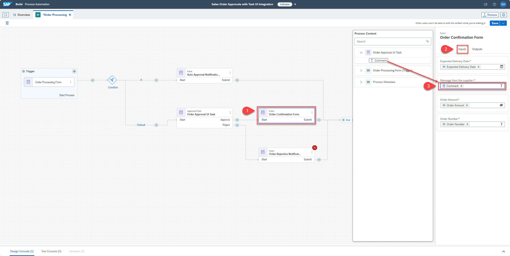

8. Select the **Order Rejection Notification** form
   
    - map the required missing input accordingly

    <!-- border -->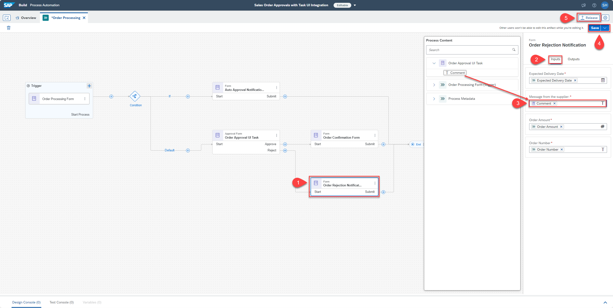
  
9. Save your project

10. Release your project
    

### Deploy your project 
  
1. Deploy your **Project** and retrieve the **Form Trigger** link for testing 
     
    <!-- border -->

2. Provide **Sales Order** data and test your process going through the approval process branch
  
    <!-- border -->

### Inbox checking and process monitoring

1. Open your **Inbox**
  
    <!-- border -->

2. Review your approval task and take a decision
  
    <!-- border -->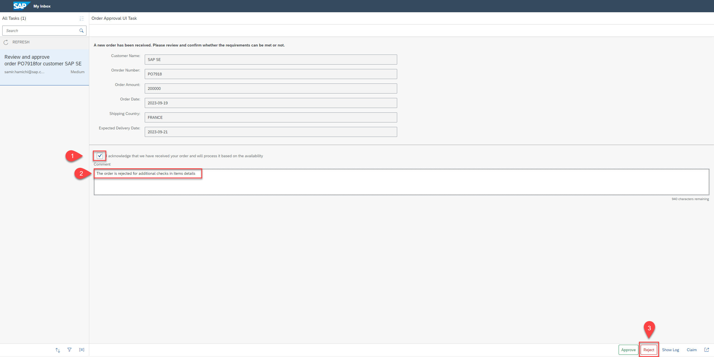

3. Complete your process:
   
    - refresh your tasks 
    - check that the decision is reflected with the right notification task
     
    <!-- border -->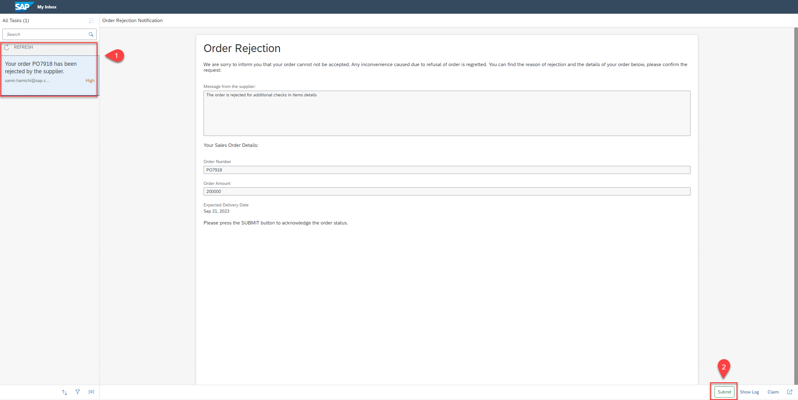

4. Monitor the business process
  
    <!-- border -->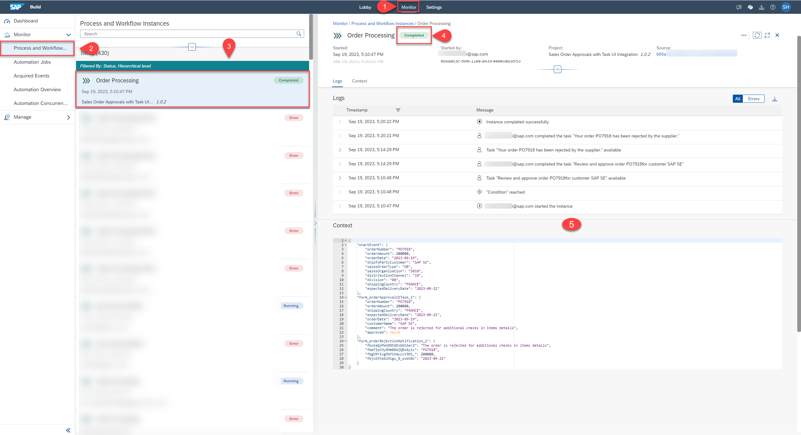

You have successfully completed the tutorial, integrating an SAP UI5 application in the order approval business process.