# Run Business Process
<!-- description --> Once the business process is deployed, learn how to run the business process and monitor the process with action execution details.

## You will learn
- to run and monitor business process with action
- to observe the action logs and outcome of the action execution
- to retrieve sample project from the Store

### Run sales order approval business process

1. From the deployed version of the project, click **Order Processing** process from list of **Artifacts**.

    <!-- border -->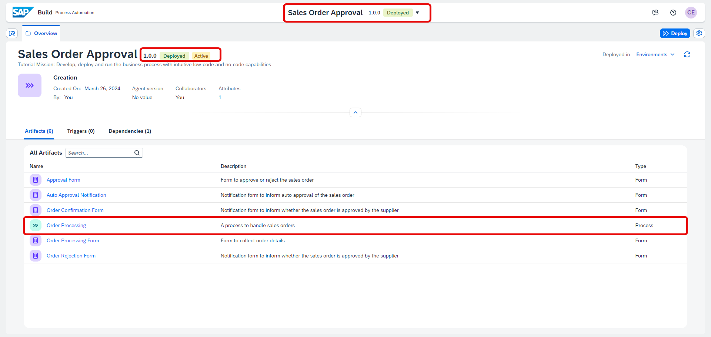

2. In the process editor,
    - select **Order Processing Form**.
    - copy the **Form Link**.
    - open it in new browser tab/window.

    <!-- border -->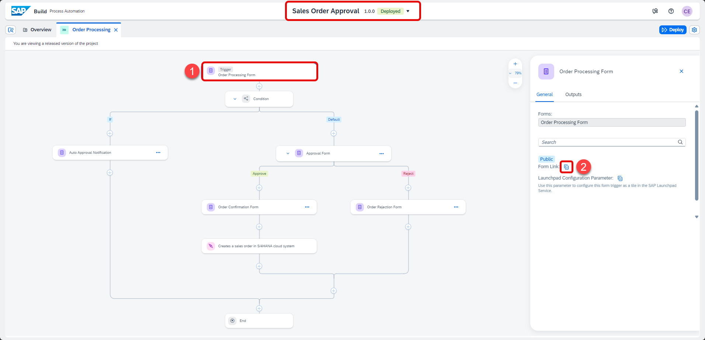

3. Fill the form with following details and click **Submit**.

    > This will start the business process.

    | Form Field Name | Value    |
    | :------------- | :------------- |
    | Order Number  | any value like PO34890, 56390 etc. |
    | Order Amount | any number greater than 100000 |
    | Order Date | select any previous date from date-selector |
    | Ship To Party | 17100006   note: this is a customer ID in the   backend S/4HANA System|
    | Sales Order Type | OR   note: this stands for Standard Order  in the   backend S/4HANA System|
    | Sales Organization | 1710   note: this is the organisation ID already   existing in the backend S/4HANA System|
    | Distribution Channel | 10   note: this stands for Direct Sales distribution channel   in the backend S/4HANA System|
    | Division | 00   note: this stands for Product Division   in the backend S/4HANA System|
    | Shipping Country | any country name like India, Germany etc. |
    | Expected Delivery Date |  select any later date from the date-selector |

    > As per the process, if the order amount is > 100000 then it will go for approval or else it will auto-approved.

    > The sales order information in the form has to be filled based on the available business object values in the backend system such that the sales order gets created successfully in S/4HANA system.

    <!-- border -->

### Monitor sales order approval process

1. Return to the lobby and select **Monitoring** then choose **Process and Workflow Instances** under **Monitor** to monitor the process execution.

    <!-- border -->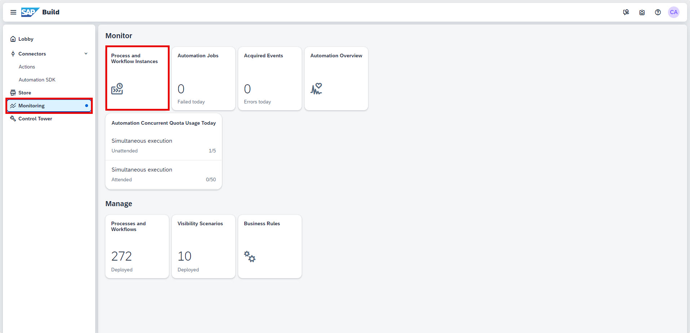

2. In process instance detail page, select your process instance to inspect the instance details.

    - Look at the context section. In the context, you will see the order details that you entered in the form.

    <!-- border -->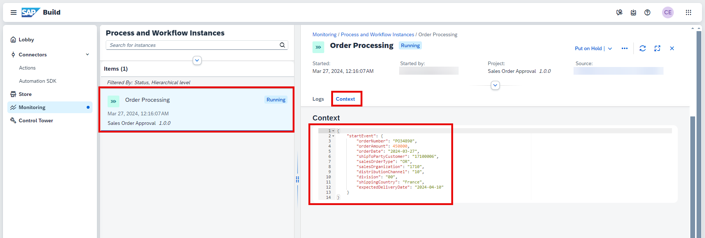

    - Go to **Logs** and you will see that the user task is waiting to be approved.

    <!-- border -->

### Approve sales order from MyInbox

1. Open `MyInbox` application from top-right corner of the screen.

    <!-- border -->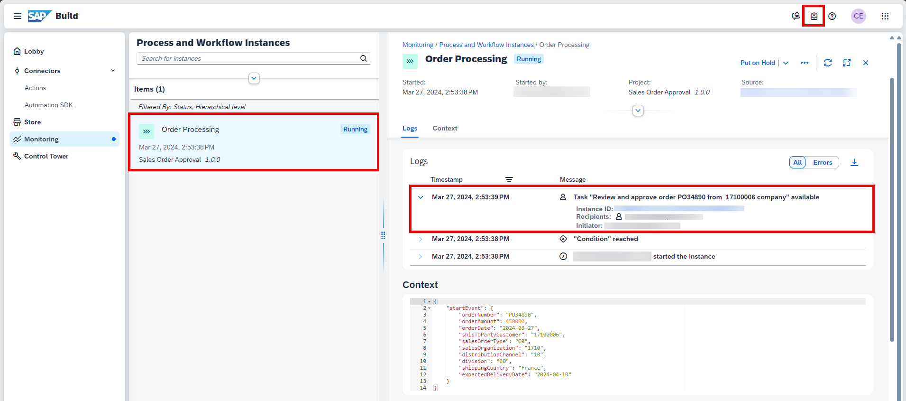

2. In `MyInbox` application, you will see a new task **Review and Approve order** with the given purchase order number in your inbox.

    > You can also search the inbox items with your purchase order number.

    - Select the acknowledgement checkbox.
    - Enter any comment of your choice.
    
    > This comment will be sent to the requester during final notification.

    - Click **Approve**.

    <!-- border -->

3. As per the process, once you approve the sales order - an explicit notification task is sent to the approver to inform him of the approval with the comment from the supplier.

    - Choose **Refresh** to get new tasks.
    - Select task with your purchase order number having text **Your order PO has been successfully received**.

    > You will see the message from the supplier.

    - Click **Submit** to acknowledge the response from the supplier.

    <!-- border -->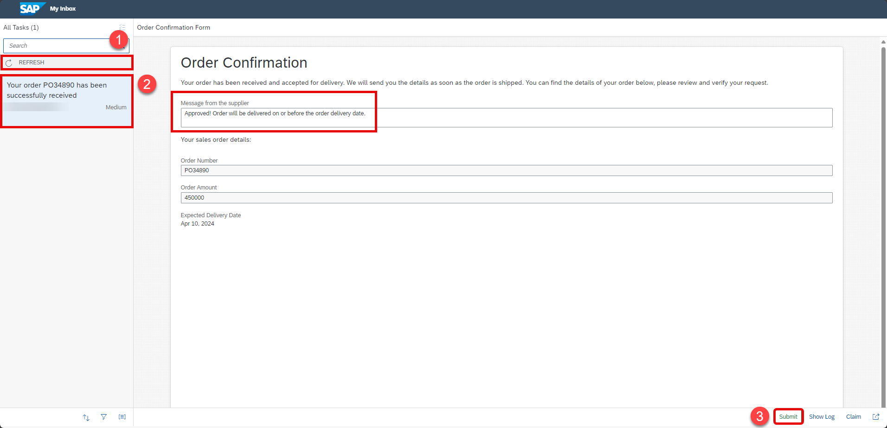

### Check action log

1. Go back to **Monitoring > Process and Workflow Instances**, select your process instance and observe the **Logs**.

    - **Refresh** the logs from top-right corner of the screen.
    - You will see the log entry for **Action** execution which informs you that a POST API for Sales Order has been executed, with the given destination configuration.

    <!-- border -->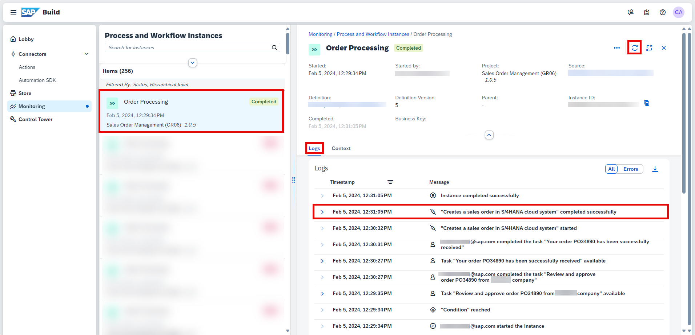

2. Now click to open **Context** tab.

    - You can observe the process context as how it has been updated after successful execution of each process step.
    - Notice the output after the Action execution.
    - Copy this `SalesOrder` number from the output to validate it in
      SAP S/4HANA system.

    <!-- border -->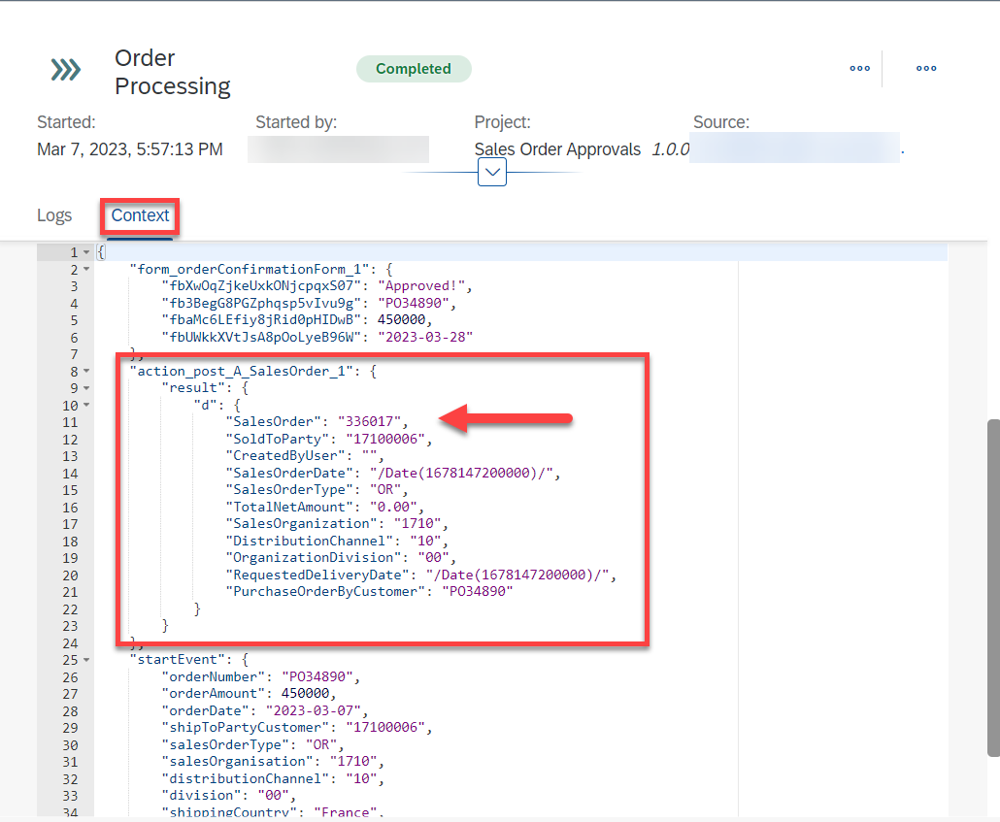

You've successfully built and executed an automated sales order approval process where the sales order is created in the backend S/4HANA Cloud system once the approval is done.

### Retrieve sample project from the store (Optional)

   > The entire project is available in the SAP Build Store as a sample and you can follow the below steps to retrieve the project and use it for reference.

This sample project can be downloaded from the SAP Build Store.

To retrieve this sample, please follow these steps:
    
1. From the SAP Build Lobby, navigate to Store.
   
2. Search for the sample project: **Sales Order Management (MI06)**.
   
3. Choose **Create from Template** to retrieve the sample and save it as a new project in your lobby.

    <!-- border -->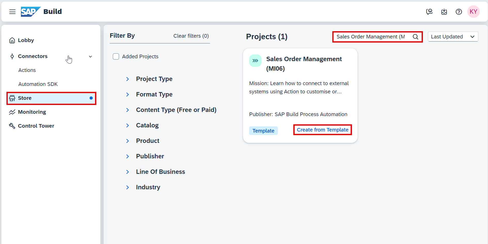

4. Choose **Create**.

    <!-- border -->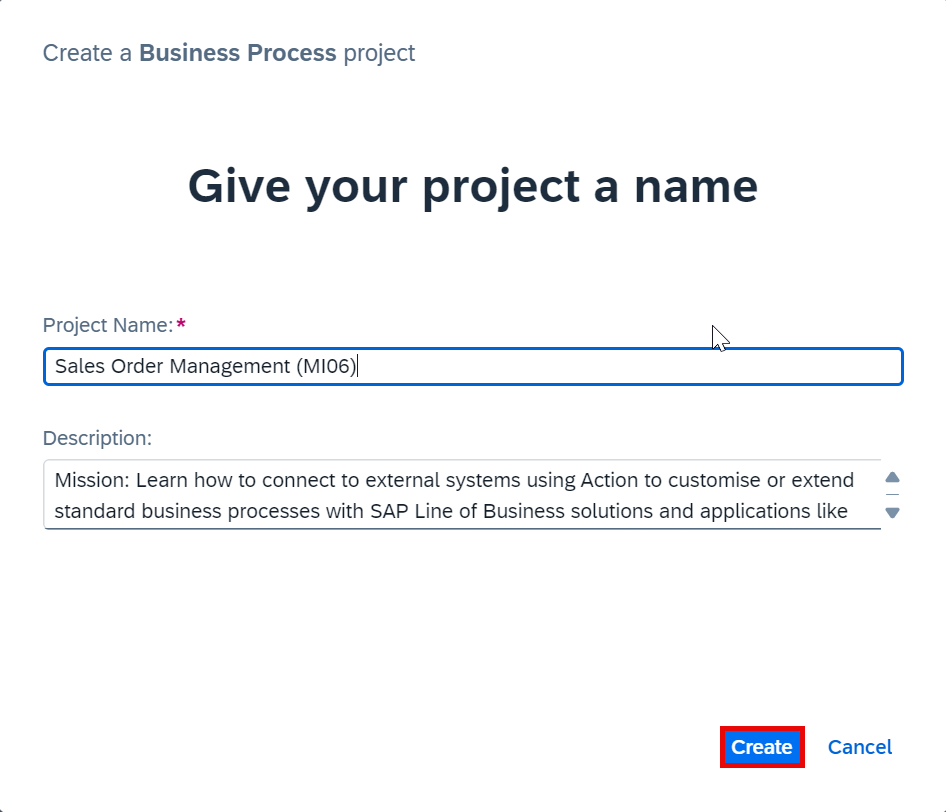

    Your project gets created in editable version. You may release and deploy it and run the project.
    
5. Navigate back to the lobby by clicking on the SAP logo.
  
    <!-- border -->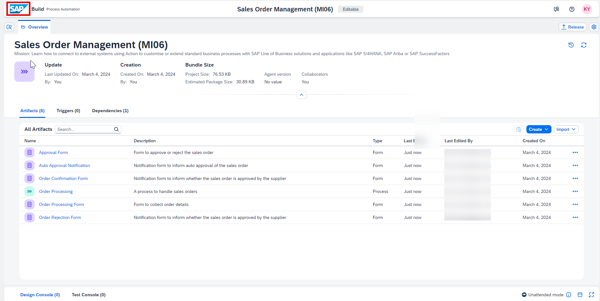

    You can see your project is available in the lobby.
  
    <!-- border -->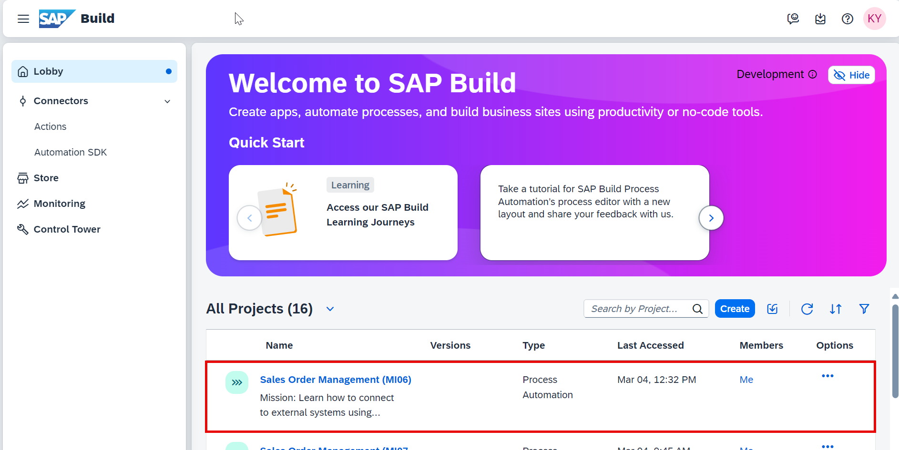

---
