# Run the Process With an Automation
<!-- description --> Run the business process with a full monitoring of the workflow instances and automation jobs

## Prerequisites
 - Complete [Agent Management settings to execute the process with an automation](spa-run-agent-settings)
 - Complete [Create an Automation to Extract Data](spa-create-automation) 
 - Complete [Create a Decision](spa-create-decision)
 - Complete [Create Process Visibility Scenario](spa-create-process-visibility)

## You will learn
  - How to run the Process
  - How to work on the Tasks
  - How to monitor Process and Automation
  - How to gain visibility into the Business Process
  - How to retrieve the sample project from the Store
---

### Release and deploy the business process

Before releasing and deploying your business process, please make sure you have completed the required [Agent Management settings to execute the process with an automation](spa-run-agent-settings).

Once you have taken care of the agent management settings, you can release and deploy the business process project to run the process.

  <!-- border -->

  <!-- border -->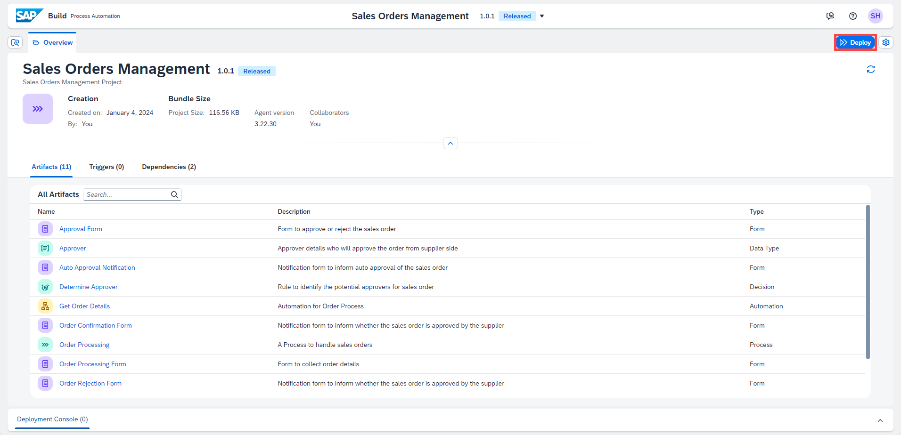

1. While deploying, the `OrderFilePath` data type should be the path to the excel workbook saved on your machine.

2. Choose **Next**.

    <!-- border -->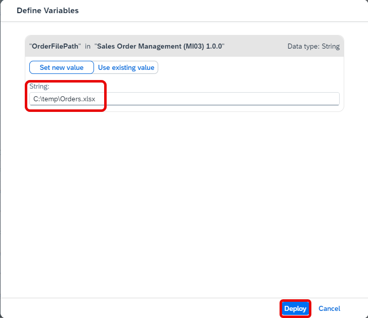

3. Choose **Deploy**.
 
    <!-- border -->

### Run the business process

You will now run the process and learn how to monitor the process and work on the tasks. You have released and deployed the business process project.

1. From the deployed version of the Business Process Project in the **Overview** section, open the process **Order Processing**.

    <!-- border -->

2. Choose **Order Processing Form**.

3. Choose the **Copy** icon aside the **Form Link**.

    <!-- border -->

4. Open the Form pasting the **Form Link** in a browser window.

    > When you open the form in the browser, you will see all the input fields you defined in the process trigger form.

5. Fill the form with the Customer Name and Order Number values and choose **Submit**.

    > You have to enter one of the order numbers from the excel file. Do not enter any random order number or else the automation will not give any results.

    <!-- border -->

    After you choose the **Submit** button, you will be notified that the form has been successfully submitted.

6. The workflow has been triggered and the approval process has started. You can now work on the tasks, monitor the process and gain insights.

### Work on the tasks

Tasks are requests for users to participate in an approval or review process. These tasks appear in the **My Inbox** application shipped with SAP Build Process Automation. Users can claim, approve, and/or reject the task from their inbox.

1. Start in the **Lobby** and open the **My Inbox**.

    <!-- border -->

2. After opening the **My Inbox** application, you will see on the left-hand side all the tasks listed. Select the Approval Form, complete it and choose **Approve**.

    <!-- border -->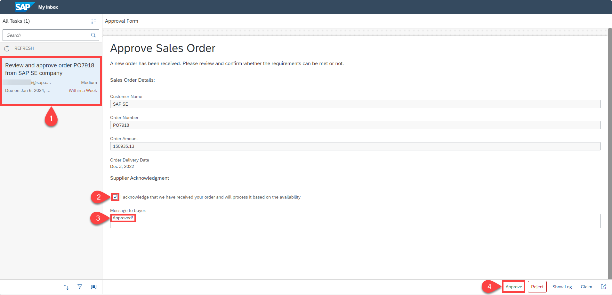

    > The provided tasks and forms might look different than this screenshot, depending on your configurations.

3. Depending on your selected actions and the information you have provided at the start of the process, the next task could be to **confirm** the order.

    Once you approve or reject the approval task, refresh the inbox again to get the final notification based on the action you took. Once you acknowledge the notification sent via the approval process, the process will be completed.

    <!-- border -->

### Monitor process and automation

Monitoring business processes is one of the key aspects of successful automation. Using monitoring capabilities, you can proactively and consistently monitor process performance, identify any issues in the process and take necessary actions to ensure business process continuity.

SAP Build Process Automation provides different applications for monitoring and managing different process skills. The applications include Process and Workflow Instances, Automation Jobs, Acquired Events etc. These applications are available under the **Monitor** tab in SAP Build.

> All deployed processes can be accessed by following **Monitoring** > **Manage** > **Processes and Workflows application**.

1. To monitor all the running instances of the process, navigate to **Monitoring** > **Monitor**> **Process and Workflow Instances**.

    <!-- border -->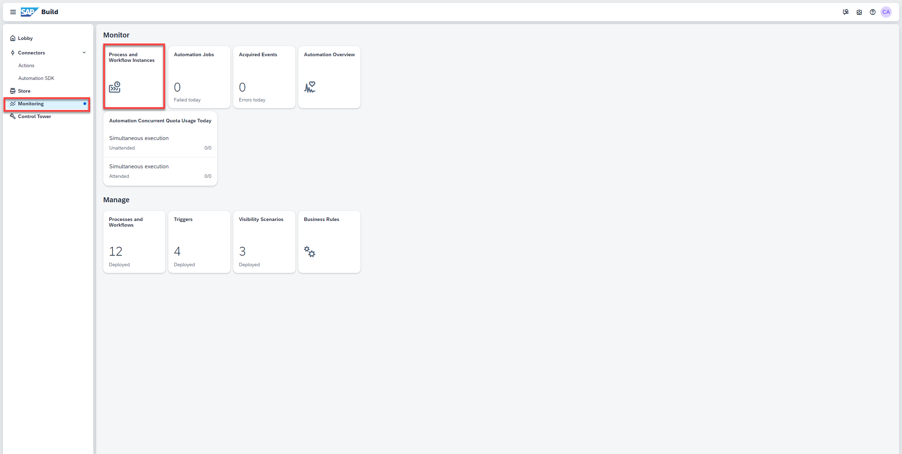

    In there, you will see all the running, erroneous and canceled process instances. Use the filter bar to get a more customized view of the process instances based on different statuses such as running, completed, canceled, etc.

    To explore different process monitoring options, go to the **Process and Workflow Instances** list and choose your new process instance that was just triggered via the start form.

2. Select your **Order Processing** instance to check the status of the **Logs** and **Context**.

    > Observe the process instance information, which provides the context for the process. You can see actual process data flowing across different activities in the process, and the logs where you can trace how the entire process has been progressing. You can also see some basic runtime information for each activity such activity name, who started it, when was it completed etc.

    <!-- border -->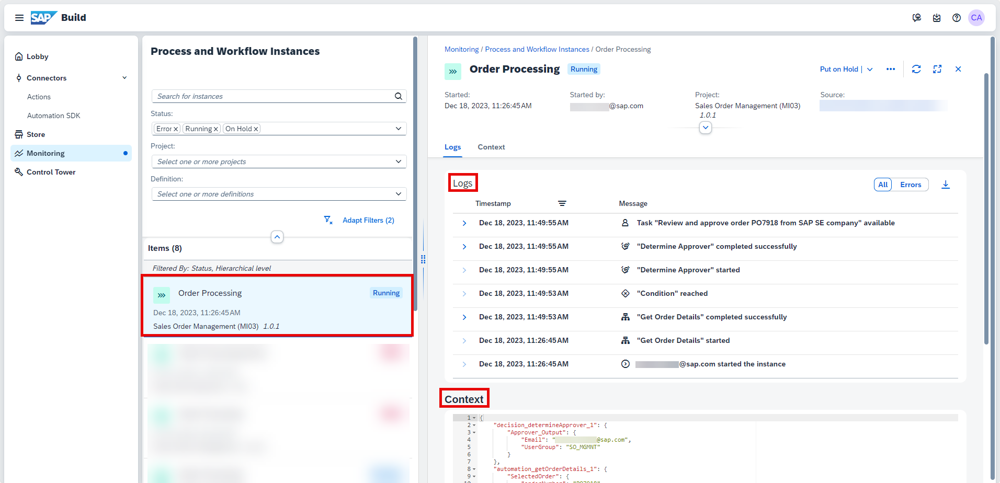

3. Go to **Automation Jobs** under **Monitoring**.

    <!-- border -->

4. Choose the **Warning** icon (if applicable) to learn more about the Automation:

    > If this is the case, go to the [Settings](spa-run-agent-settings) section and add your agent in order to run the Automation Job.

    <!-- border -->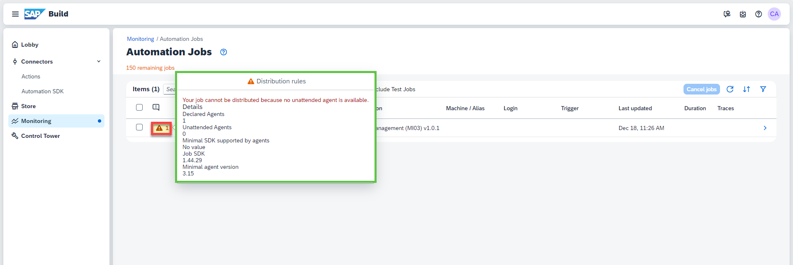

    > In this case, the Desktop agent version installed locally is less than the desktop agent version configured in the project settings.

      <!-- border -->

    > **CAUTION: Desktop agent version installed locally should be greater than or equal to the minimum desktop agent version maintained in the project settings**

5. To fix this, please go the **Editable** version of your project and select **Settings > Agent Version** and choose the agent version that is registered on your local machine. 

    As you can see in the screenshot below, the configured agent version is 3.22 which is greater than the local registered version of 3.19. You will need to choose a version that is less or equal to 3.19

      <!-- border -->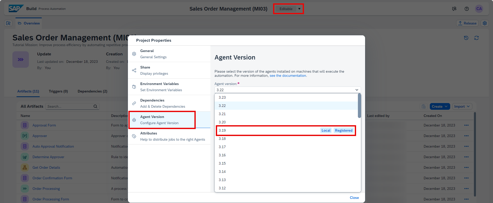

6. Once you have configured an agent version that is less or equal to the desktop agent version installed locally, you will then need to release and deploy your project.

7. You will see the automation ran successfully as below:

    <!-- border -->

    The process instance progresses further to the approval step in the business process as you complete the tasks. Once the tasks are completed, the instance will be completed successfully.

8. Go to **Monitoring** > **Monitor** > **Process and Workflow Instances**.

9. Under **Status**, select **Completed**.

    <!-- border -->

10. Select your completed **Order Processing** instance.

    <!-- border -->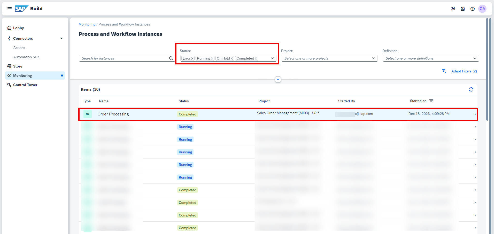

    Again you may check the status of the **Logs** and **Context**. The instance has completed successfully.

    <!-- border -->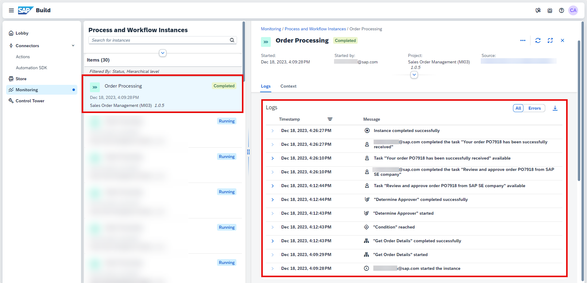

### Gain visibility into the business process

1. From the deployed version of the business process project, select **Sales Order Visibility Scenario** to open the artifact.

    <!-- border -->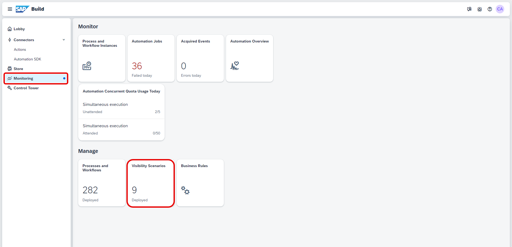

2. In **General** section, choose the **Copy** icon aside the **Dashboard Link**.

    <!-- border -->

3. Open the **Visibility Scenario Dashboard** by pasting the **Dashboard Link** in a browser window.

    The dashboard is there. The performance indicators are filling up, depending on the time it has taken, there might be different results. Please now feel free to explore the details and discover what is included in each tile. You could even navigate into single instances.

    <!-- border -->

    
### Retrieve sample project from the store

This sample project can be downloaded from the SAP Build Store.

To retrieve this sample, please follow these steps:
    
1. From the SAP Build Lobby, navigate to Store.
   
2. Search for the sample project: **Sales Order Management (MI03)**.
   
3. Choose **Create from Template** to retrieve the sample and save it as a new project in your lobby.

    <!-- border -->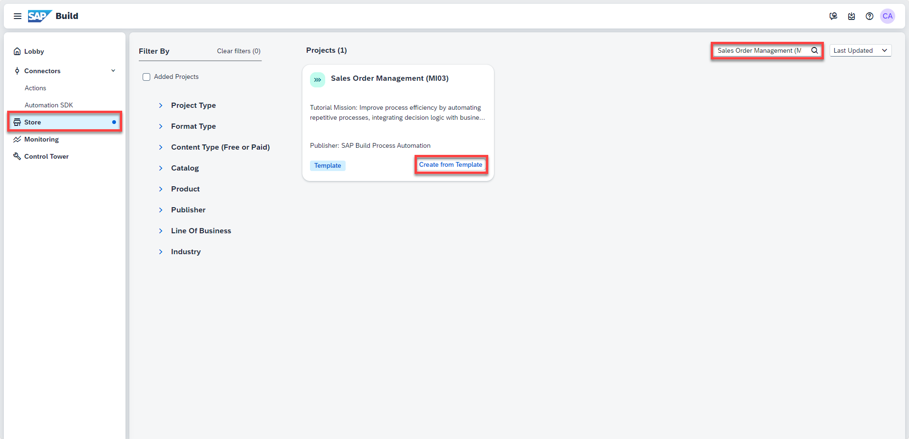

4. Choose **Create**.

    <!-- border -->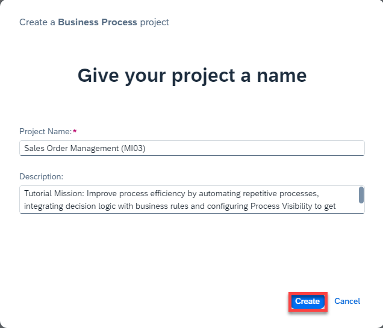

    Your project gets created in editable version. You may release and deploy it and run the project.
    
5. Navigate back to the lobby by clicking on the SAP logo.
  
    <!-- border -->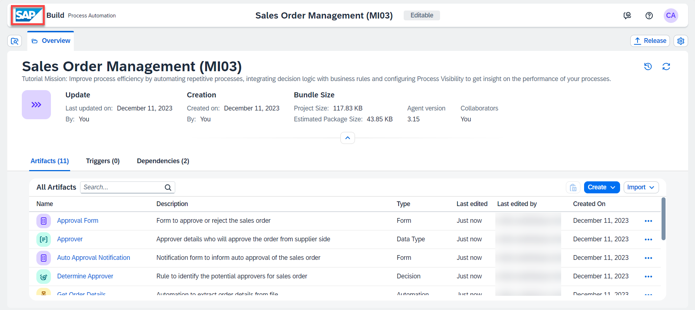

    You can see your project is available in the lobby.
  
    <!-- border -->
    
---
