# Install and Set Up the Desktop Agent 3
<!-- description --> Install and set up the Desktop Agent 3 to run your automations

## Prerequisites
 - A Windows PC
 - If you are using a MAC, please install a VDI
 - Access to a [SAP BTP tenant with SAP Build Process Automation](spa-subscribe-booster)

## You will learn
  - How to install the Desktop Agent 3
  - How to register a tenant in the Desktop Agent 3

---

### About the Desktop Agent 3

The Desktop Agent 3 is an on-premise component of SAP Build Process Automation that is installed locally on user desktops. It executes automation projects that launch and run applications of various kinds, read information from screens, enter data, click options, and process data.

The very first time you launch the Desktop Agent 3 on your workstations, you will be prompted to log in. If you are unsure of your login details, please ask an administrator.

### Download the Desktop Agent 3

>**CAUTION**: If you are a **P user**, you will have to download the Desktop Agent 3 from the SAP Development Tools. Please choose option **Manually**.

[OPTION BEGIN [Automatically]]

Follow these steps once and your Desktop Agent 3 will be regularly updated to the latest version.

1. You can install the Desktop Agent 3 from SAP Build. Navigate to the **Control Tower** in **SAP Build** lobby, choose **Agent Update** under **Agent Configuration**. 

    <!-- border -->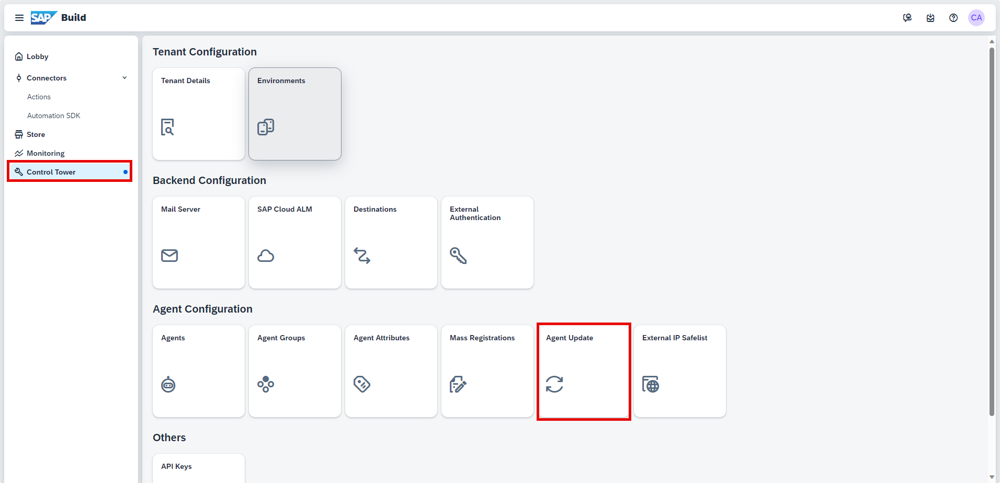

    >The following steps are required if you have not set up your Secret ID yet. 

2. Select **Go to RBSC Portal**.

    <!-- border -->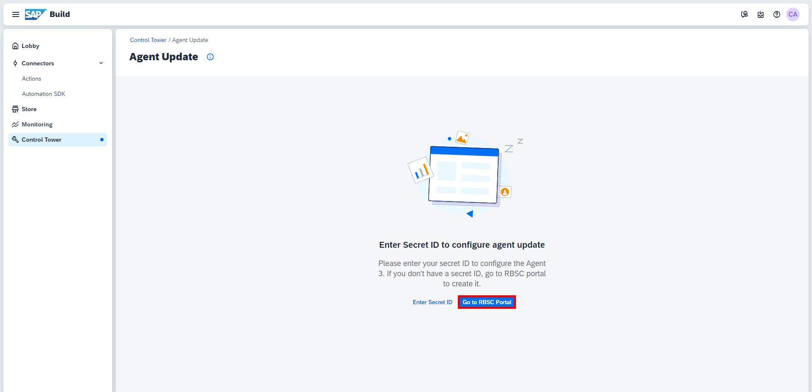

3. Select **Add User**.

    <!-- border -->

    > Please make sure you assign the `ProcessAutomationAdmin` role when you subscribe to SAP Build Process Automation in your BTP account. If you do not do so you will not be able to add a user.

4. Set the name of the user and choose **Add user**.

    <!-- border -->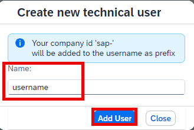

5. Confirm with **OK** button.

    <!-- border -->

6. To generate a new Secret ID, choose **Generate** and then select **OK**.

    > Note the full username as it will be needed later.

    <!-- border -->

7. When the Secret ID is generated, copy its value and click **OK**.

    <!-- border -->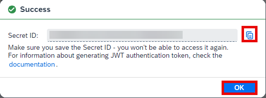

8. Go back to SAP Build, and select the **Enter Secret ID** button.

    <!-- border -->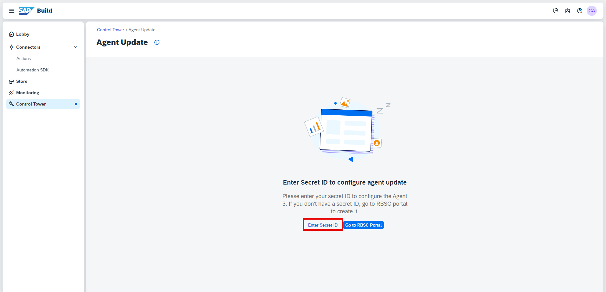

9.  Set the Name and the Secret ID.
    
10. Choose **Confirm**.

    <!-- border -->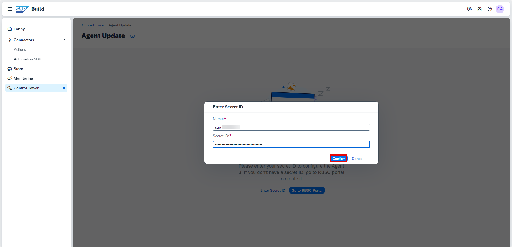

11. Choose the **Go to Download Page** button.

    <!-- border -->

12. Download the file.

    <!-- border -->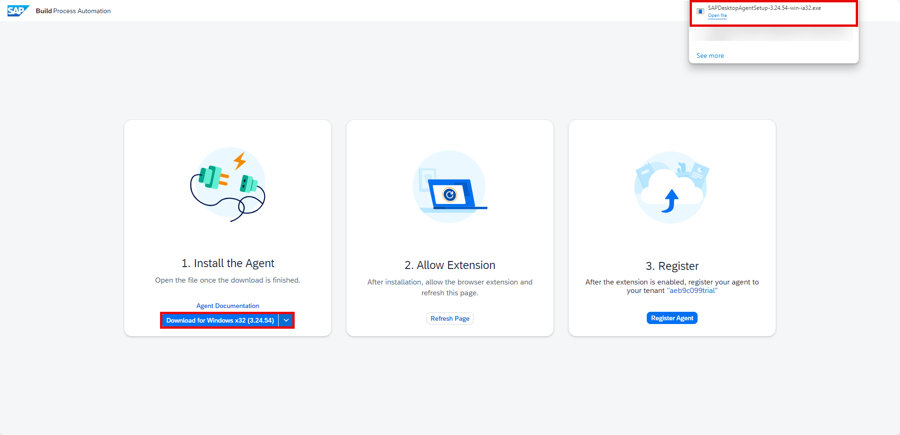

[OPTION END]

[OPTION BEGIN [Manually]]

You will download the setup program from the SAP Development Tools. It is provided in the form of an industry standard Windows MSI installer.

   
1. Download the **latest version**  of the [MSI file extension](https://tools.hana.ondemand.com/#cloud).

    > MSI version will be updated for every new release. Always download the latest version.

2. Scroll down to **SAP Process Automation: Desktop Agent 3 for Trial**.
   
3. Select the desktop agent available for your operating system.

    <!-- border -->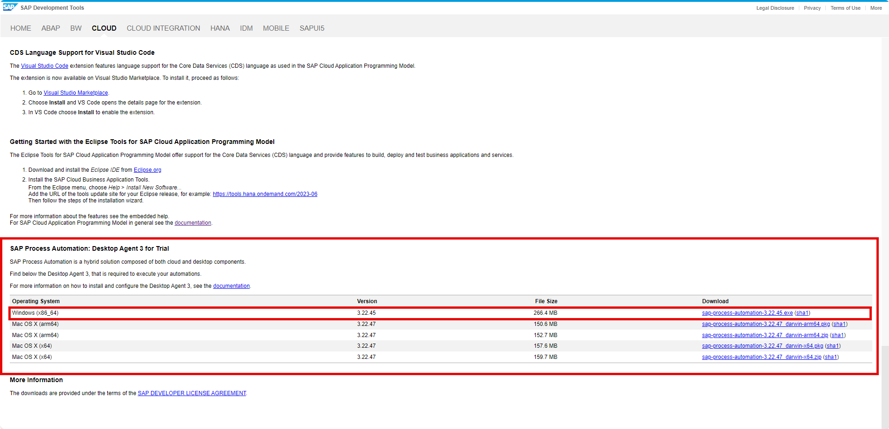

[OPTION END]

### Install the Desktop Agent 3

When you install the Desktop Agent 3, it will automatically set up the SAP Build Process Automation web browser extension for Google Chrome and Edge.

>To prevent issues during the installation, please close all the Chrome or Edge tabs opened on your machine.

>The minimum version of the Desktop Agent supported by SAP Build Process Automation is **3.7.41**.

1. Open the downloaded file. Select **Next** to begin the installation process.

    <!-- border -->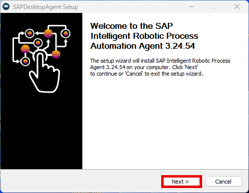

    > You can open the file with **administrator rights**, and install the service, only if your use case requires it. For example, using the agent in unattended mode in production. It is not required for following the tutorials.

2. Wait for the installation process to complete.

    <!-- border -->

3. Once the installation is successfully completed, choose **Finish** and launch the Desktop Agent 3.

    >A Google Chrome extension and an Edge add-on are installed when you install the Desktop Agent but you have to enable them (at least the Google Chrome extension).

4. On Google Chrome select the manage extensions under Extensions.

    <!-- border -->

5. Enable SAP BUild Process Automation extension.

    <!-- border -->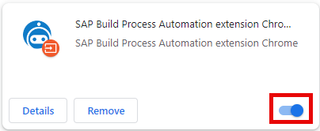

6. Do the same for the Edge extension.

    <!-- border -->

### Register the Desktop Agent on your tenant

Once the installation steps of the SAP Build Process Automation setup wizard are completed, you need to register your agent and connect it to a SAP Build Process Automation tenant in order to execute automations.

> The Agent icon will be available on your System Tray, when the Desktop Agent 3 is installed.

[OPTION BEGIN [Automatically]]

1. After installation is completed and browser extension allowed, open the **Download Page** and choose **Refresh Page**.

2. Once the extension is enabled, you may register your agent to your tenant. Choose **Register Agent**.

    <!-- border -->

3. The Agent is registered:
   
    <!-- border -->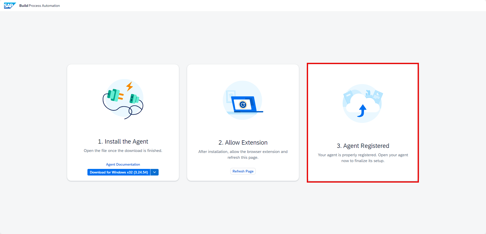

3. Once the process is completed, open the **Desktop Agent 3**.

    <!-- border -->

4.  Confirm the tenant configuration.

    <!-- border -->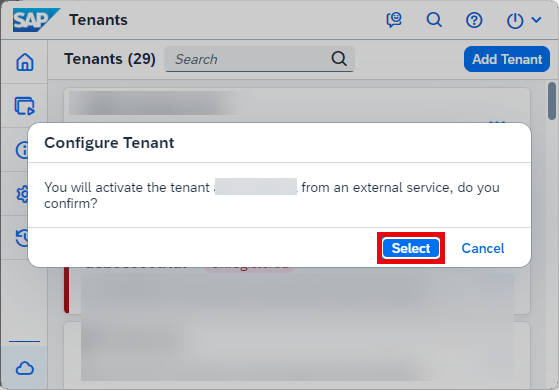

    The tenant is active.

    <!-- border -->

5. Once you completed the previous actions, log in to your tenant with your user name or e-mail and password.

    <!-- border -->

6.  The Agent should be in **Idle** state, waiting to start a project. To check, go to **Control Tower**, and select **Agents**.

    <!-- border -->

    <!-- border -->

[OPTION END]

[OPTION BEGIN [Manually]]

1. Navigate to **SAP Build** lobby. Select **Control Tower > Agents**.
   
    <!-- border -->

2. Select **Register new agent**.

    <!-- border -->  

3. In the **Register New Agent** window, select **Copy and Close**.

    <!-- border -->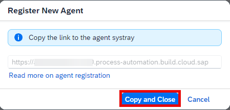

4. Select the **Desktop Agent 3** icon.

    <!-- border -->

5. Choose **Tenants**, select **Add Tenant** button.

6. In **Add Tenant** window, do the following:
   
    - In the **Name** field, enter a name for your Tenant,
    - In the **Domain** field paste the URL you copied previously,
    - Choose **Save**.

    <!-- border -->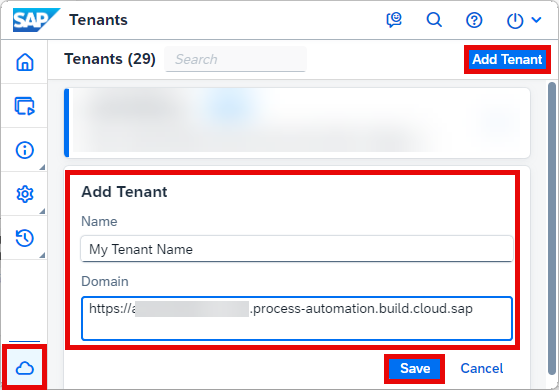

7. Select the tenant, choose the three dots and select **Activate**.

    <!-- border -->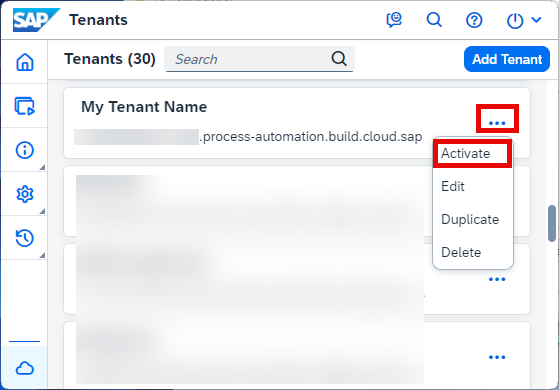

8.  Once you completed the previous actions, log in to your tenant with your user name or e-mail and password.

    <!-- border -->

9.  The Agent should be in **Idle** state, waiting to start a project. To check, go to **Control Tower**, and select **Agents**.

    <!-- border -->

[OPTION END]

### Create an environment to add your agent

1. Navigate back to **Control Tower**. Select **Environments** under **Tenant Configuration**.
    
    <!-- border -->
   
2. Choose **Create Environment**.
   
3. In the **Create Environment** window do the following:

    - Give your environment a name
    - Select a color
    - You may enter a short description
    - Choose **Create**

    <!-- border -->

4. Select the created environment to add your agent in it.

    <!-- border -->

5. Select **Agent Management > Add Agent**.

6. In the **Add Agent** window, select your agent and choose **Add agent**.

    <!-- border -->

7.  Your agent is now added and ready to run.

    <!-- border -->

---
