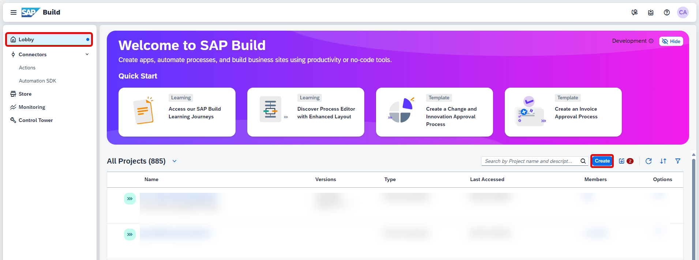
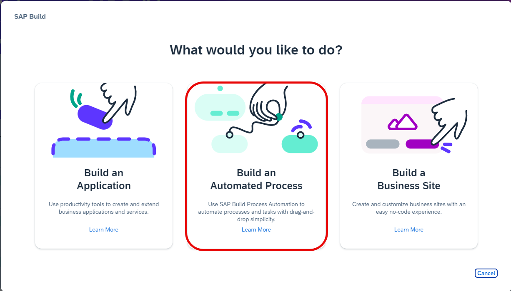
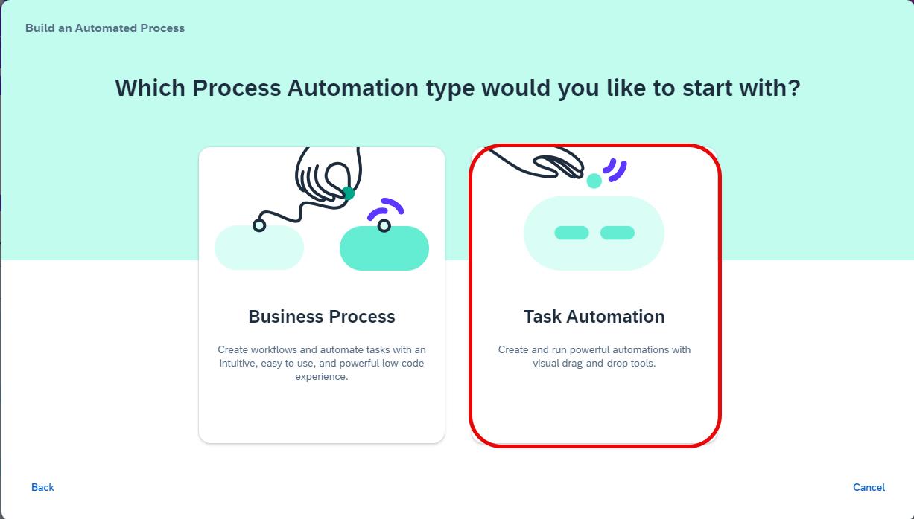
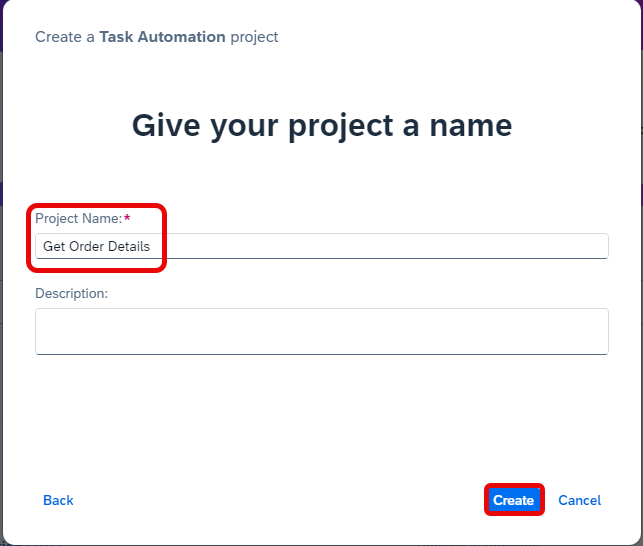

# Capture and Declare an Application to Trigger Technical Events
<!-- description --> Capture and declare an order detail application to retrieve details on an excel spreadsheet

## Prerequisites
 - [Subscribe to SAP Build Process Automation Using Booster in SAP BTP Free Tier](spa-subscribe-booster)

## You will learn
    - How to capture and declare a Sales Orders application
    - How to declare the elements

---

### Create a project

The first step consists in creating a project.

1. In the **Lobby** of **SAP Build**, choose **Create**.

    <!-- border -->

2. Select **Build an Automated Process**.

    <!-- border -->

3. Select **Task Automation**.

    <!-- border -->

4. In the **Create a Task Automation project** window, name the project **Get Order Details** and choose **Create**.

    <!-- border -->

5. You will be navigated to the **Get Order Details** project overview page.

6. You will be prompted to configure your agent version. Select the agent version that is registered on your machine.

7. Choose **Confirm**.

    <!-- border -->

 8. A pop-up window asking you to create an automation will appear, please choose **Cancel**.

    <!-- border -->

    > ### What is going on?
    > As you will be using the capture feature, you do not need to create an automation but an application.

    The next step would be to create your application within your project.

### Capture and declare the application

Now you can start capturing the application you wish to retrieve the order details from.

1. Open the [Browse Orders](https://openui5.hana.ondemand.com/test-resources/sap/m/demokit/orderbrowser/webapp/test/mockServer.html#) application in a different window. You will capture the details of one order from the **Browse Order** page. To do so, select an order.

    > Make sure the Browse Order page is open in a separate window than SAP Build Process Automation.

2. Navigate back to the **Overview** tab.

3. In the **Overview** page, select **Create** and then **Application**.

    <!-- border -->

4. In the **Create Application** window, name your application: **Browse Orders** and choose **Create**.

    <!-- border -->

5. Select the **Browse Orders** screen from the list, choose **Next**.

    <!-- border -->

6. Choose **Manual Capture** as type ad select **Capture**.

    <!-- border -->

    The screen that you captured will appear in **SAP Build Process Automation**.

6. Select the captured screen.

    <!-- border -->

7. In the **Screen Details** panel change the name to **Order Details**.

8. Remove the criteria **Mainframe** and add the criteria **URL**. Change the Operator to **contains** and the Value to **tab=shipping**. Choose **Apply**.

9. Choose **Save**.

    <!-- border -->

### Declare the order reference

1. You will now declare an Order Reference on the **Order Details** screen.

2. Choose **Both** to have a view of the screen and the tree.

3. Find the element that corresponds to an order. In this case, order 7991 is chosen.

4. In the **Element Details** panel, remove **Text** as criteria and add **id** as criteria.

5. Change the **Name** to **Order Reference**.

6. Choose **Declare Element** and hit **Save**.

  <!-- border -->

### Declare the customer name

1. You will now declare the customer name related to order 7991. Select the **Order Details** screen.

2. Choose **Both** to have a view of the screen and the tree.

3. Find the element that corresponds to the customer `Berglunds snabbköp`.

4. In the **Element Details** panel, remove **Text** as criteria and add **id** and **class** as criteria.

5.  Change the **Name** to **Customer Name**.

6. Choose **Declare Elements** and hit **Save**.

  <!-- border -->

### Declare the order amount

7. You will now declare the order amount of this order. Select the **Order Details** screen.

8. Select the order amount on the screen.

9. In the **Element Details** panel, change the name to **Order Amount**.

10. Remove **Text** as criteria and add **id** and **class**.

11. Choose **Declare Element** and hit **Save**.

  <!-- border -->

### Declare the shipping address details

1. You will declare the shipping address name. Select the **Order Details** screen.

2. Choose **Both** to have a view of the screen and the tree.

3. Find the **DIV** that corresponds to the shipping address name on the screen.

4. In the **Element Details** panel, change the name to **Shipping Address Name**.

5. Remove **Text** as criteria and add **class** and **nth-child-tag=1**.

6. Choose **Declare Element** and hit **Save**.

    <!-- border -->

7. You will move on to declare the next shipping detail: the street. Select the **Order Details** screen.

8. Choose **Both** to have a view of the screen and the tree.

9. Find the **DIV** that corresponds to the shipping address street on the screen.

10. In the **Element Details** panel, change the name to **Shipping Address Street**.

11. Remove **Text** as criteria and add **Class** and **nth-child-tag=3**.

12. Choose **Declare Element** and hit **Save**.

    <!-- border -->

13. You will declare the next shipping detail: the zip code/city. Select the **Order Details** screen.

14. Choose **Both** to have a view of the screen and the tree.

15. Find the **DIV** that corresponds to the shipping address zip code/city on the screen.

16. In the **Element Details** panel, change the name to **Shipping Address Zip Code City**.

17. Remove **Text** as criteria and add **class** and **nth-child-tag=5**.

18. Choose **Declare Element** and hit **Save**.

    <!-- border -->

19. You will declare the next shipping detail: the region. Select the **Order Details** screen.

14. Choose **Both** to have a view of the screen and the tree.

15. Find the **DIV** that corresponds to the shipping address region on the screen.

16. In the **Element Details** panel, change the name to **Shipping Address Region**.

17. Remove **Text** as criteria and add **class** and **nth-child-tag=7**.

18. Choose **Declare Element** and hit **Save**.

    <!-- border -->

19. Lastly, you will declare the last shipping detail: the country. Select the **Order Details** screen.

14. Choose **Both** to have a view of the screen and the tree.

15. Find the **DIV** that corresponds to the shipping address country on the screen.

16. In the **Element Details** panel, change the name to **Shipping Address Country**.

17. Remove **Text** as criteria and add **class** and **nth-child-tag=9**.

18. Choose **Declare Element** and hit **Save**.

    <!-- border -->

### Declare the line items

1. Now you will declare the Line Items on the Order Details screen. First, you will declare the Table Header (TH) element. Select the **Order Details** screen.

2. Choose **Both** to have a view of the screen and the tree.

3. Find the **TH** that corresponds to the **Product** header on the screen.

4. In the **Element Details** panel, change the name to **Table Header**.

5. Remove **Text** as criteria and add **class**.

    <!-- border -->

6. Now choose the three dots next to the **TH** element and select **Set as collection**.

    >The Table Header consists of several items hence it needs to be set as a collection.

7. Choose **Declare Element** and hit **Save**.

    <!-- border -->

8. Next, you will declare the Table Row (TR) element. Select the **Order Details** screen.

9. Choose **Both** to have a view of the screen and the tree.

10. Find the **TR** that corresponds to the first row's table on the screen.

11. In the **Element Details** panel, change the name to **Table Row**.

12. Remove **Text** as criteria.

    <!-- border -->

13. Now choose the three dots next to the **TR** element and select **Set as collection**.

14. Choose **Declare Element** and hit **Save**.

    <!-- border -->

15. Lastly, you will declare the Table Data (TD) element. Select the **Order Details** screen.

16. Choose **Both** to have a view of the screen and the tree.

17. Find the **TD** that corresponds to the data found in the first row's table on the screen.

18. In the **Element Details** panel, change the name to **Table Data**.

19. Remove **Text** as criteria and add **class**.

    <!-- border -->

20. Now choose the three dots next to the **TD** element and select **Set as collection**.

21. Choose **Declare Element** and hit **Save**.

22. You need to add the **Table Row** element as criteria. Select **Table Data** from the list of **Declared Elements**, choose the tree dots next to the **Table Row** element and from the drop-down menu choose **Add to criteria**.

23. Choose **Save**.

    <!-- border -->

    Now that the application is fully captured and declared, you may start designing your automation.

---
