# Create Process Visibility Scenario
<!-- description --> Create a Visibility Scenario for your Business Process

## Prerequisites

 - [Create an Automation to Extract Data](spa-vl-create-automation) 
 - [Create a Decision](spa-vl-create-decision)

## You will learn
  - How to create and configure a Process Visibility Scenario
  - How to define performance indicators of a process by using visibility scenarios
  - Why and how you can gain visibility into your processes to measure performance with SAP Build Process Automation.

---
The process is created where several forms are defined, an automation to extract data is included in that same process and a condition to control the flow and even improved the process with some decision logic are used. Now it is time to measure success and improvements. In fact, you will gain end-to-end process visibility. There is a comprehensive dashboard with several process performance indicators, like process cycle time, duration of individual steps or status of the running processes – and this view is created automatically, in real time.

### Prepare Process

Before creating a **Visibility Scenario**, you need to prepare the process.

1. In the **Process Builder** open the process and on the right-hand side, select  icon to view the process details.

    <!-- border -->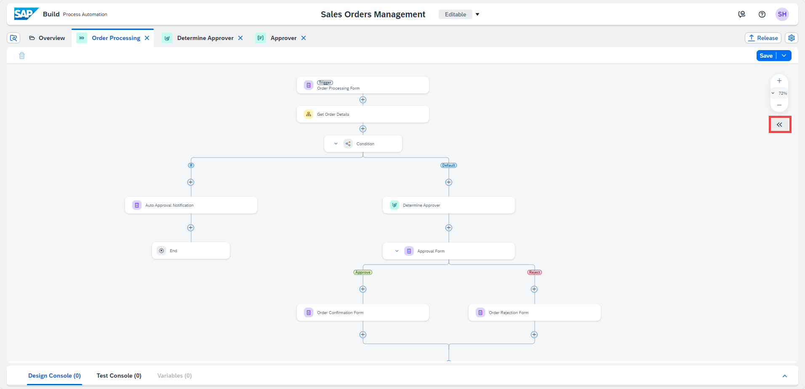

2. Then, select the tab **Visibility**.

    <!-- border -->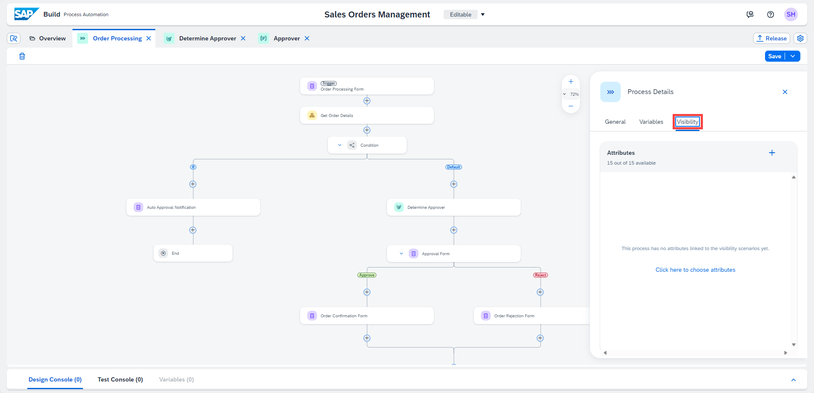

    > Here you define the connection between the process context and the newly to be created visibility scenario.   

3. Select **+** on the right panel to add the relevant attributes from the process.

    <!-- border -->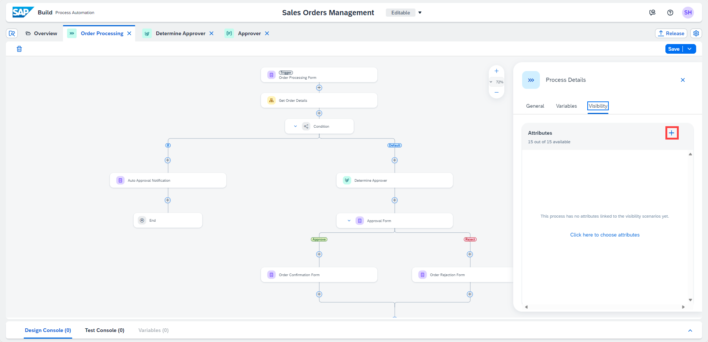

4. Add the following attributes:

    - `expectedDeliveryDate`
    - `orderAmount`
    - `orderDate`
    - `orderNumber`
    - `shippingCountry`
    - `Customer Name`

    <!-- border -->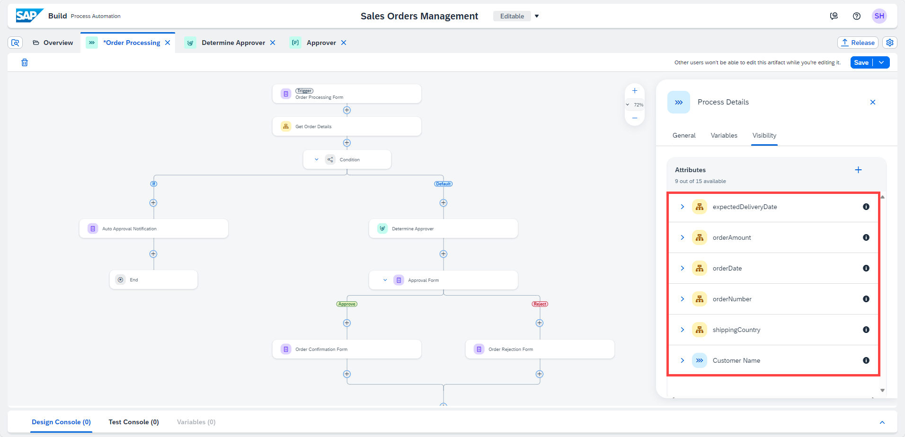

    > The relevant attributes are the ones that could be used to measure, calculate, or derive some meaningful information in the visibility dashboard.

5. **Save** your work.

### Create Visibility Scenario

1.  Select the **Open Project Content** icon as below.

    <!-- border -->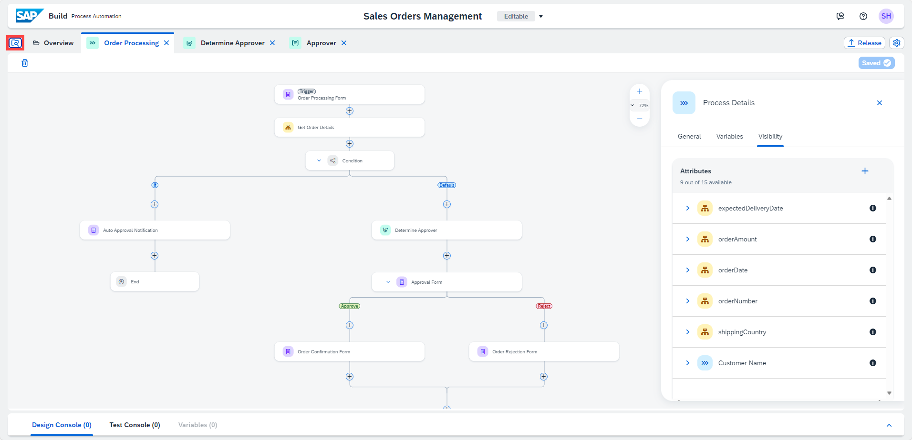

2. Select **+**. Choose **Create** > **Visibility Scenario**.

    <!-- border -->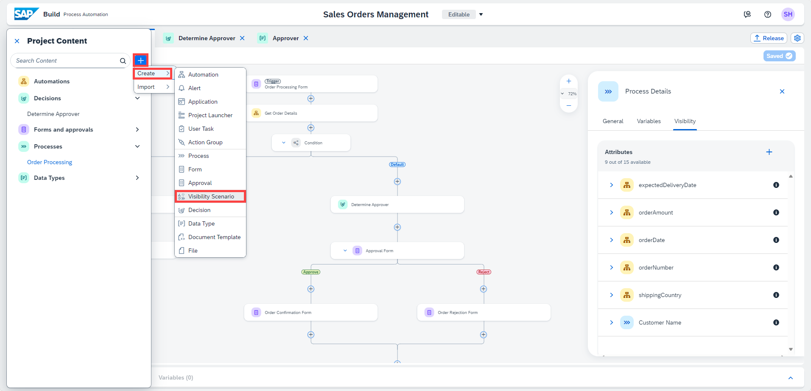

3.  Set **Name** to **Sales Order Visibility Scenario** then click **Create**.

    <!-- border -->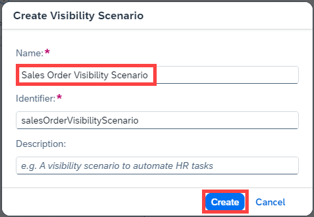

    > Please ensure you use a **unique name**, to make it easier to identify your scenario later on.

    The **Visibility Scenario** is created.

4.  Move to **General** tab in **Sales Order Visibility Scenario** and change: **Instances** to **Sales Orders** and **Instance** to **Sales Order**.

    > To make it better understandable what the instances are processing: Sales Orders.

    <!-- border -->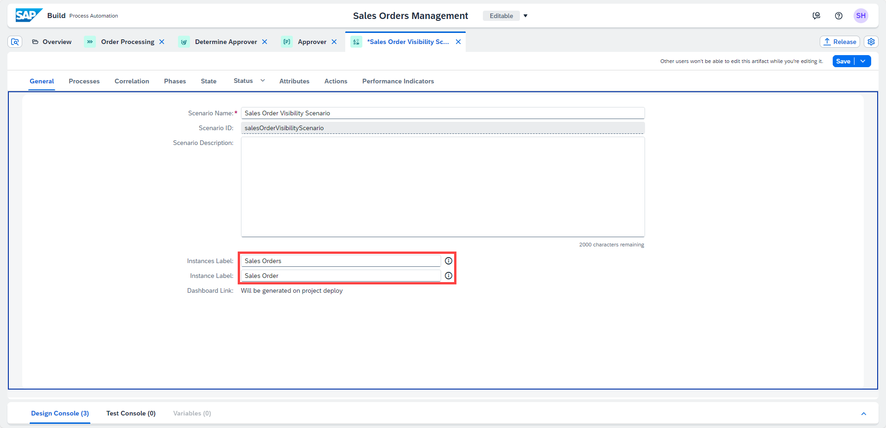

### Configure Visibility Scenario Process

This step involves adding a process to the visibility scenario we created.

1.  Select **+**, then **Add Process** in **Processes** tab in **Sales Order Visibility Scenario**.

    <!-- border -->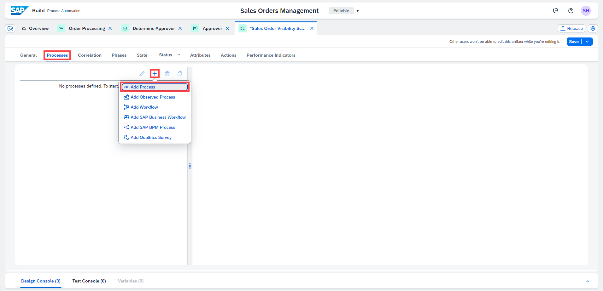

2.  Select **Order Processing** process.

    <!-- border -->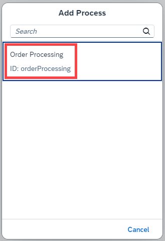

    > This will lead to the visibility scenario configuration screen, where these can be viewed and controlled:

    > 1. All the events that could potentially occur during the process execution
    > 2. The context data which is the attributes selected before (Step 1.3)

3.  Change within the following context data the data types. Select the pencil icon.

    <!-- border -->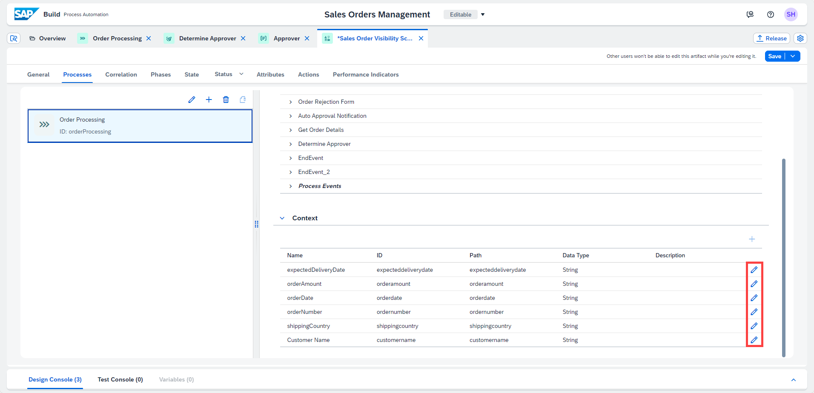

    | **Name**                   | **Current Data Type** | **New Data Type** |
    | ---------------------- | ----------------- | ------------- |
    | `expectedDeliveryDate` | String            | Date          |
    | `orderAmount`          | String            | Double        |
    | `orderDate`            | String            | Date          |

    <!-- border -->

### Define Visibility Scenario Status

This step involves configuring the visibility scenario's status that allows to define under which circumstance a process instance will change the status to require special processing or actions.

1.  Move to **Status** tab in **Sales Order Visibility Scenario**.

2.  Change **Target Type** from **None** to **Constant**.

    <!-- border -->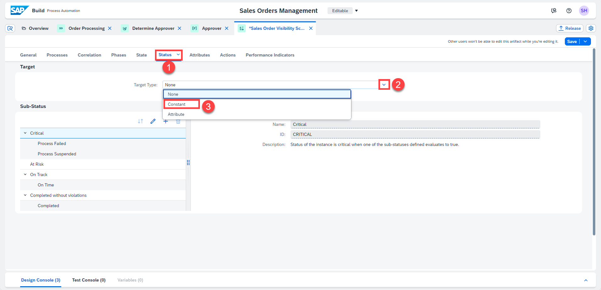

3.  Set **Target Value** to **10 Min** and **Threshold** to **50%**.

    <!-- border -->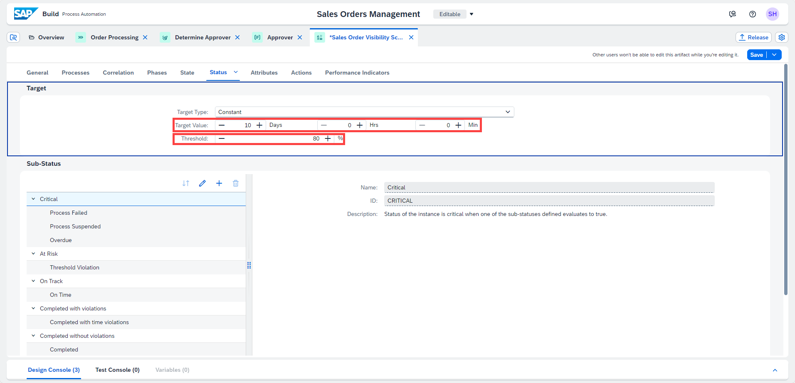

    > The means: as soon as processing duration crosses 5 minutes (50% of **Target Value**), the status will switch to "At Risk". After 10 minutes it will change to "Critical".

### Configure Visibility Scenario Performance Indicators

1.  Move to **Performance Indicators** tab in **Sales Order Visibility Scenario** and add additional ones or leave them as is.

    <!-- border -->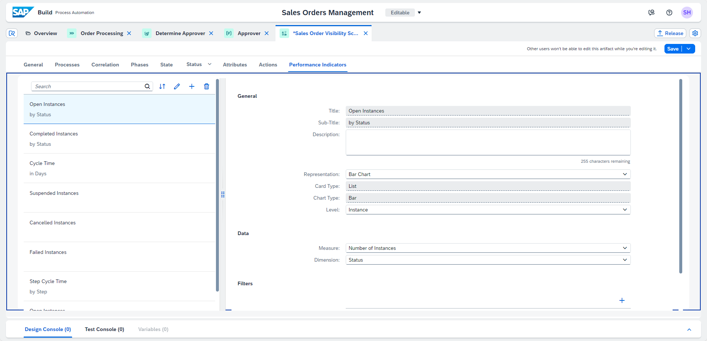

2.  Click **Save**.

You have now configured a visibility scenario which is related to your process. Based on this configuration a dashboard will be created which you can use to measure the performance, but to also get deep insights into single instances and even trigger actions.

In the next tutorial, you will run the process and will be able to monitor the **Process Visibility Dashboard**.

---
